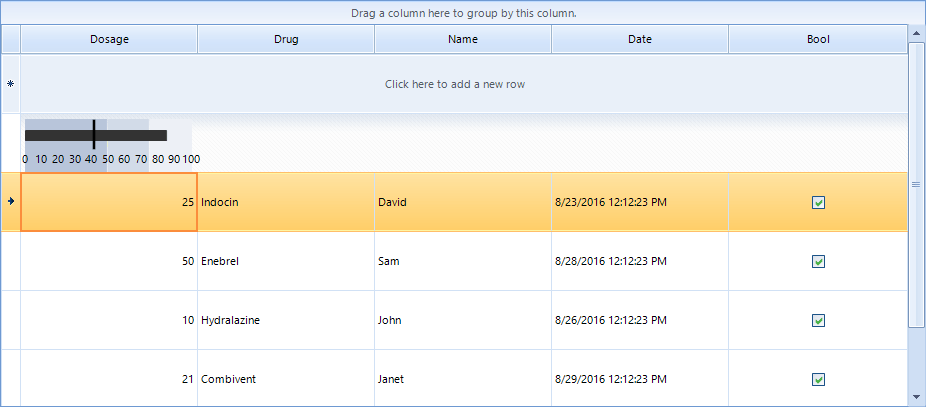

|Product Version|Product|Author|Last modified|
|----|----|----|----|
|Q2 2016|RadRadialGauge for WinForms|Dimitar Karamfilov|August 24, 2016|

## Problem  
The design time functionality of the gauge controls allows you to easily create the desired gauge. This is not the case when you need to use a gauge inside other control as element. In this case the best solution would be to first create and save the layout at design time and then just load it form the xml.  
  
Figure 1: The final result.  
  
  

## Solution  
1. Create the layout at design time and save it as xml by using the smart tag (you can use any of the predefined templates as well).  
2. Open the saved file and remove the main tag, only the items collection should remain. For example you can use the following xml:  


````XML
<Items>
    <Telerik.WinControls.UI.Gauges.BulletGraphQualitativeBar RangeEnd="49" BackColor2="184, 197, 218" BackColor="184, 197, 218" Padding="0, 0, 0, 0" Name="bulletGraphQualitativeBar1">
      <DataBindings DefaultDataSourceUpdateMode="OnValidation" />
    </Telerik.WinControls.UI.Gauges.BulletGraphQualitativeBar>
    <Telerik.WinControls.UI.Gauges.BulletGraphQualitativeBar RangeEnd="74" RangeStart="50" BackColor2="210, 219, 232" BackColor="210, 219, 232" Padding="0, 0, 0, 0" Name="bulletGraphQualitativeBar2">
      <DataBindings DefaultDataSourceUpdateMode="OnValidation" />
    </Telerik.WinControls.UI.Gauges.BulletGraphQualitativeBar>
    <Telerik.WinControls.UI.Gauges.BulletGraphQualitativeBar RangeStart="75" BackColor2="237, 240, 246" BackColor="237, 240, 246" Padding="0, 0, 0, 0" Name="bulletGraphQualitativeBar3">
      <DataBindings DefaultDataSourceUpdateMode="OnValidation" />
    </Telerik.WinControls.UI.Gauges.BulletGraphQualitativeBar>
    <Telerik.WinControls.UI.Gauges.BulletGraphFeaturedMeasureBar Offset="11" Width2="10" Width="10" RangeEnd="85" AutoSize="False" Bounds="0, 0, 280, 50" Padding="0, 0, 0, 0" Name="bulletGraphFeaturedMeasureBar1">
      <DataBindings DefaultDataSourceUpdateMode="OnValidation" />
    </Telerik.WinControls.UI.Gauges.BulletGraphFeaturedMeasureBar>
    <Telerik.WinControls.UI.Gauges.LinearGaugeNeedleIndicator LineLenght="30" LocationPercentage="30" Thickness="3" Value="80" LenghtPercentage="0" BackColor="Black" AutoSize="False" Bounds="0, 0, 280, 50" Padding="0, 0, 0, 0" Name="linearGaugeNeedleIndicator1">
      <DataBindings DefaultDataSourceUpdateMode="OnValidation" />
    </Telerik.WinControls.UI.Gauges.LinearGaugeNeedleIndicator>
    <Telerik.WinControls.UI.Gauges.LinearGaugeLabels AutoSize="False" Bounds="0, 0, 280, 40" Padding="0, 0, 0, 0" Name="linearGaugeLabels1">
      <DataBindings DefaultDataSourceUpdateMode="OnValidation" />
    </Telerik.WinControls.UI.Gauges.LinearGaugeLabels>
</Items>

````
  
In order to demonstrate the scenario we can create a simple custom cell where we can add a gauge element and load the layout created in the previous step. First you need to create the custom cell class. The following class adds a gauge element to a summary cell. It uses **ComponentXmlSerializer** to restore the gauge elements form the xml file:  


````C#
class CustomSummaryCell : GridSummaryCellElement
{
    public CustomSummaryCell(GridViewColumn col, GridRowElement row) : base(col, row)
    { }
    RadLinearGaugeElement bullet1;
    protected override void CreateChildElements()
    {
        base.CreateChildElements();
        bullet1 = new RadLinearGaugeElement();
        bullet1.Padding = new Padding(5,3,7,3);
        using (StreamReader sr = new StreamReader(@"..\..\BulletDefault1.xml"))
        {
            var ser = new ComponentXmlSerializer();
            using (XmlTextReader textReader = new XmlTextReader(sr))
            {
                ser.ReadObjectElement(textReader, bullet1);
            }
        }
        this.Children.Add(bullet1);
    }
    public override void SetContent()
    {
        base.SetContent();
        ((LinearGaugeNeedleIndicator )this.bullet1.Items[4]).Value = Convert.ToSingle(this.Value.ToString());
    }
}

````
````VB.NET
Friend Class CustomSummaryCell
    Inherits GridSummaryCellElement
    Public Sub New(ByVal col As GridViewColumn, ByVal row As GridRowElement)
        MyBase.New(col, row)
    End Sub
    Private bullet1 As RadLinearGaugeElement
    Protected Overrides Sub CreateChildElements()
        MyBase.CreateChildElements()
        bullet1 = New RadLinearGaugeElement()
        bullet1.Padding = New Padding(5,3,7,3)
        Using sr As New StreamReader("..\..\BulletDefault1.xml")
            Dim ser = New ComponentXmlSerializer()
            Using textReader As New XmlTextReader(sr)
                ser.ReadObjectElement(textReader, bullet1)
            End Using
        End Using
        Me.Children.Add(bullet1)
    End Sub
    Public Overrides Sub SetContent()
        MyBase.SetContent()
        CType(Me.bullet1.Items(4), LinearGaugeNeedleIndicator).Value = Convert.ToSingle(Me.Value.ToString())
    End Sub
End Class

````


The final step is to change the default summary cell. The **CreateCell** event is suitable for this:   


````C#
private void RadGridView1_CreateCell(object sender, GridViewCreateCellEventArgs e)
{
    if (e.CellType == typeof(GridSummaryCellElement) && e.Column.Name == "Dosage")
    {
        e.CellElement = new CustomSummaryCell(e.Column, e.Row);
    }
}

````
````VB.NET
Private Sub RadGridView1_CreateCell(ByVal sender As Object, ByVal e As GridViewCreateCellEventArgs)
    If e.CellType Is GetType(GridSummaryCellElement) AndAlso e.Column.Name = "Dosage" Then
        e.CellElement = New CustomSummaryCell(e.Column, e.Row)
    End If
End Sub

````

>note A complete sample application on VB and C# can be found [here](https://github.com/telerik/winforms-sdk/tree/master/GridView/UseGaugeElementInRadGridView).


