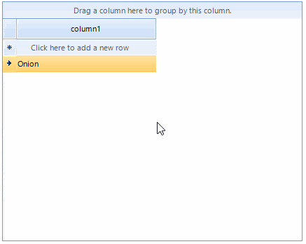

|Product Version|Product|Author|Last modified|
|----|----|----|----|
|Q2 2015|RadGridView for WinForms|Dimitar Karamfilov|July 28, 2015|


## Problem

By default you can only select values from the drop down with **GridViewComboBoxColumn**. Sometimes you may need to provide the user with predefined values and allow him/her to use custom ones as well.

## Solution  
  
#### Figure1. The final result.   


To achieve this functionality, you should create a custom editor which returns the text of the combo box editor. In addition, you should create a custom cell element and override the **SetContent** method. This is necessary because by default the cell is looking for the proper value in the editor data source.


````C#
public class MyRadDropDownListEditor : RadDropDownListEditor
{
    public override object Value
    {
        get
        {
            RadDropDownListElement editor = this.EditorElement as RadDropDownListElement;
            if (editor.SelectedItem != null)
            {
                if (!string.IsNullOrEmpty(editor.ValueMember))
                {
                    return editor.SelectedItem.Value;
                }
 
                return editor.SelectedItem.Text;
            }
 
            return editor.Text;
        }
        set
        {
            base.Value = value;
        }
    }
}
 
public class MyCombBoxCellElement : GridComboBoxCellElement
{
    public MyCombBoxCellElement(GridViewColumn col, GridRowElement row) : base(col, row)
    {
    }
 
    public override void SetContent()
    {
         
        SetContentCore(this.Value);
    }
}

````
````VB.NET
Public Class MyRadDropDownListEditor
    Inherits RadDropDownListEditor
 
    Public Overrides Property Value() As Object
        Get
            Dim editor As RadDropDownListElement = TryCast(Me.EditorElement, RadDropDownListElement)
            If editor.SelectedItem IsNot Nothing Then
                If Not String.IsNullOrEmpty(editor.ValueMember) Then
                    Return editor.SelectedItem.Value
                End If
 
                Return editor.SelectedItem.Text
            End If
 
            Return editor.Text
        End Get
        Set(ByVal value As Object)
            MyBase.Value = value
        End Set
    End Property
End Class
 
Public Class MyCombBoxCellElement
    Inherits GridComboBoxCellElement
 
    Public Sub New(ByVal col As GridViewColumn, ByVal row As GridRowElement)
        MyBase.New(col, row)
    End Sub
 
    Public Overrides Sub SetContent()
 
        SetContentCore(Me.Value)
    End Sub
End Class

````

  

The default editor and the default cell element can be changed in the **CellEditorRequired** and **CellCreated** events:  

````C#
void radGridView1_CreateCell(object sender, GridViewCreateCellEventArgs e)
{
    if (e.CellType == typeof(GridComboBoxCellElement))
    {
        e.CellElement = new MyCombBoxCellElement(e.Column as GridViewDataColumn, e.Row);
    }
}
 
void radGridView1_EditorRequired(object sender, EditorRequiredEventArgs e)
{
    if (e.EditorType == typeof(RadDropDownListEditor))
    {
        e.EditorType = typeof(MyRadDropDownListEditor);
    }
}

````
````VB.NET
Private Sub radGridView1_CreateCell(ByVal sender As Object, ByVal e As GridViewCreateCellEventArgs)
    If e.CellType Is GetType(GridComboBoxCellElement) Then
        e.CellElement = New MyCombBoxCellElement(TryCast(e.Column, GridViewDataColumn), e.Row)
    End If
End Sub
  
Private Sub radGridView1_EditorRequired(ByVal sender As Object, ByVal e As EditorRequiredEventArgs)
    If e.EditorType Is GetType(RadDropDownListEditor) Then
        e.EditorType = GetType(MyRadDropDownListEditor)
    End If
End Sub

````

>note The complete examples in C# and VB can be downloaded by clicking the following [link](https://github.com/telerik/winforms-sdk/blob/master/GridView/GridViewComboxColumnCustomValue/description.md).


