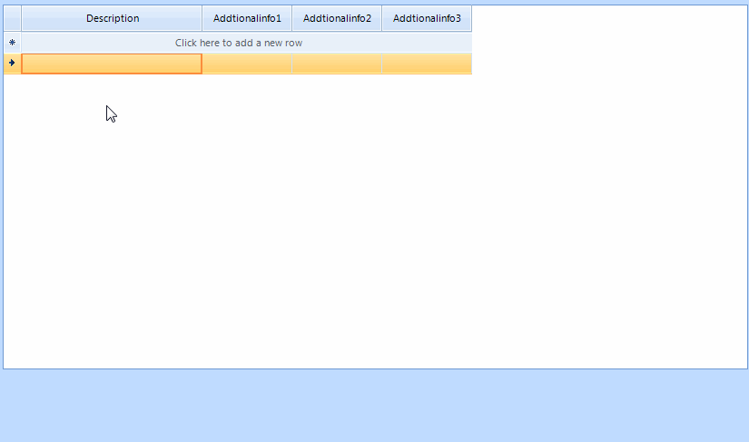

## Environment
 
|Product Version|Product|Author|
|----|----|----|
|2021.3.119|RadGridView for WinForms|[Desislava Yordanova](https://www.telerik.com/blogs/author/desislava-yordanova)|
 
## Description

This tutorial demonstrates a sample approach how to create a [custom editor](() ) in RadGridView that uses a RadPopupEditor hosting a grid. Typing into the editable part of RadPopupEditor filters the popup grid:
 


This approach can be used to optimize the performance when filtering **GridViewMultiComboBoxColumn**.

## Solution 

Create a derivative of **BaseGridEditor** and add a RadPopupEditor and RadPopupContainer in its **CreateEditorElement** method. Note that the container can host any control that you need.


````C#

private void radGridView1_EditorRequired(object sender, EditorRequiredEventArgs e)
{
    if (this.radGridView1.CurrentColumn.Name == "Description")
    {
        MyEditor editor = new MyEditor();
        GridViewMultiComboBoxColumn mccbCol = this.radGridView1.CurrentColumn as GridViewMultiComboBoxColumn;
        editor.DataSource = mccbCol.DataSource;
        editor.DisplayMember = mccbCol.DisplayMember;
        e.Editor = editor;
    }
}

public class MyEditor : BaseGridEditor
{
    public string DisplayMember { get; set; }

    public object DataSource
    {
        get
        {
            {
                return this.grid.DataSource;
            }
        }
        set
        {
            this.grid.DataSource = value;
        }
    }

    public override void BeginEdit()
    {
        base.BeginEdit();
        this.popupEditor.TextBoxElement.TextBoxItem.TextBoxControl.Focus();
    }

    public override object Value
    {
        get
        {
            if (grid.CurrentRow != null)
            {
                return this.grid.CurrentRow.Cells[this.DisplayMember].Value;
            }
            return null;
        }
        set
        {
            if (value != null)
            {
                foreach (GridViewRowInfo row in grid.Rows)
                {
                    if (row.Cells[this.DisplayMember].Value == value)
                    {
                        grid.CurrentRow = row;
                        break;
                    }
                }
            }
        }
    }

    RadGridView grid = new RadGridView();
    RadPopupEditor popupEditor = new RadPopupEditor();
    RadPopupContainer container = new RadPopupContainer();

    protected override RadElement CreateEditorElement()
    {
        popupEditor.AssociatedControl = container;
        popupEditor.DropDownStyle = RadDropDownStyle.DropDown;
        container.Controls.Add(grid);
        grid.Dock = DockStyle.Fill;
        grid.EnableFiltering = true;
        grid.ShowFilteringRow = false;
        grid.ReadOnly = true;
        grid.EnableCustomFiltering = true;
        grid.AutoSizeColumnsMode = GridViewAutoSizeColumnsMode.Fill;
        grid.CustomFiltering += grid_CustomFiltering;
        this.popupEditor.TextBoxElement.TextChanged += popupEditor_TextChanged;
 
        RadHostItem item = new RadHostItem(popupEditor);
        return item;
    }

    private void popupEditor_TextChanged(object sender, EventArgs e)
    {
        grid.MasterTemplate.Refresh();
        popupEditor.PopupEditorElement.ShowPopup();
        this.popupEditor.PopupEditorElement.TextBoxElement.TextBoxItem.TextBoxControl.Focus();
    }

    private void grid_CustomFiltering(object sender, GridViewCustomFilteringEventArgs e)
    {
        string searchText = popupEditor.Text;
        if (searchText != null && searchText != string.Empty)
        {
            DataRowView rowView = e.Row.DataBoundItem as DataRowView;
            e.Handled = true;
            e.Visible = rowView.Row[this.DisplayMember].ToString().Contains(searchText);
        }
        else
        {
            e.Handled = false;
        }
    }
}


````
````VB.NET

Private Sub radGridView1_EditorRequired(ByVal sender As Object, ByVal e As EditorRequiredEventArgs)
    If Me.RadGridView1.CurrentColumn.Name = "Description" Then
        Dim editor As MyEditor = New MyEditor()
        Dim mccbCol As GridViewMultiComboBoxColumn = TryCast(Me.RadGridView1.CurrentColumn, GridViewMultiComboBoxColumn)
        editor.DataSource = mccbCol.DataSource
        editor.DisplayMember = mccbCol.DisplayMember
        e.Editor = editor
    End If
End Sub

Public Class MyEditor
    Inherits BaseGridEditor

    Public Property DisplayMember As String

    Public Property DataSource As Object
        Get

            If True Then
                Return Me.grid.DataSource
            End If
        End Get
        Set(ByVal value As Object)
            Me.grid.DataSource = value
        End Set
    End Property

    Public Overrides Sub BeginEdit()
        MyBase.BeginEdit()
        Me.popupEditor.TextBoxElement.TextBoxItem.TextBoxControl.Focus()
    End Sub

    Public Overrides Property Value As Object
        Get

            If grid.CurrentRow IsNot Nothing Then
                Return Me.grid.CurrentRow.Cells(Me.DisplayMember).Value
            End If

            Return Nothing
        End Get
        Set(ByVal value As Object)

            If value IsNot Nothing Then

                For Each row As GridViewRowInfo In grid.Rows

                    If row.Cells(Me.DisplayMember).Value = value Then
                        grid.CurrentRow = row
                        Exit For
                    End If
                Next
            End If
        End Set
    End Property

    Private grid As RadGridView = New RadGridView()
    Private popupEditor As RadPopupEditor = New RadPopupEditor()
    Private container As RadPopupContainer = New RadPopupContainer()

    Protected Overrides Function CreateEditorElement() As RadElement
        popupEditor.AssociatedControl = container
        popupEditor.DropDownStyle = RadDropDownStyle.DropDown
        container.Controls.Add(grid)
        grid.Dock = DockStyle.Fill
        grid.EnableFiltering = True
        grid.ShowFilteringRow = False
        grid.[ReadOnly] = True
        grid.EnableCustomFiltering = True
        grid.AutoSizeColumnsMode = GridViewAutoSizeColumnsMode.Fill
        AddHandler grid.CustomFiltering, AddressOf grid_CustomFiltering
        AddHandler Me.popupEditor.TextBoxElement.TextChanged, AddressOf popupEditor_TextChanged
        Dim item As RadHostItem = New RadHostItem(popupEditor)
        Return item
    End Function

    Private Sub popupEditor_TextChanged(ByVal sender As Object, ByVal e As EventArgs)
        grid.MasterTemplate.Refresh()
        popupEditor.PopupEditorElement.ShowPopup()
        Me.popupEditor.PopupEditorElement.TextBoxElement.TextBoxItem.TextBoxControl.Focus()
    End Sub

    Private Sub grid_CustomFiltering(ByVal sender As Object, ByVal e As GridViewCustomFilteringEventArgs)
        Dim searchText As String = popupEditor.Text

        If searchText IsNot Nothing AndAlso searchText <> String.Empty Then
            Dim rowView As DataRowView = TryCast(e.Row.DataBoundItem, DataRowView)
            e.Handled = True
            e.Visible = rowView.Row(Me.DisplayMember).ToString().Contains(searchText)
        Else
            e.Handled = False
        End If
    End Sub
End Class

```` 

# See Also

* [Custom Editors]() 


    
   
  
    
 
