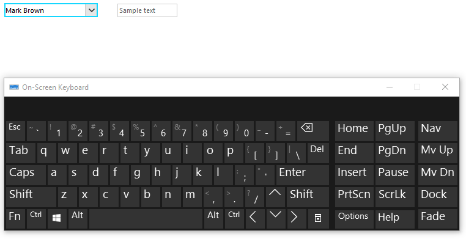
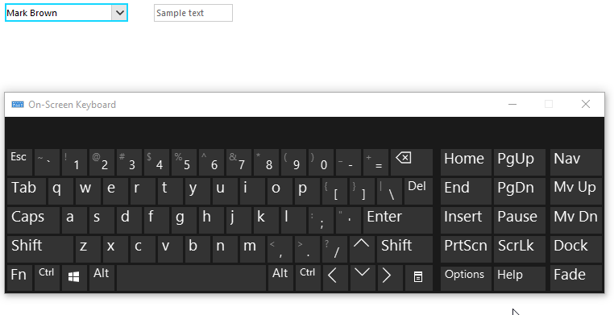

## Environment
 
|Product Version|Product|Author|
|----|----|----|
|2019.2.618|RadDropDownList for WinForms|[Desislava Yordanova](https://www.telerik.com/blogs/author/desislava-yordanova)|
 

## Description
 
**RadDropDownList** is an enhanced alternative to the standard Windows Forms combo box control. It can be either bound to data sources or populated with items programmatically. However, in both cases, **RadDropDownList** is designed to allow users to enter valid values according to the filled RadDropDownList.**Items** collection. If the user enters any text that don't match any record in the **Items** collection, this value won't be accepted as valid and it won't be preserved as **SelectedValue** after you navigate to another control.



## Solution 

In order to keep the user-defined values, add a record with the custom text to the applied [**DataSource**]()  collection. Consider that the **RadDropDownList** control is bound to a **DataTable**:

````C#

public RadForm1()
{
    InitializeComponent();

    this.radDropDownList1.DisplayMember = "Name";
    this.radDropDownList1.ValueMember = "Id";
    this.radDropDownList1.DataSource = GetEmployees();
    this.radDropDownList1.AutoCompleteMode = AutoCompleteMode.Suggest;
    this.radDropDownList1.DropDownStyle = RadDropDownStyle.DropDown;
    this.radDropDownList1.DropDownListElement.TextBox.TextBoxItem.TextBoxControl.PreviewKeyDown += TextBoxControl_PreviewKeyDown;
}

private object GetEmployees()
{
    DataTable dt = new DataTable();
    dt.Columns.Add("Id", typeof(int));
    dt.Columns.Add("Name", typeof(string));
    dt.Rows.Add(1, "Mark Brown");
    dt.Rows.Add(2, "Anna Smith");
    dt.Rows.Add(3, "John Adams");
    return dt;
}

private void TextBoxControl_PreviewKeyDown(object sender, PreviewKeyDownEventArgs e)
{
    if (e.KeyData == Keys.Enter)
    {
        bool found = false;
        string text = this.radDropDownList1.DropDownListElement.TextBox.TextBoxItem.TextBoxControl.Text;

        // Checking if the typed value exists in the datasource of the column.
        DataTable dt = this.radDropDownList1.DataSource as DataTable;
        for (int i = 0; i < dt.Rows.Count; i++)
        {
            if (dt.Rows[i]["Name"].ToString() == text)
            {
                found = true;
                break;
            }
        }
        if (!found)
        {
            DataRow newEmployeesRow = dt.NewRow();
            newEmployeesRow["Name"] = text;
            newEmployeesRow["Id"] = dt.Rows.Count+1;
            dt.Rows.Add(newEmployeesRow);

            this.radDropDownList1.SelectedValue = newEmployeesRow["Id"];
        }
    }
}
    

````
````VB.NET

 Public Sub New()
    InitializeComponent()
    Me.RadDropDownList1.DisplayMember = "Name"
    Me.RadDropDownList1.ValueMember = "Id"
    Me.RadDropDownList1.DataSource = GetEmployees()
    Me.RadDropDownList1.AutoCompleteMode = AutoCompleteMode.Suggest
    Me.RadDropDownList1.DropDownStyle = RadDropDownStyle.DropDown
    AddHandler Me.RadDropDownList1.DropDownListElement.TextBox.TextBoxItem.TextBoxControl.PreviewKeyDown, AddressOf TextBoxControl_PreviewKeyDown
End Sub

Private Function GetEmployees() As Object
    Dim dt As DataTable = New DataTable()
    dt.Columns.Add("Id", GetType(Integer))
    dt.Columns.Add("Name", GetType(String))
    dt.Rows.Add(1, "Mark Brown")
    dt.Rows.Add(2, "Anna Smith")
    dt.Rows.Add(3, "John Adams")
    Return dt
End Function

Private Sub TextBoxControl_PreviewKeyDown(ByVal sender As Object, ByVal e As PreviewKeyDownEventArgs)
    If e.KeyData = Keys.Enter Then
        Dim found As Boolean = False
        Dim text As String = Me.RadDropDownList1.DropDownListElement.TextBox.TextBoxItem.TextBoxControl.Text
        Dim dt As DataTable = TryCast(Me.RadDropDownList1.DataSource, DataTable)

        For i As Integer = 0 To dt.Rows.Count - 1

            If dt.Rows(i)("Name").ToString() = text Then
                found = True
                Exit For
            End If
        Next

        If Not found Then
            Dim newEmployeesRow As DataRow = dt.NewRow()
            newEmployeesRow("Name") = text
            newEmployeesRow("Id") = dt.Rows.Count + 1
            dt.Rows.Add(newEmployeesRow)
            Me.RadDropDownList1.SelectedValue = newEmployeesRow("Id")
        End If
    End If
End Sub
     

```` 

Now, when you enter any custom text and press `Enter` to confirm that value, a new record will be added to the **DataSource** collection and the selected item will be preserved when **RadDropDownList** looses focus. 



# See Also

* [Data Binding]() 


    
   
  
    
 
