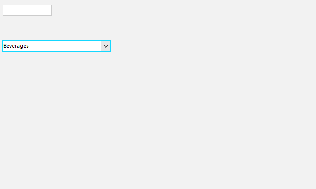

## Environment
 
|Product Version|Product|Author|
|----|----|----|
|2022.2.622|RadMultiColumnComboBox for WinForms|[Desislava Yordanova](https://www.telerik.com/blogs/author/desislava-yordanova)|


## Description

This article shows how to preserve a user-defined valued to RadMultiColumnComboBox when this item is contained in the assigned DataSource collection.

## Solution

In order to keep user-defined values in RadMultiColumnComboBox, note that it is necessary to add it to the assigned DataSource collection. Otherwise, it wouldn't be considered as a valid value. It required handling the Tab or Enter keys for adding the custom defined value to the applied DataSource collection.
  
````C#  

public partial class RadForm1 : Telerik.WinControls.UI.RadForm
{
    public RadForm1()
    {
        InitializeComponent();
    }

    public NwindDataSet DataSet
    {
        get
        {
            return this.nwindDataSet;
        }
    }

    public CategoriesTableAdapter CategoriesTA
    {
        get
        {
            return this.categoriesTableAdapter;
        }
    }

    private void RadForm1_Load(object sender, EventArgs e)
    { 
        this.categoriesTableAdapter.Fill(this.nwindDataSet.Categories);

        this.radMultiColumnComboBox1.DisplayMember = "CategoryName";
        this.radMultiColumnComboBox1.ValueMember = "CategoryID"; 
        this.radMultiColumnComboBox1.DataSource = this.categoriesBindingSource;
        this.radMultiColumnComboBox1.AutoSizeDropDownToBestFit = true;
        this.radMultiColumnComboBox1.CausesValidation = true;

        this.radMultiColumnComboBox1.AutoFilter = true;
        FilterDescriptor myFilter = new FilterDescriptor();
        myFilter.PropertyName = radMultiColumnComboBox1.DisplayMember;
        myFilter.Operator = FilterOperator.Contains;
        radMultiColumnComboBox1.EditorControl.MasterTemplate.FilterDescriptors.Add(myFilter); 
    } 

    public class CustomRadMultiColumnComboBox:RadMultiColumnComboBox
    {
        public override string ThemeClassName  
        { 
            get 
            { 
                return typeof(RadMultiColumnComboBox).FullName;  
            }
        }

        protected override void OnValidated(EventArgs e)
        {
            ProcessCustomText();
            base.OnValidated(e);
        }

        protected override bool ProcessCmdKey(ref Message msg, Keys keyData)
        {
            if (keyData== Keys.Tab || keyData== Keys.Enter)
            {
                ProcessCustomText();
            }
            return base.ProcessCmdKey(ref msg, keyData);
        }

        private void ProcessCustomText()
        {
            RadForm1 f = (RadForm1)this.ElementTree.Control.FindForm();

            NwindDataSet.CategoriesDataTable dt = f.DataSet.Categories;
            for (int i = 0; i < dt.Rows.Count; i++)
            {
                if (dt.Rows[i]["CategoryName"].ToString() == this.Text)
                {
                    return;
                }
            }
            if (this.Text != String.Empty)
            {

                NwindDataSet.CategoriesRow newCategoriesRow = dt.NewCategoriesRow();
                newCategoriesRow.CategoryName = this.Text;
                f.DataSet.Categories.Rows.Add(newCategoriesRow);

                f.CategoriesTA.Update(f.DataSet.Categories);
            }
        }
    }
    
}
         
````
````VB.NET

Public Class RadForm1

    Public ReadOnly Property DataSet As NwindDataSet
        Get
            Return Me.NwindDataSet
        End Get
    End Property

    Public ReadOnly Property CategoriesTA As CategoriesTableAdapter
        Get
            Return Me.CategoriesTableAdapter
        End Get
    End Property

    Private Sub RadForm1_Load(ByVal sender As Object, ByVal e As EventArgs) Handles Me.Load
        Me.CategoriesTableAdapter.Fill(Me.NwindDataSet.Categories)

        Me.RadMultiColumnComboBox1.DisplayMember = "CategoryName"
        Me.RadMultiColumnComboBox1.ValueMember = "CategoryID"
        Me.RadMultiColumnComboBox1.DataSource = Me.CategoriesBindingSource
        Me.RadMultiColumnComboBox1.AutoSizeDropDownToBestFit = True
        Me.RadMultiColumnComboBox1.CausesValidation = True
        Me.RadMultiColumnComboBox1.AutoFilter = True
        Dim myFilter As FilterDescriptor = New FilterDescriptor()
        myFilter.PropertyName = RadMultiColumnComboBox1.DisplayMember
        myFilter.[Operator] = FilterOperator.Contains
        RadMultiColumnComboBox1.EditorControl.MasterTemplate.FilterDescriptors.Add(myFilter)
    End Sub

    Public Class CustomRadMultiColumnComboBox
        Inherits RadMultiColumnComboBox

        Public Overrides Property ThemeClassName As String
            Get
                Return GetType(RadMultiColumnComboBox).FullName
            End Get
            Set(value As String)
                MyBase.ThemeClassName = value
            End Set
        End Property

        Protected Overrides Sub OnValidated(ByVal e As EventArgs)
            ProcessCustomText()
            MyBase.OnValidated(e)
        End Sub

        Protected Overrides Function ProcessCmdKey(ByRef msg As Message, ByVal keyData As Keys) As Boolean
            If keyData = Keys.Tab OrElse keyData = Keys.Enter Then
                ProcessCustomText()
            End If

            Return MyBase.ProcessCmdKey(msg, keyData)
        End Function

        Private Sub ProcessCustomText()
            Dim f As RadForm1 = CType(Me.ElementTree.Control.FindForm(), RadForm1)
            Dim dt As NwindDataSet.CategoriesDataTable = f.DataSet.Categories

            For i As Integer = 0 To dt.Rows.Count - 1

                If dt.Rows(i)("CategoryName").ToString() = Me.Text Then
                    Return
                End If
            Next

            If Me.Text <> String.Empty Then
                Dim newCategoriesRow As NwindDataSet.CategoriesRow = dt.NewCategoriesRow()
                newCategoriesRow.CategoryName = Me.Text
                f.DataSet.Categories.Rows.Add(newCategoriesRow)
                f.CategoriesTA.Update(f.DataSet.Categories)
            End If
        End Sub
    End Class
End Class

````

>note Do not forget to replace the default RadMultiColumnComboBox with the custom one in the Designer.cs file.




# See Also

* [Filtering]()
* [Allow End-Users to Add Items to MultiColumnCombobox Editor]()
* [Allow end-users to add items to DropDownListEditor]()
