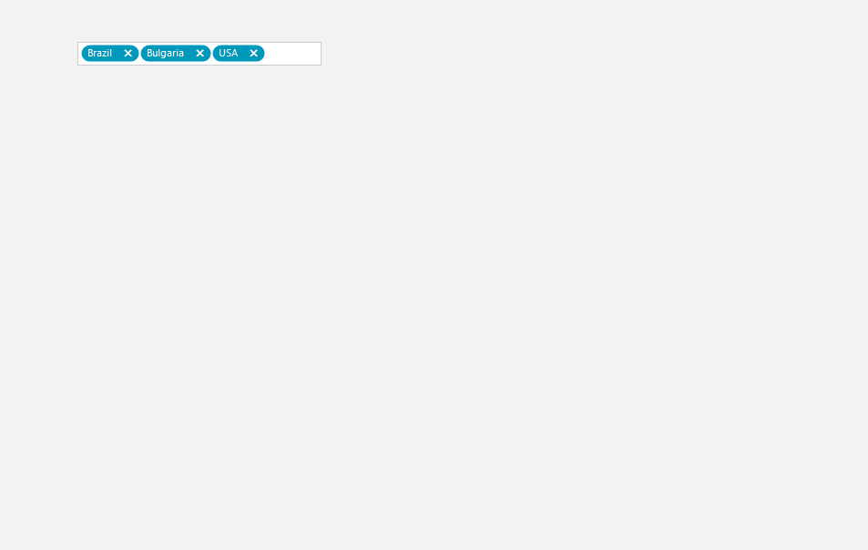

## Environment
 
|Product Version|Product|Author|
|----|----|----|
|2021.1.223|RadAutoCompleteBox for WinForms|[Nadya Karaivanova](https://www.telerik.com/blogs/author/nadya-karaivanova)|
 
## Description

A common requirement is to validate the user action when he/she wants to remove a tokenized item from the text box field in **RadAutoCompleteBox**. This article will demonstrate how you can achieve this by displaying a message box which ensures whether the item should be removed or not.


 
## Solution 

This can be achieved with using a [custom text block element](). First, it is necessary to create a custom class that inherits from the **TokenizedTextBlockElement** class. Then, override the **OnRemoveButtonClick** method where the actual removing of items is happening:


````C#
public class MyTokenizedTextBlockElement : TokenizedTextBlockElement
{
    protected override void CreateChildElements()
    {
        base.CreateChildElements();

    }

    protected override void OnRemoveButtonClick()
    {
        if (RadMessageBox.Show("Are you sure you want to delete item: " + this.Item.Text, "Action needed",
            MessageBoxButtons.YesNo) == System.Windows.Forms.DialogResult.Yes)
        {
            base.OnRemoveButtonClick();
        }
    }
    protected override Type ThemeEffectiveType
    {
        get
        {
            return typeof(TokenizedTextBlockElement);
        }
    }
}

````
````VB.NET
Public Class MyTokenizedTextBlockElement
    Inherits TokenizedTextBlockElement
    Protected Overrides Sub CreateChildElements()
        MyBase.CreateChildElements()
    End Sub
    Protected Overrides Sub OnRemoveButtonClick()
        If RadMessageBox.Show("Are you sure you want to delete item: " & Me.Item.Text, "Action needed", MessageBoxButtons.YesNo) = System.Windows.Forms.DialogResult.Yes Then
            MyBase.OnRemoveButtonClick()
        End If
    End Sub
    Protected Overrides ReadOnly Property ThemeEffectiveType As Type
        Get
            Return GetType(TokenizedTextBlockElement)
        End Get
    End Property
End Class

````

Then, you should replace the default item with the newly created custom one in the **CreateTextBlock** event:

````C#
public RadForm1()
{
    InitializeComponent();

    List<Country> items = new List<Country>();
    items.Add(new Country(1, "Germany"));
    items.Add(new Country(2, "USA"));
    items.Add(new Country(3, "Brazil"));
    items.Add(new Country(4, "Bulgaria"));
    items.Add(new Country(5, "Greece"));
    this.radAutoCompleteBox1.AutoCompleteDataSource = items;
    this.radAutoCompleteBox1.AutoCompleteDisplayMember = "Name";
    this.radAutoCompleteBox1.AutoCompleteValueMember = "Id";
    this.radAutoCompleteBox1.ShowRemoveButton = true;
    this.radAutoCompleteBox1.CreateTextBlock += this.RadAutoCompleteBox1_CreateTextBlock;
}

private void RadAutoCompleteBox1_CreateTextBlock(object sender, CreateTextBlockEventArgs e)
{
    TokenizedTextBlockElement element = e.TextBlock as TokenizedTextBlockElement;
    if (element != null)
    {
        e.TextBlock = new MyTokenizedTextBlockElement();
    }
}

public class Country
{
    public int Id { get; set; }

    public string Name { get; set; }

    public Country(int id, string name)
    {
        this.Id = id;
        this.Name = name;
    }
}


````
````VB.NET
Public Sub New()
    InitializeComponent()
    Dim items As List(Of Country) = New List(Of Country)()
    items.Add(New Country(1, "Germany"))
    items.Add(New Country(2, "USA"))
    items.Add(New Country(3, "Brazil"))
    items.Add(New Country(4, "Bulgaria"))
    items.Add(New Country(5, "Greece"))
    Me.RadAutoCompleteBox1.AutoCompleteDataSource = items
    Me.RadAutoCompleteBox1.AutoCompleteDisplayMember = "Name"
    Me.RadAutoCompleteBox1.AutoCompleteValueMember = "Id"
    Me.RadAutoCompleteBox1.ShowRemoveButton = True
    AddHandler Me.RadAutoCompleteBox1.CreateTextBlock, AddressOf Me.RadAutoCompleteBox1_CreateTextBlock
End Sub

Private Sub RadAutoCompleteBox1_CreateTextBlock(ByVal sender As Object, ByVal e As CreateTextBlockEventArgs)
    Dim element As TokenizedTextBlockElement = TryCast(e.TextBlock, TokenizedTextBlockElement)

    If element IsNot Nothing Then
        e.TextBlock = New MyTokenizedTextBlockElement()
    End If
End Sub

Public Class Country
    Public Property Id As Integer
    Public Property Name As String

    Public Sub New(ByVal id As Integer, ByVal name As String)
        Me.Id = id
        Me.Name = name
    End Sub
End Class


````

