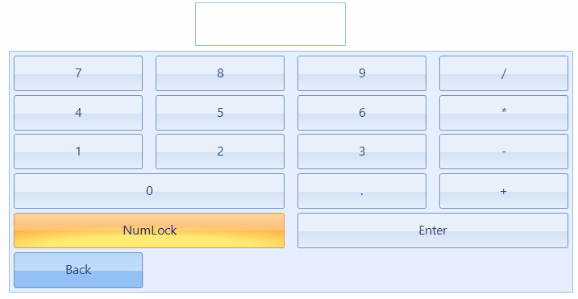

 
## Environment
|Product Version|Product|Author|
|----|----|----|
|2022.2.511|RadChartView for WinForms|[Dinko Krastev](https://www.telerik.com/blogs/author/dinko-krastev)|
 

## Description

A common requirement is to display a virtual keyboard for editing fields in your application in __Numpad__ KeyboardLayoutType. In this keyboard layout type, the Backspace key is not present. There are cases where such key will be require to allow the user to delete wrong enter data.
 
## Solution 

To add an additional key, you can use the __MainLayoutPanel__ property of the control. This property is represented by a __VirtualKeyboardLayoutPanel__ that hosts __VirtualKeyboardLayouts__ and other __VirtualKeyboardLayoutPanels__. In our case, we can get the VirtualKeyboardLayout from __RadVirtualKeyboard.MainLayoutPanel.KeyboardLayouts__ collection. Then we can add an additional row and manually populate the __Keys__ collection with the desired keys. The following code demonstrate this solution. 



````C#

this.radVirtualKeyboard1.LayoutType = KeyboardLayoutType.Numpad;
var virtualKeyboardLayout = this.radVirtualKeyboard1.MainLayoutPanel.KeyboardLayouts[0] as VirtualKeyboardLayout;
Row specialRow = new Row();
specialRow.Keys.Add(new Key(8,"Back", KeyType.Special, 1, 1, true, false));
virtualKeyboardLayout.Rows.Add(specialRow);


````
````VB.NET

Me.radVirtualKeyboard1.LayoutType = KeyboardLayoutType.Numpad
Dim virtualKeyboardLayout = TryCast(Me.radVirtualKeyboard1.MainLayoutPanel.KeyboardLayouts(0), VirtualKeyboardLayout)
Dim specialRow As Row = New Row()
specialRow.Keys.Add(New Key(8, "Back", KeyType.Special, 1, 1, True, False))
virtualKeyboardLayout.Rows.Add(specialRow)


````


 

