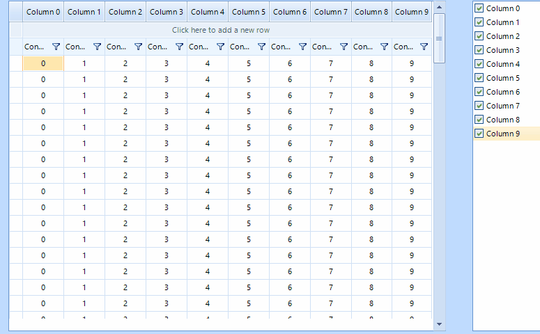

## Environment
|Product Version|Product|Author|
|----|----|----|
|2022.2.622|Scheduler for WinForms|[Dinko Krastev](https://www.telerik.com/blogs/author/dinko-krastev)|
 

## Description
RadVirtualGrid is a control providing a convenient UI to display only the visible part of a large set of data. By definition, not all of that data needs to be visually available. This article aims to show you how to show/hide columns in RadVirtualGrid depending on the user requirements.

## Solution 

In this example, we will demonstrate how to use RadCheckedListBox to list all columns in the RadVirtualGrid. Then using the checkbox on each item we can show/hide columns in the RadVirtualGrid control.



````C#

public partial class RadForm1 : Telerik.WinControls.UI.RadForm
{
    DataTable data;
    List<string> visibleColumns = new List<string>();
    List<string> columnNames = new List<string>();
    public RadForm1()
    {
        InitializeComponent();
        data = GetTable();
        for (int i = 0; i < 10; i++)
        {
            string name = "Column " + i;
            radCheckedListBox1.Items.Add(name);
            this.visibleColumns.Add(name);
            this.columnNames.Add(name);
        }

        foreach (var item in radCheckedListBox1.Items)
        {
            item.CheckState = Telerik.WinControls.Enumerations.ToggleState.On;
        }

        radCheckedListBox1.ItemCheckedChanged += RadCheckedListBox1_ItemCheckedChanged;
            
        radVirtualGrid1.CellValueNeeded += RadVirtualGrid1_CellValueNeeded;

        radVirtualGrid1.RowCount = data.Rows.Count;
        radVirtualGrid1.ColumnCount = radCheckedListBox1.CheckedItems.Count;
        radVirtualGrid1.AutoSizeColumnsMode = VirtualGridAutoSizeColumnsMode.Fill;
    }

    private void RadVirtualGrid1_CellValueNeeded(object sender, Telerik.WinControls.UI.VirtualGridCellValueNeededEventArgs e)
    {
        if (e.ColumnIndex < 0 || e.ColumnIndex >= radVirtualGrid1.ColumnCount) return;

        if (e.RowIndex == RadVirtualGrid.HeaderRowIndex)
        {
            e.Value = data.Columns[this.visibleColumns[e.ColumnIndex]];
        }

        if (e.RowIndex < 0)
        {
            return;
        }

        var row = data.Rows[e.RowIndex];
        e.Value = row[this.visibleColumns[e.ColumnIndex]];
    }

    private void RadCheckedListBox1_ItemCheckedChanged(object sender, Telerik.WinControls.UI.ListViewItemEventArgs e)
	{
		if (e.Item.CheckState == Telerik.WinControls.Enumerations.ToggleState.Off)
		{
			this.visibleColumns.Remove(e.Item.Text);
			this.radVirtualGrid1.ColumnCount = 0;
			this.radVirtualGrid1.ColumnCount = this.visibleColumns.Count;
		}
		else
		{
			this.visibleColumns.Add(e.Item.Text);
			this.visibleColumns.Sort(new ColumnNamesComparer(this.columnNames));
		}

		radVirtualGrid1.ColumnCount = this.visibleColumns.Count;
	}

    static DataTable GetTable()
    {

        DataTable table = new DataTable();
        for (int i = 0; i < 10; i++)
        {
            table.Columns.Add("Column " + i, typeof(int));
        }

        for (int i = 0; i < 100; i++)
        {

            table.Rows.Add(new object[] { 0, 1, 2, 3, 4, 5, 6, 7, 8, 9 });
        }

        return table;
    }
}

public class ColumnNamesComparer : IComparer<string>
{
    public List<string> columnOrder;

    public ColumnNamesComparer(List<string> order)
    {
        this.columnOrder = order;
    }

    public int Compare(string x, string y)
    {
        return this.columnOrder.IndexOf(x).CompareTo(this.columnOrder.IndexOf(y));
    }
}

       
````
````VB.NET

Partial Public Class RadForm1
    Inherits Telerik.WinControls.UI.RadForm

    Private data As DataTable
    Private visibleColumns As List(Of String) = New List(Of String)()
    Private columnNames As List(Of String) = New List(Of String)()

    Public Sub New()
        InitializeComponent()
        data = GetTable()

        For i As Integer = 0 To 10 - 1
            Dim name As String = "Column " & i
            radCheckedListBox1.Items.Add(name)
            Me.visibleColumns.Add(name)
            Me.columnNames.Add(name)
        Next

        For Each item In radCheckedListBox1.Items
            item.CheckState = Telerik.WinControls.Enumerations.ToggleState.[On]
        Next

        AddHandler radCheckedListBox1.ItemCheckedChanged, AddressOf RadCheckedListBox1_ItemCheckedChanged
        AddHandler radVirtualGrid1.CellValueNeeded, AddressOf RadVirtualGrid1_CellValueNeeded
        radVirtualGrid1.RowCount = data.Rows.Count
        radVirtualGrid1.ColumnCount = radCheckedListBox1.CheckedItems.Count
        radVirtualGrid1.AutoSizeColumnsMode = VirtualGridAutoSizeColumnsMode.Fill
    End Sub

    Private Sub RadVirtualGrid1_CellValueNeeded(ByVal sender As Object, ByVal e As Telerik.WinControls.UI.VirtualGridCellValueNeededEventArgs)
        If e.ColumnIndex < 0 OrElse e.ColumnIndex >= radVirtualGrid1.ColumnCount Then Return

        If e.RowIndex = RadVirtualGrid.HeaderRowIndex Then
            e.Value = data.Columns(Me.visibleColumns(e.ColumnIndex))
        End If

        If e.RowIndex < 0 Then
            Return
        End If

        Dim row = data.Rows(e.RowIndex)
        e.Value = row(Me.visibleColumns(e.ColumnIndex))
    End Sub

    Private Sub RadCheckedListBox1_ItemCheckedChanged(ByVal sender As Object, ByVal e As Telerik.WinControls.UI.ListViewItemEventArgs)
		If e.Item.CheckState = Telerik.WinControls.Enumerations.ToggleState.Off Then
			Me.visibleColumns.Remove(e.Item.Text)
			Me.radVirtualGrid1.ColumnCount = 0
			Me.radVirtualGrid1.ColumnCount = Me.visibleColumns.Count
		Else
			Me.visibleColumns.Add(e.Item.Text)
			Me.visibleColumns.Sort(New ColumnNamesComparer(Me.columnNames))
		End If

		radVirtualGrid1.ColumnCount = Me.visibleColumns.Count
	End Sub

    Private Shared Function GetTable() As DataTable
        Dim table As DataTable = New DataTable()

        For i As Integer = 0 To 10 - 1
            table.Columns.Add("Column " & i, GetType(Integer))
        Next

        For i As Integer = 0 To 100 - 1
            table.Rows.Add(New Object() {0, 1, 2, 3, 4, 5, 6, 7, 8, 9})
        Next

        Return table
    End Function
End Class

Public Class ColumnNamesComparer
    Implements IComparer(Of String)

    Public columnOrder As List(Of String)

    Public Sub New(ByVal order As List(Of String))
        Me.columnOrder = order
    End Sub

    Private Function IComparer_Compare(x As String, y As String) As Integer Implements IComparer(Of String).Compare
        Return Me.columnOrder.IndexOf(x).CompareTo(Me.columnOrder.IndexOf(y))
    End Function
End Class


````


