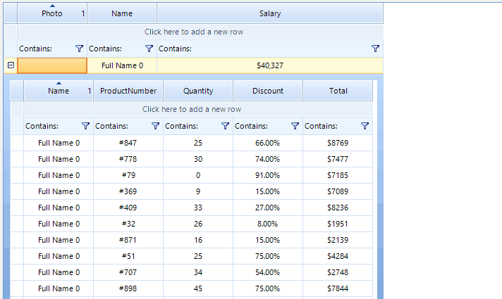

## Environment
|Product Version|Product|Author|
|----|----|----|
|2024.1.312|VirtualGrid for WinForms|[Dinko Krastev](https://www.telerik.com/blogs/author/dinko-krastev)|
 
## Description

Marking the column sort number is not supported out of the box. In this article, we will demonstrate how you can add a custom element in the header cell to show the sort index of the column.



## Solution 

What we need to do first is to add an additional element in the __VirtualGridHeaderCellElement__ which will hold the sorting index.

````C#

public class MyHeaderCellElement : VirtualGridHeaderCellElement
{
    public LightVisualElement lightVisualElement;

    protected override void CreateChildElements()
    {
        base.CreateChildElements();

        this.lightVisualElement = new LightVisualElement();
        this.Children.Add(this.lightVisualElement);
    }

    public override bool IsCompatible(int data, object context)
    {
        return true;
    }

    protected override SizeF ArrangeOverride(SizeF finalSize)
    {
        SizeF size = base.ArrangeOverride(finalSize);

        this.lightVisualElement.Arrange(new RectangleF((finalSize.Width - this.lightVisualElement.DesiredSize.Width) ,
            (finalSize.Height - this.lightVisualElement.DesiredSize.Height) / 2f, this.lightVisualElement.DesiredSize.Width, this.lightVisualElement.DesiredSize.Height));

        return size;
    }

    protected override Type ThemeEffectiveType
    {
        get
        {
            return typeof(VirtualGridHeaderCellElement);
        }
    }
}


       
````
````VB.NET

Public Class MyHeaderCellElement
    Inherits VirtualGridHeaderCellElement

    Public lightVisualElement As LightVisualElement

    Protected Overrides Sub CreateChildElements()
        MyBase.CreateChildElements()
        Me.lightVisualElement = New LightVisualElement()
        Me.Children.Add(Me.lightVisualElement)
    End Sub

    Public Overrides Function IsCompatible(ByVal data As Integer, ByVal context As Object) As Boolean
        Return True
    End Function

    Protected Overrides Function ArrangeOverride(ByVal finalSize As SizeF) As SizeF
        Dim size As SizeF = MyBase.ArrangeOverride(finalSize)
        Me.lightVisualElement.Arrange(New RectangleF((finalSize.Width - Me.lightVisualElement.DesiredSize.Width), (finalSize.Height - Me.lightVisualElement.DesiredSize.Height) / 2F, Me.lightVisualElement.DesiredSize.Width, Me.lightVisualElement.DesiredSize.Height))
        Return size
    End Function

    Protected Overrides ReadOnly Property ThemeEffectiveType As Type
        Get
            Return GetType(VirtualGridHeaderCellElement)
        End Get
    End Property
End Class


````


We can replace the default __VirtualGridHeaderCellElement__ in the CreateCellElement event.

````C#

private void RadVirtualGrid1_CreateCellElement(object sender, VirtualGridCreateCellEventArgs e)
{
    if (e.CellType == typeof(VirtualGridHeaderCellElement))
    {
        e.CellElement = new MyHeaderCellElement();
    }            
}

       
````
````VB.NET

Private Sub RadVirtualGrid1_CreateCellElement(ByVal sender As Object, ByVal e As VirtualGridCreateCellEventArgs)
    If e.CellType = GetType(VirtualGridHeaderCellElement) Then
        e.CellElement = New MyHeaderCellElement()
    End If
End Sub


````

Then we can subscribe to the SortChanged event. Inside the event handler, we can get the header cells to check if they are sorted by comparing them with the sort Expression.

````C#

private void RadVirtualGrid1_SortChanged(object sender, VirtualGridEventArgs e)
{
    var gridElement = sender as RadVirtualGridElement;
    VirtualGridTableElement tableElement = null;
    if (e.ViewInfo.ParentRowIndex >= 0)
    {
		// This will get the hierarchical grid table element
        var scroll = (gridElement.TableElement.ViewElement.Children[0].Children[0] as VirtualGridRowElement).Children.Last() as VirtualGridDetailViewCellElement;
        tableElement = scroll.Children[0] as VirtualGridTableElement;
    }
    else
    {
        tableElement = gridElement.TableElement;
    }
            
    var virtualGridHeaderRowElement = tableElement.ViewElement.TopPinnedRows.Children[0];
   
    if (virtualGridHeaderRowElement != null)
    {
        if (virtualGridHeaderRowElement.Children.Count > 0)
        {
            var headerCells = virtualGridHeaderRowElement.Children[2].Children;
            // var headerCells2 = test.Children[2].Children;

            foreach (MyHeaderCellElement myHeaderCellElement in headerCells)
            {

                List<string> sortExpressions = e.ViewInfo.SortDescriptors.Expression.Split(new string[] { "," }, StringSplitOptions.RemoveEmptyEntries).ToList();

                if (sortExpressions.Count == 0)
                {
                    myHeaderCellElement.lightVisualElement.Text = "";
                    continue;
                }

                List<string> sortedColumns = new List<string>();

                foreach (var item in sortExpressions)
                {
                    var headerName = item.Replace("ASC", "").Replace("DESC", "").Replace(" ", "");
                    sortedColumns.Add(headerName);
                }

                var headerText = myHeaderCellElement.Text.Replace(" ", "");

                if (sortedColumns.Contains(myHeaderCellElement.Text.Replace(" ", "")))
                {
                    myHeaderCellElement.lightVisualElement.Text = sortedColumns.IndexOf(headerText) + 1 + "";
                }
                else
                {
                    myHeaderCellElement.lightVisualElement.Text = "";
                }
            }
        }
    }
}

       
````
````VB.NET

Private Sub RadVirtualGrid1_SortChanged(ByVal sender As Object, ByVal e As VirtualGridEventArgs)
    Dim gridElement = TryCast(sender, RadVirtualGridElement)
    Dim tableElement As VirtualGridTableElement = Nothing

    If e.ViewInfo.ParentRowIndex >= 0 Then
        Dim scroll = TryCast((TryCast(gridElement.TableElement.ViewElement.Children(0).Children(0), VirtualGridRowElement)).Children.Last(), VirtualGridDetailViewCellElement)
        tableElement = TryCast(scroll.Children(0), VirtualGridTableElement)
    Else
        tableElement = gridElement.TableElement
    End If

    Dim virtualGridHeaderRowElement = tableElement.ViewElement.TopPinnedRows.Children(0)

    If virtualGridHeaderRowElement IsNot Nothing Then

        If virtualGridHeaderRowElement.Children.Count > 0 Then
            Dim headerCells = virtualGridHeaderRowElement.Children(2).Children

            For Each myHeaderCellElement As MyHeaderCellElement In headerCells
                Dim sortExpressions As List(Of String) = e.ViewInfo.SortDescriptors.Expression.Split(New String() {","}, StringSplitOptions.RemoveEmptyEntries).ToList()

                If sortExpressions.Count = 0 Then
                    myHeaderCellElement.lightVisualElement.Text = ""
                    Continue For
                End If

                Dim sortedColumns As List(Of String) = New List(Of String)()

                For Each item In sortExpressions
                    Dim headerName = item.Replace("ASC", "").Replace("DESC", "").Replace(" ", "")
                    sortedColumns.Add(headerName)
                Next

                Dim headerText = myHeaderCellElement.Text.Replace(" ", "")

                If sortedColumns.Contains(myHeaderCellElement.Text.Replace(" ", "")) Then
                    myHeaderCellElement.lightVisualElement.Text = sortedColumns.IndexOf(headerText) + 1 & ""
                Else
                    myHeaderCellElement.lightVisualElement.Text = ""
                End If
            Next
        End If
    End If
End Sub


````


