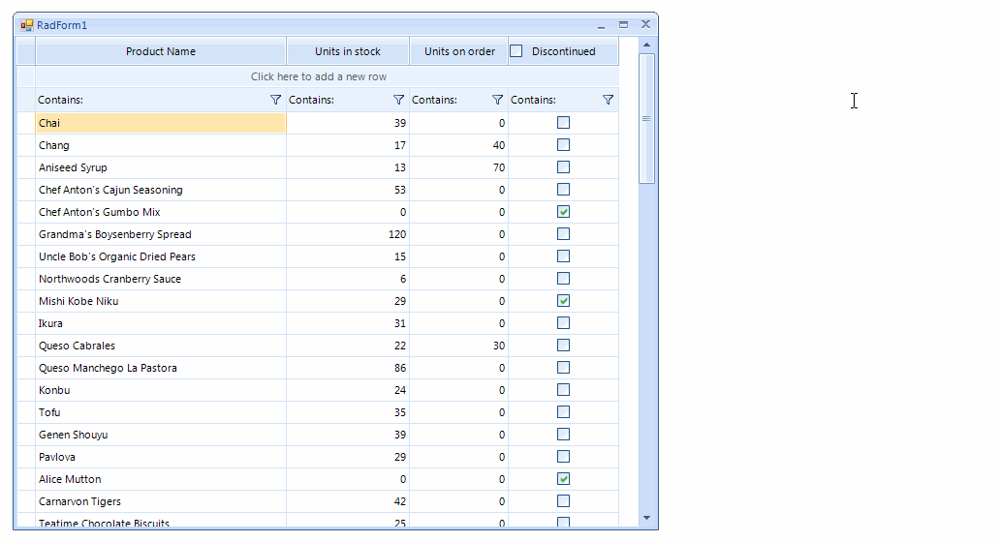

## Environment
 
|Product Version|Product|Author|
|----|----|----|
|2019.1.219|RadVirtualGrid for WinForms|[Desislava Yordanova](https://www.telerik.com/blogs/author/desislava-yordanova)|
 

## Description

This article aims to show you how to create a check box column in **RadVirtualGrid** that contains a check box in the header cell in order to check/uncheck all records.
 


## Solution 

The [CellValueNeeded]() event in **RadVirtualGrid** is responsible for populating the grid with data extracting the records from the external data source. The [CellValuePushed]() event is the appropriate place to push the changes to the external source collection. 

**RadVirtualGrid** supports a powerful and flexible mechanism for creating cell types with custom content elements, functionality and properties. A sample approach how to create a check-box column is demonstrated in the following help article: [Creating custom cells](). We will extend this example to include a header check-box that will check/uncheck all records in **RadVirtualGrid**.

1\. Create a derivative of the **VirtualGridHeaderCellElement** class and add a **RadCheckBoxElement** in the **CreateChildElements** event. In the **ToggleStateChanged** event of the check-box you should update the toggle state of the records inside the grid:

#### Custom VirtualGridHeaderCellElement

````C#
        public class CustomVirtualGridHeaderCellElement : VirtualGridHeaderCellElement
        {
            RadCheckBoxElement headerCheckBox = new RadCheckBoxElement();

            protected override Type ThemeEffectiveType
            {
                get
                {
                    return typeof(VirtualGridHeaderCellElement);
                }
            }

            public override bool IsCompatible(int data, object context)
            {
                return data == 3;
            }

            protected override void CreateChildElements()
            {
                base.CreateChildElements();
                this.Children.Add(headerCheckBox);
                this.headerCheckBox.ToggleStateChanged += headerCheckBox_ToggleStateChanged;
            }

            public override void Synchronize()
            {
                base.Synchronize();
                this.headerCheckBox.ToggleStateChanged -= headerCheckBox_ToggleStateChanged;
                headerCheckBox.IsChecked = GetCheckState(this.ColumnIndex);
                this.headerCheckBox.ToggleStateChanged += headerCheckBox_ToggleStateChanged;
            }

            private bool GetCheckState(int columnIndex)
            {
                bool isChecked = true;
                for (int i = 0; i < this.TableElement.RowCount; i++)
                {
                    isChecked &= (bool)((CustomRadVirtualGridElement)this.TableElement.GridElement).GetCellValue(this.headerCheckBox.Checked, i, this.ColumnIndex, this.ViewInfo);
                    if (isChecked == false)
                    {
                        break;
                    }
                }
                return isChecked;
            }

            private void headerCheckBox_ToggleStateChanged(object sender, StateChangedEventArgs args)
            {
                for (int i = 0; i < this.TableElement.RowCount; i++)
                {
                    this.TableElement.GridElement.SetCellValue(this.headerCheckBox.Checked, i, this.ColumnIndex, this.ViewInfo);
                }
                this.TableElement.SynchronizeRows();
            }
        }

       
````
````VB.NET

     Public Class CustomVirtualGridHeaderCellElement
    Inherits VirtualGridHeaderCellElement

        Private headerCheckBox As RadCheckBoxElement

        Protected Overrides ReadOnly Property ThemeEffectiveType As Type
            Get
                Return GetType(VirtualGridHeaderCellElement)
            End Get
        End Property

        Public Overrides Function IsCompatible(ByVal data As Integer, ByVal context As Object) As Boolean
            Return data = 3
        End Function

        Protected Overrides Sub CreateChildElements()
            MyBase.CreateChildElements()
            headerCheckBox = New RadCheckBoxElement()
            Me.Children.Add(headerCheckBox)
            AddHandler Me.headerCheckBox.ToggleStateChanged, AddressOf headerCheckBox_ToggleStateChanged
        End Sub

        Public Overrides Sub Synchronize()
            MyBase.Synchronize()
            RemoveHandler Me.headerCheckBox.ToggleStateChanged, AddressOf headerCheckBox_ToggleStateChanged
            headerCheckBox.IsChecked = GetCheckState(Me.ColumnIndex)
            AddHandler Me.headerCheckBox.ToggleStateChanged, AddressOf headerCheckBox_ToggleStateChanged
        End Sub

        Private Function GetCheckState(ByVal columnIndex As Integer) As Boolean
            Dim isChecked As Boolean = True

            For i As Integer = 0 To Me.TableElement.RowCount - 1
                isChecked = isChecked And CBool((CType(Me.TableElement.GridElement, CustomRadVirtualGridElement)).GetCellValue(Me.headerCheckBox.Checked, i, Me.ColumnIndex, Me.ViewInfo))

                If isChecked = False Then
                    Exit For
                End If
            Next

            Return isChecked
        End Function

        Private Sub headerCheckBox_ToggleStateChanged(ByVal sender As Object, ByVal args As StateChangedEventArgs)
            For i As Integer = 0 To Me.TableElement.RowCount - 1
                Me.TableElement.GridElement.SetCellValue(Me.headerCheckBox.Checked, i, Me.ColumnIndex, Me.ViewInfo)
            Next

            Me.TableElement.SynchronizeRows()
        End Sub
    End Class  

````

2\. Handle the **CreateCellElement** event and for the header row (which row index is *-1*) use the custom header cell:

#### Apply the custom VirtualGridHeaderCellElement

````C#
        private void radVirtualGrid1_CreateCellElement(object sender, VirtualGridCreateCellEventArgs e)
        {
            if (e.ColumnIndex == 3)
            {
                if (e.RowIndex >= 0)
                {
                    e.CellElement = new MyVirtualGridCheckBoxCellElement();
                }
            }

            if (e.RowIndex == -1)
            {
                if (e.ColumnIndex == 3)
                {
                    e.CellElement = new CustomVirtualGridHeaderCellElement();
                }
            }
        }

       
````
````VB.NET

    Private Sub radVirtualGrid1_CreateCellElement(ByVal sender As Object, ByVal e As VirtualGridCreateCellEventArgs)
        If e.ColumnIndex = 3 Then

            If e.RowIndex >= 0 Then
                e.CellElement = New MyVirtualGridCheckBoxCellElement()
            End If
        End If

        If e.RowIndex = -1 Then

            If e.ColumnIndex = 3 Then
                e.CellElement = New CustomVirtualGridHeaderCellElement()
            End If
        End If
    End Sub   

````

3\. Since you need to iterate the boolean values for all records in the virtual grid in order to determine the value for the header check-box, it is necessary to create a public **GetCellValue** method for the **RadVirtualGridElement**. For this purpose, it is necessary to create a custom **RadVirtualGrid** as follows:

#### Create a custom RadVirtualGrid

````C#

        public class CustomVirtualGrid : RadVirtualGrid
        {
            public override string ThemeClassName
            {
                get
                {
                    return typeof(RadVirtualGrid).FullName;
                }
            }

            protected override RadVirtualGridElement CreateElement()
            {
                return new CustomRadVirtualGridElement();
            }
        }

        public class CustomRadVirtualGridElement : RadVirtualGridElement
        {
            public object GetCellValue(object value, int rowIndex, int columnIndex, VirtualGridViewInfo viewInfo)
            {
                VirtualGridCellValueNeededEventArgs args = new VirtualGridCellValueNeededEventArgs(rowIndex, columnIndex, viewInfo);
                this.OnCellValueNeeded(args);
                return args.Value;
            }
        }

       
````
````VB.NET

    Public Class CustomVirtualGrid
    Inherits RadVirtualGrid

        Public Overrides Property ThemeClassName As String
            Get
                Return GetType(RadVirtualGrid).FullName
            End Get
            Set(value As String)
                MyBase.ThemeClassName = value
            End Set
        End Property

        Protected Overrides Function CreateElement() As RadVirtualGridElement
            Return New CustomRadVirtualGridElement()
        End Function
    End Class

    Public Class CustomRadVirtualGridElement
    Inherits RadVirtualGridElement

        Public Function GetCellValue(ByVal value As Object, ByVal rowIndex As Integer, ByVal columnIndex As Integer, ByVal viewInfo As VirtualGridViewInfo) As Object
            Dim args As VirtualGridCellValueNeededEventArgs = New VirtualGridCellValueNeededEventArgs(rowIndex, columnIndex, viewInfo)
            Me.OnCellValueNeeded(args)
            Return args.Value
        End Function
    End Class  

        
````

>tip A complete solution providing a C# and VB.NET project is available [here](https://github.com/telerik/winforms-sdk/tree/master/VirtualGrid/VirtualGridHeaderCheckBox).
