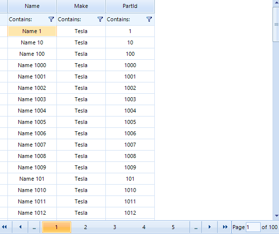

## Environment
|Product Version|Product|Author|
|----|----|----|
|2022.2.511|Scheduler for WinForms|[Dinko Krastev](https://www.telerik.com/blogs/author/dinko-krastev)|
 

## Description
RadVirtualGrid is a control providing a convenient UI to display only the visible part of a large set of data. By definition, not all of that data needs to be available locally. This article aims to show you how to add paging with filter and sort functionalities in RadVirtualGrid.

## Solution 

In this example, we will demonstrate how to use the PageChanging, CellValueNeeded, FilterChanged, and SortChanged to populate the VirtualGrid viewport with data on the current page.



````C#

public partial class Form1 : Form
{
    List<CarPart> repository = new List<CarPart>();
    List<CarPart> data = new List<CarPart>();
    int count = 0;
    bool shouldCancel = false;
    private string[] columnNames = new string[] { "Name","Make","PartId"};
    public Form1()
    {
        for (int i = 1; i < 10000; i++)
        {
            repository.Add(new CarPart()
            {
                Name = "Name " + i,
                Make = "Tesla",
                PartId = i
            });
        }

        InitializeComponent();

        this.radVirtualGrid1.ColumnCount = columnNames.Length;
        this.radVirtualGrid1.PageChanging += RadVirtualGrid1_PageChanging;
        this.radVirtualGrid1.CellEditorInitialized += RadVirtualGrid1_CellEditorInitialized;
        this.radVirtualGrid1.FilterChanged += radVirtualGrid1_FilterChanged;
        this.radVirtualGrid1.SortChanged  += radVirtualGrid1_SortChanged;
        SelectData();
    }

    private void RadVirtualGrid1_CellEditorInitialized(object sender, VirtualGridCellEditorInitializedEventArgs e)
    {
        VirtualGridCellElement currentCell = null;
        foreach (VirtualGridCellElement cellElement in this.radVirtualGrid1.VirtualGridElement.GetDescendants(
            delegate (RadElement x) { return x is VirtualGridFilterCellElement; },
            TreeTraversalMode.BreadthFirst))
        {
            if (cellElement.RowIndex == e.RowIndex && cellElement.ColumnIndex == e.ColumnIndex && cellElement.ViewInfo == e.ViewInfo)
            {
                currentCell = cellElement;
            }
        }

        if (e.RowIndex < 0 && currentCell != null)
        {
            VirtualGridTextBoxEditor textBoxEditor = e.ActiveEditor as VirtualGridTextBoxEditor;
            if (textBoxEditor != null)
            {
                this.count = 0;
                this.shouldCancel = false;

                RadTextBoxEditorElement el = textBoxEditor.EditorElement as RadTextBoxEditorElement;
                el.KeyDown -= el_KeyDown;
                el.KeyDown += el_KeyDown;

            }
        }
    }

       
    private void el_KeyDown(object sender, KeyEventArgs e)
    {
        this.shouldCancel = ++count % 3 != 0;
        if (!this.shouldCancel)
        {
            count = 0;
        }
    }

    private void RadVirtualGrid1_PageChanging(object sender, VirtualGridPageChangingEventArgs e)
    {
        SelectData(e.NewIndex);
    }

    private void SelectData(int pageIndex = -1)
    {
        //Assume IQueryable
        var query = from data in repository select data;

        string sortProperty = this.radVirtualGrid1.SortDescriptors.FirstOrDefault()?.PropertyName;

        if (string.IsNullOrEmpty(sortProperty) || sortProperty == "Name")
        {
            if (string.IsNullOrEmpty(sortProperty) || this.radVirtualGrid1.SortDescriptors.First().Direction == ListSortDirection.Ascending)
            {
                query = query.OrderBy(x => x.Name);
            }
            else
            {
                query = query.OrderByDescending(x => x.Name);
            }
        }
        else if (sortProperty == "Make")
        {
            if (this.radVirtualGrid1.SortDescriptors.First().Direction == ListSortDirection.Ascending)
            {
                query = query.OrderBy(x => x.Make);
            }
            else
            {
                query = query.OrderByDescending(x => x.Make);
            }
        }
        else if (sortProperty == "PartId")
        {
            if (this.radVirtualGrid1.SortDescriptors.First().Direction == ListSortDirection.Ascending)
            {
                query = query.OrderBy(x => x.PartId);
            }
            else
            {
                query = query.OrderByDescending(x => x.PartId);
            }
        }

        //Contains only
        foreach (var filters in radVirtualGrid1.FilterDescriptors)
        {
            if(filters.Value == null)
            {
                continue;
            }
            if (filters.PropertyName == "Name")
            {
                query = query.Where(x => x.Name.Contains(filters.Value.ToString()));
            }
            if (filters.PropertyName == "Make")
            {
                query = query.Where(x => x.Make.Contains(filters.Value.ToString()));
            }
            if (filters.PropertyName == "PartId")
            {
                query = query.Where(x => x.PartId.ToString().Contains(filters.Value.ToString()));
            }
        }

        //Retrieve only needed page
        if (pageIndex == -1)
        {
            pageIndex = radVirtualGrid1.PageIndex;
        }

        data = query.Skip(pageIndex * radVirtualGrid1.PageSize).Take(radVirtualGrid1.PageSize).ToList();
        radVirtualGrid1.RowCount = query.Count();
    }

    private void radVirtualGrid1_SortChanged(object sender, VirtualGridEventArgs e)
    {
        SelectData();
    }

    private void radVirtualGrid1_FilterChanged(object sender, VirtualGridEventArgs e)
    {           
        SelectData();            
    }

    private void radVirtualGrid1_CellValueNeeded(object sender, Telerik.WinControls.UI.VirtualGridCellValueNeededEventArgs e)
    {
        if (e.ColumnIndex < 0)
            return;
        if (e.RowIndex == RadVirtualGrid.HeaderRowIndex)
        {
            e.Value = columnNames[e.ColumnIndex];
        }

        if (e.RowIndex < 0)
        {
            e.FieldName = columnNames[e.ColumnIndex];
        }

        if (e.RowIndex >= 0 && e.RowIndex < data.Count * (this.radVirtualGrid1.PageIndex + 1))
        {
            int index = e.RowIndex - this.radVirtualGrid1.PageSize * this.radVirtualGrid1.PageIndex;
            e.Value = data[index][e.ColumnIndex];
        }
    }
}

       
````
````VB.NET

Public Partial Class Form1
    Inherits Form

    Private repository As List(Of CarPart) = New List(Of CarPart)()
    Private data As List(Of CarPart) = New List(Of CarPart)()
    Private count As Integer = 0
    Private shouldCancel As Boolean = False
    Private columnNames As String() = New String() {"Name", "Make", "PartId"}

    Public Sub New()
        For i As Integer = 1 To 10000 - 1
            repository.Add(New CarPart() With {
                .Name = "Name " & i,
                .Make = "Tesla",
                .PartId = i
            })
        Next

        InitializeComponent()
        Me.radVirtualGrid1.ColumnCount = columnNames.Length
        AddHandler Me.radVirtualGrid1.PageChanging, AddressOf RadVirtualGrid1_PageChanging
        AddHandler Me.radVirtualGrid1.CellEditorInitialized, AddressOf RadVirtualGrid1_CellEditorInitialized
        AddHandler Me.radVirtualGrid1.FilterChanged, AddressOf radVirtualGrid1_FilterChanged
        AddHandler Me.radVirtualGrid1.SortChanged, AddressOf radVirtualGrid1_SortChanged
        SelectData()
    End Sub

    Private Sub RadVirtualGrid1_CellEditorInitialized(ByVal sender As Object, ByVal e As VirtualGridCellEditorInitializedEventArgs)
        Dim currentCell As VirtualGridCellElement = Nothing

        For Each cellElement As VirtualGridCellElement In Me.radVirtualGrid1.VirtualGridElement.GetDescendants(Function(ByVal x As RadElement) TypeOf x Is VirtualGridFilterCellElement, TreeTraversalMode.BreadthFirst)

            If cellElement.RowIndex = e.RowIndex AndAlso cellElement.ColumnIndex = e.ColumnIndex AndAlso cellElement.ViewInfo = e.ViewInfo Then
                currentCell = cellElement
            End If
        Next

        If e.RowIndex < 0 AndAlso currentCell IsNot Nothing Then
            Dim textBoxEditor As VirtualGridTextBoxEditor = TryCast(e.ActiveEditor, VirtualGridTextBoxEditor)

            If textBoxEditor IsNot Nothing Then
                Me.count = 0
                Me.shouldCancel = False
                Dim el As RadTextBoxEditorElement = TryCast(textBoxEditor.EditorElement, RadTextBoxEditorElement)
                RemoveHandler el.KeyDown, AddressOf el_KeyDown
                AddHandler el.KeyDown, AddressOf el_KeyDown
            End If
        End If
    End Sub

    Private Sub el_KeyDown(ByVal sender As Object, ByVal e As KeyEventArgs)
        Me.shouldCancel = System.Threading.Interlocked.Increment(count) Mod 3 <> 0

        If Not Me.shouldCancel Then
            count = 0
        End If
    End Sub

    Private Sub RadVirtualGrid1_PageChanging(ByVal sender As Object, ByVal e As VirtualGridPageChangingEventArgs)
        SelectData(e.NewIndex)
    End Sub

    Private Sub SelectData(ByVal Optional pageIndex As Integer = -1)
        Dim query = From data In repository Select data
        Dim sortProperty As String = Me.radVirtualGrid1.SortDescriptors.FirstOrDefault()?.PropertyName

        If String.IsNullOrEmpty(sortProperty) OrElse sortProperty = "Name" Then

            If String.IsNullOrEmpty(sortProperty) OrElse Me.radVirtualGrid1.SortDescriptors.First().Direction = ListSortDirection.Ascending Then
                query = query.OrderBy(Function(x) x.Name)
            Else
                query = query.OrderByDescending(Function(x) x.Name)
            End If
        ElseIf sortProperty = "Make" Then

            If Me.radVirtualGrid1.SortDescriptors.First().Direction = ListSortDirection.Ascending Then
                query = query.OrderBy(Function(x) x.Make)
            Else
                query = query.OrderByDescending(Function(x) x.Make)
            End If
        ElseIf sortProperty = "PartId" Then

            If Me.radVirtualGrid1.SortDescriptors.First().Direction = ListSortDirection.Ascending Then
                query = query.OrderBy(Function(x) x.PartId)
            Else
                query = query.OrderByDescending(Function(x) x.PartId)
            End If
        End If

        For Each filters In radVirtualGrid1.FilterDescriptors

            If filters.Value Is Nothing Then
                Continue For
            End If

            If filters.PropertyName = "Name" Then
                query = query.Where(Function(x) x.Name.Contains(filters.Value.ToString()))
            End If

            If filters.PropertyName = "Make" Then
                query = query.Where(Function(x) x.Make.Contains(filters.Value.ToString()))
            End If

            If filters.PropertyName = "PartId" Then
                query = query.Where(Function(x) x.PartId.ToString().Contains(filters.Value.ToString()))
            End If
        Next

        If pageIndex = -1 Then
            pageIndex = radVirtualGrid1.PageIndex
        End If

        data = query.Skip(pageIndex * radVirtualGrid1.PageSize).Take(radVirtualGrid1.PageSize).ToList()
        radVirtualGrid1.RowCount = query.Count()
    End Sub

    Private Sub radVirtualGrid1_SortChanged(ByVal sender As Object, ByVal e As VirtualGridEventArgs)
        SelectData()
    End Sub

    Private Sub radVirtualGrid1_FilterChanged(ByVal sender As Object, ByVal e As VirtualGridEventArgs)
        SelectData()
    End Sub

    Private Sub radVirtualGrid1_CellValueNeeded(ByVal sender As Object, ByVal e As Telerik.WinControls.UI.VirtualGridCellValueNeededEventArgs)
        If e.ColumnIndex < 0 Then Return

        If e.RowIndex = RadVirtualGrid.HeaderRowIndex Then
            e.Value = columnNames(e.ColumnIndex)
        End If

        If e.RowIndex < 0 Then
            e.FieldName = columnNames(e.ColumnIndex)
        End If

        If e.RowIndex >= 0 AndAlso e.RowIndex < data.Count * (Me.radVirtualGrid1.PageIndex + 1) Then
            Dim index As Integer = e.RowIndex - Me.radVirtualGrid1.PageSize * Me.radVirtualGrid1.PageIndex
            e.Value = data(index)(e.ColumnIndex)
        End If
    End Sub
End Class


````

#### Data Model

````C#

public class CarPart
{
	public string Name { get; set; }

	public string Make { get; set; }

	public int PartId { get; set; }

	public string this[int i]
	{
		get
		{
			switch (i)
			{
				case 0:
					return Name;
				case 1:
					return Make;
				case 2:
					return PartId.ToString();
				default:
					return string.Empty;
			}
		}
	}
}

       
````
````VB.NET

Public Class CarPart
    Public Property Name As String
    Public Property Make As String
    Public Property PartId As Integer

    Default Public ReadOnly Property Item(ByVal i As Integer) As String
        Get

            Select Case i
                Case 0
                    Return Name
                Case 1
                    Return Make
                Case 2
                    Return PartId.ToString()
                Case Else
                    Return String.Empty
            End Select
        End Get
    End Property
End Class
   

````

