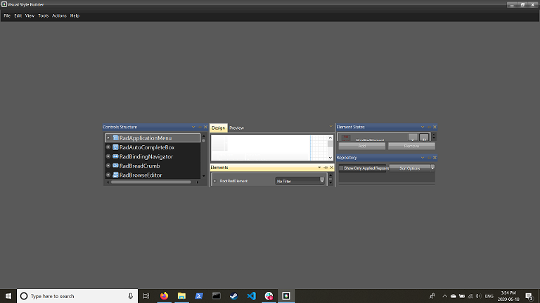

## Environment
|Product Version|Product|Author|
|----|----|----|
|2021.1.223|Visual Style Builder for WinForms|[Desislava Yordanova](https://www.telerik.com/blogs/author/desislava-yordanova)|

## Description

There are cases in which [Visual Style Builder]() may not open properly indicating any XML errors. In other cases, the VSB tool may open successfully but its layout is totally messed up.
 

## Solution

Since **R2 2018 SP1** [Visual Style Builder]() is DPI-aware. Usually, the layout file of Visual Style Builder may store some old settings which leads to the undesired result illustrated above. 

A common solution to this behavior is to close Visual Style Builder. Please navigate to the **C:\Users\'your user name'\AppData\Roaming\Telerik\WinForms\VSB** folder and delete the **VsbLayout.xml**. Restart Visual Style Builder and now it should be loaded as expected. 

# See Also

* [Visual Style Builder]()  

