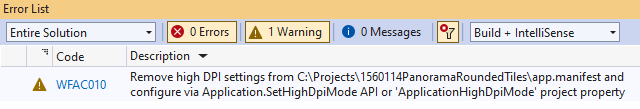

## Environment
 
|Product Version|Product|Author|
|----|----|----|
|2022.1.222|UI for WinForms|[Desislava Yordanova](https://www.telerik.com/blogs/author/desislava-yordanova)|


## Description

When building a project in .NET6 on Windows 10 with Visual Studio 2022, the following warning is generated:



The app.manifest file contains the following settings:

````XML
<asmv3:application>
    <asmv3:windowsSettings xmlns="http://schemas.microsoft.com/SMI/2005/WindowsSettings">
      <dpiAware>true/PM</dpiAware>
    </asmv3:windowsSettings>
  </asmv3:application>

````

## Solution

With the development of the .NET Framework, Microsoft has introduced several changes through the years in order to keep Windows Forms up to date. These changes naturally include scaling mechanisms for high DPI displays. Some of the changes regard to how you can declare your app to be DPI aware. 

In the beginning, this was done in the app.manifest file. During the latest versions of the full framework, this behavior was moved to the App.config. And in the .NET Core, .NET5/6 Microsoft introduced a public API to do this. The public API and the app.manifest do the same thing - declare your app to be DPI aware.

The WFAC010 warning is just stating that you are using the app.manifest file to declare the DPI mode. You can safely ignore it or you can remove the **dpiAware** section from the manifest and use the new API. Removing the noted section from the app.manifest will render your app using the default setting, which is SystemAware. If you want to remove the section from app.manifest, you must use the Application.[SetHighDpiMode](https://docs.microsoft.com/en-us/dotnet/api/system.windows.forms.application.sethighdpimode?view=windowsdesktop-6.0) API to set equivalent dpi aware mode.

It is recommended to use the new API instead of app.manifest with following line:

````C#  
          
Application.SetHighDpiMode(HighDpiMode.PerMonitorV2);

````

# See Also

* [DPI Support]()
