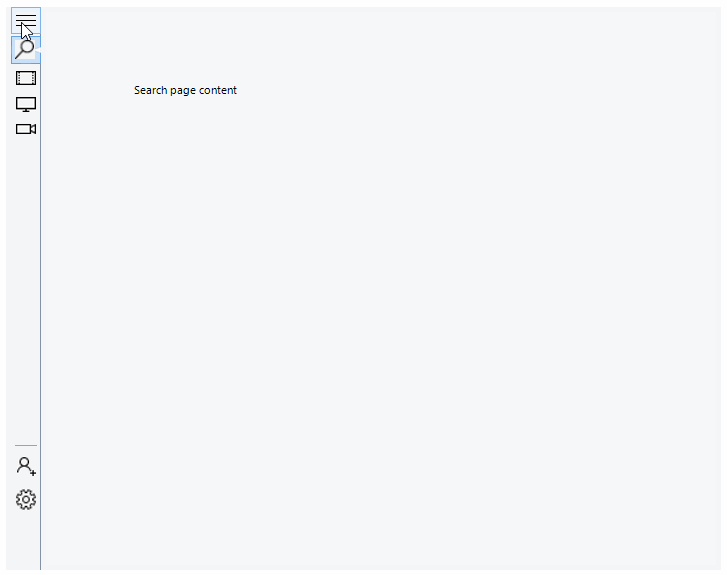

|Product Version|Product|Author|Last modified|
|----|----|----|----|
|Q2 2015|RadPageView for WinForms|Dimitar Karamfilov|August 11, 2015|


The following example aims to mimic the navigation provided by the Movies & TV app in Windows 10 by using **RadPageView** in **Backstage** view mode. In this example, the tabs are positioned on the left part of the control and when the expand/collapse item is clicked the menu will expand/collapse. When the menu is expanded the items will have text when it is collapsed only icons will be displayed. The example also shows how you can create search tab item. When the search item is clicked the menu will expand and a text box will be displayed. You can see the final result in figure 1.

Figure 1. Navigation bar with RadPageView in Backstage view mode.
  
  


This functionality is achieved by setting the **ItemContainer** size when the details or search item is clicked and also modifying the items appearance:   

````C#
private void Toggle()
{
    RadPageViewBackstageElement backstage = (RadPageViewBackstageElement)radPageView1.ViewElement;
    bool expanded = backstage.ItemContainer.MinSize.Width > 36;
 
    int width = expanded ? 36 : 200;
    backstage.ItemContainer.MinSize = new Size(width, 0);
    backstage.ItemContainer.MaxSize = new Size(width, 0);
    searchPage.Item.DrawImage = expanded;
    textBox.Visibility = expanded ? ElementVisibility.Hidden : ElementVisibility.Visible;
 
    foreach (RadPageViewPage page in radPageView1.Pages)
    {
        page.Item.DrawText = !expanded;
    }
}

````
````VB.NET
Private Sub Toggle()
    Dim backstage As RadPageViewBackstageElement = CType(radPageView1.ViewElement, RadPageViewBackstageElement)
    Dim expanded As Boolean = backstage.ItemContainer.MinSize.Width > 36
 
    Dim menu_width As Integer = If(expanded, 36, 200)
    backstage.ItemContainer.MinSize = New Size(menu_width, 0)
    backstage.ItemContainer.MaxSize = New Size(menu_width, 0)
    searchPage.Item.DrawImage = expanded
    textBox.Visibility = If(expanded, ElementVisibility.Hidden, ElementVisibility.Visible)
 
    For Each page As RadPageViewPage In radPageView1.Pages
        page.Item.DrawText = Not expanded
    Next page
End Sub

````


>note The complete example can be downloaded by clicking the following [link](https://github.com/telerik/winforms-sdk/tree/master/PageView/BackstageViewMenuExample).


