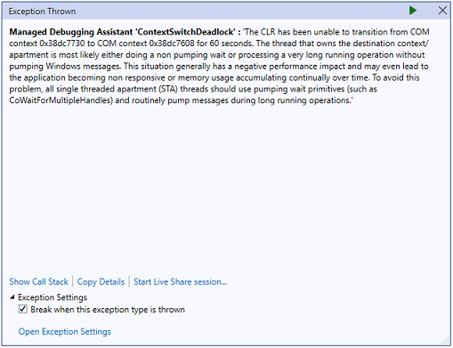
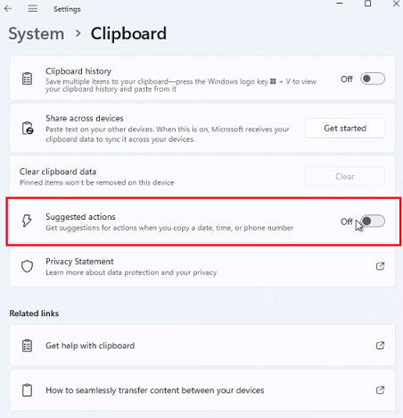

## Environment
|Product Version|Product|Author|
|----|----|----|
|2023.1.117|RadGridView for WinForms|[Desislava Yordanova](https://www.telerik.com/blogs/author/desislava-yordanova)|

## Description

When a single cell is copied in RadGridView with sufficient number of records (e.g. 50 000), the UI stays frozen and eventually leads to this error:

Such behavior is observed only on **Windows 11 Version 22H2** machines.

## Solution

It seems that Windows 11 comes with an improved clipboard: ["The upcoming Windows 11 update, also known as version 22H2 or Sun Valley 2, will introduce support for Smart Clipboard, which will offer a new way to paste contents between apps."](https://www.windowslatest.com/2022/03/30/windows-11-to-get-smart-clipboard-and-actions-features/).

It seems that even browsers are experiencing freezing when copying some text: [Mozilla Firefox fixes freezes caused by new Windows 11 feature](https://www.bleepingcomputer.com/news/security/mozilla-firefox-fixes-freezes-caused-by-new-windows-11-feature/)

Currently, the possible solution is to disable **Suggested Actions** temporarily to avoid this undesired behavior: Select **Start**  > **Settings**  > **System**  > **Clipboard** > and turn the **Suggested actions** toggle **Off**:

 
