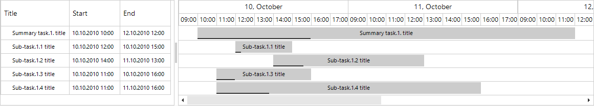

## Environment
 
|Product Version|Product|Author|
|----|----|----|
|2020.3.1020|RadGanttView for WinForms|[Desislava Yordanova](https://www.telerik.com/blogs/author/desislava-yordanova)|
 
## Description

This article demonstrates a sample approach how to simulate working hours in **RadGanttView**. The time slots outside the range are not visible. 



## Solution 

This can be achieved with the help of a [Custom Timeline]() that shows the hours from **9:00** to **18:00**. In order to align the tasks with the time slots, a [Custom Task Element]() is required. You can find below a complete solution which result is demonstrated in the above gif file. Due to the complexity of **RadGanttView** and its graphical view's internal implementation, there are some UI actions that are forbidden with this approach.

>caution This article just demonstrates a sample approach and it may not cover all possible cases. Resizing the tasks in the graphical view is not allowed. You can use the columns in the text view for editing the start/end time. The links between the tasks are also not supported.
  

````C#
public partial class RadForm1 : Telerik.WinControls.UI.RadForm
{
    public RadForm1()
    {
        InitializeComponent();
        this.radGanttView1.ItemElementCreating += radGanttView1_ItemElementCreating;      
        this.radGanttView1.GanttViewElement.GraphicalViewElement.TimelineRange = TimeRange.Day;
        this.radGanttView1.GanttViewElement.GraphicalViewElement.TimelineBehavior = new WorkingDaysGanttViewTimelineBehavior();
        this.radGanttView1.GanttViewElement.GraphicalViewElement.OnePixelTime = new TimeSpan(0, 0, 260);
        this.SetupGantt();
    }

    private void radGanttView1_ItemElementCreating(object sender, GanttViewItemElementCreatingEventArgs e)
    {
        if (e.ViewElement is GanttViewGraphicalViewElement)
        {
            e.ItemElement = new MyGanttViewTaskItemElement((GanttViewGraphicalViewElement)e.ViewElement); 
        }
    }

    private void SetupGantt()
    {
        this.radGanttView1.GanttViewElement.GraphicalViewElement.TimelineStart = new DateTime(2010, 10, 10);
        this.radGanttView1.GanttViewElement.GraphicalViewElement.TimelineEnd = new DateTime(2010, 10, 15);
         
        GanttViewDataItem item1 = new GanttViewDataItem();
        item1.Start = new DateTime(2010, 10, 10, 10,0,0);
        item1.End = new DateTime(2010, 10, 12,12,0,0,0);
        item1.Progress = 30M;
        item1.Title = "Summary task.1. title";

        GanttViewDataItem subitem11 = new GanttViewDataItem();
        subitem11.Start = new DateTime(2010, 10, 10, 12,0,0);
        subitem11.End = new DateTime(2010, 10, 10, 15,0,0);
        subitem11.Progress = 10M;
        subitem11.Title = "Sub-task.1.1 title";
        GanttViewDataItem subitem12 = new GanttViewDataItem();
        subitem12.Start = new DateTime(2010, 10, 10, 14,0,0);
        subitem12.End = new DateTime(2010, 10, 11,13,0,0);
        subitem12.Progress = 20M;
        subitem12.Title = "Sub-task.1.2 title";

        GanttViewDataItem subitem13 = new GanttViewDataItem();
        subitem13.Start = new DateTime(2010, 10, 10, 11,0,0);
        subitem13.End = new DateTime(2010, 10, 10,16,0,0);
        subitem13.Progress = 20M;
        subitem13.Title = "Sub-task.1.3 title";

        GanttViewDataItem subitem14 = new GanttViewDataItem();
        subitem14.Start = new DateTime(2010, 10, 10, 11,0,0);
        subitem14.End = new DateTime(2010, 10, 11,16,0,0);
        subitem14.Progress = 20M;
        subitem14.Title = "Sub-task.1.4 title";
         
        this.radGanttView1.Items.Add(item1);
        this.radGanttView1.Items.Add(subitem11);
        this.radGanttView1.Items.Add(subitem12);
        this.radGanttView1.Items.Add(subitem13);
        this.radGanttView1.Items.Add(subitem14);

        GanttViewTextViewColumn titleColumn = new GanttViewTextViewColumn("Title");
        GanttViewTextViewColumn startColumn = new GanttViewTextViewColumn("Start") { FormatString = "{0: dd.MM.yyyy HH:mm}" };
        GanttViewTextViewColumn endColumn = new GanttViewTextViewColumn("End") { FormatString = "{0: dd.MM.yyyy HH:mm}" };
        this.radGanttView1.GanttViewElement.Columns.Add(titleColumn);
        this.radGanttView1.GanttViewElement.Columns.Add(startColumn);
        this.radGanttView1.GanttViewElement.Columns.Add(endColumn);

        this.radGanttView1.GanttViewElement.EditorInitialized += GanttViewElement_EditorInitialized;
        this.radGanttView1.DragDropService.PreviewDragStart += DragDropService_PreviewDragStart; 
    }

    void DragDropService_PreviewDragStart(object sender, Telerik.WinControls.PreviewDragStartEventArgs e)
    {
        e.CanStart = false;
    }

    private void GanttViewElement_EditorInitialized(object sender, GanttViewItemEditorInitializedEventArgs e)
    {
        GanttViewDateTimeEditor dtEditor = e.Editor as GanttViewDateTimeEditor;
        dtEditor.CustomFormat = "dd.MM.yyyy HH:mm";
        BaseDateTimeEditorElement el = dtEditor.EditorElement as BaseDateTimeEditorElement;
        el.ShowTimePicker = true;
    }
}

public class MyGanttViewTaskItemElement : GanttViewTaskItemElement
{
    public MyGanttViewTaskItemElement(GanttViewGraphicalViewElement ganttViewBaseViewElement) : base(ganttViewBaseViewElement)
    {
    }

    protected override void OnMouseMove(MouseEventArgs e)
    {
        base.OnMouseMove(e);
        this.Data.GanttViewElement.ElementTree.Control.Cursor = Cursors.Default;
    }

    public override void Synchronize()
    {
        base.Synchronize();
         
        this.LeftLinkHandleElement.PropertyChanged -= LeftLinkHandleElement_PropertyChanged;
        this.RightLinkHandleElement.PropertyChanged -= LeftLinkHandleElement_PropertyChanged;

        this.LeftLinkHandleElement.Visibility = ElementVisibility.Collapsed;
        this.RightLinkHandleElement.Visibility = ElementVisibility.Collapsed;

        this.LeftLinkHandleElement.PropertyChanged += LeftLinkHandleElement_PropertyChanged;
        this.RightLinkHandleElement.PropertyChanged += LeftLinkHandleElement_PropertyChanged;
    }

    private void LeftLinkHandleElement_PropertyChanged(object sender, PropertyChangedEventArgs e)
    {
        if (e.PropertyName == "Visibility")
        {
            ((RadElement)sender).Visibility = ElementVisibility.Collapsed;
        }
    }

    protected override Type ThemeEffectiveType
    {
        get
        {
            return typeof(GanttViewTaskItemElement);
        }
    }

    protected override SizeF ArrangeOverride(SizeF finalSize)
    { 
        int startHour = 9;
        int endHour = 18;
        int workHours = endHour - startHour; 

        RectangleF clientRect = this.GetClientRectangle(finalSize);
        DateTime adjustedStart = this.Data.Start.Date.AddHours(startHour);
        DateTime adjustedEnd = this.Data.Start.Date.AddHours(24);

        float scale = (float)((this.Data.Start - adjustedStart).TotalSeconds / TimeSpan.FromHours(workHours).TotalSeconds);
        if (scale < 0)
        {
            scale = 0;
        }

        float x = (float)((this.Data.Start.Date - this.GraphicalViewElement.TimelineBehavior.AdjustedTimelineStart).TotalSeconds /
                          this.GraphicalViewElement.OnePixelTime.TotalSeconds - this.GraphicalViewElement.HorizontalScrollBarElement.Value);
        float x2 = (float)((adjustedEnd - this.GraphicalViewElement.TimelineBehavior.AdjustedTimelineStart).TotalSeconds /
                           this.GraphicalViewElement.OnePixelTime.TotalSeconds - this.GraphicalViewElement.HorizontalScrollBarElement.Value);
            
        x += (x2 - x) * scale;

        float width = this.TaskElement.DesiredSize.Width;
             
        if (this.TaskElement is GanttViewMilestoneElement)
        {
            width = clientRect.Height;
        }

        SizeF linkHandleSize = new SizeF(Math.Min(this.GraphicalViewElement.LinksHandlesSize.Width, clientRect.Width),
            Math.Min(this.GraphicalViewElement.LinksHandlesSize.Height, clientRect.Height));
        if (width <= 0)
        {
            linkHandleSize = Size.Empty;
        }

        this.LeftLinkHandleElement.Arrange(new RectangleF(x - linkHandleSize.Width, clientRect.Y + (clientRect.Height - linkHandleSize.Height) / 2,
            linkHandleSize.Width, linkHandleSize.Height));
        this.TaskElement.Arrange(new RectangleF(x, clientRect.Y, width, clientRect.Height));
        this.RightLinkHandleElement.Arrange(new RectangleF(x + width, clientRect.Y + (clientRect.Height - linkHandleSize.Height) / 2,
            linkHandleSize.Width, linkHandleSize.Height));

        return finalSize;
    }

    protected override SizeF MeasureOverride(SizeF availableSize)
    {
        RectangleF clientRect = this.GetClientRectangle(availableSize);

        int startHour = 9;
        int endHour = 18;
        int workHours = endHour - startHour;
        int nonWorkHours = 24 - workHours;
        float width = 0;
        DateTime adjustedStart = this.Data.Start.Date.AddHours(startHour);
        DateTime start = this.Data.Start;
        if (adjustedStart > start)
        {
            start = adjustedStart;
        }

        DateTime adjustedEnd = this.Data.End.Date.AddHours(endHour); 
        DateTime end = this.Data.End;
        if (adjustedEnd < end)
        {
            end = adjustedEnd;
        }
            
        int daysDuration = (end.Date - start.Date).Days ; 
            
        if (end.Date.Day != start.Date.Day)
        {
            width = (float)((end - start).Add(new TimeSpan(-(daysDuration * (nonWorkHours)),0,0)).TotalSeconds /
                            (float)this.GraphicalViewElement.OnePixelTime.TotalSeconds);
        }
        else
        {
            width = (float)((end - start).TotalSeconds / (float)this.GraphicalViewElement.OnePixelTime.TotalSeconds);
        }

        float scale = workHours / 24f;

        width /= scale;

        if (this.TaskElement is GanttViewMilestoneElement)
        {
            this.TaskElement.Measure(new SizeF(clientRect.Height, clientRect.Height));
        }
        else
        {
            this.TaskElement.Measure(new SizeF(width, clientRect.Height));
        }

        SizeF linkHandleSize = new SizeF(Math.Min(this.GraphicalViewElement.LinksHandlesSize.Width,
            clientRect.Width), Math.Min(this.GraphicalViewElement.LinksHandlesSize.Height, clientRect.Height));
        if (width <= 0)
        {
            linkHandleSize = Size.Empty;
        }

        this.LeftLinkHandleElement.Measure(linkHandleSize);
        this.RightLinkHandleElement.Measure(linkHandleSize); 

        return availableSize;
    }
}

public class WorkingDaysGanttViewTimelineBehavior : BaseGanttViewTimelineBehavior
{
    public override DateTime AdjustedTimelineStart
    {
        get
        {
            if (this.GraphicalViewElement.TimelineRange != TimeRange.Day)
                return base.AdjustedTimelineStart;

            return new DateTime(this.GraphicalViewElement.TimelineStart.Year,
                this.GraphicalViewElement.TimelineStart.Month, this.GraphicalViewElement.TimelineStart.Day, 0, 0, 0);
        }
    }

    public override DateTime AdjustedTimelineEnd
    {
        get
        {
            if (this.GraphicalViewElement.TimelineRange != TimeRange.Day)
                return base.AdjustedTimelineEnd;

            return new DateTime(this.GraphicalViewElement.TimelineEnd.Year,
                this.GraphicalViewElement.TimelineEnd.Month,
                this.GraphicalViewElement.TimelineEnd.Day, 0, 0, 0);
        }
    }

    public override GanttTimelineCellsInfo GetTimelineCellInfoForItem(GanttViewTimelineDataItem item, TimeRange range)
    {
        if (range != TimeRange.Day)
            return base.GetTimelineCellInfoForItem(item, range);

        return this.GetTimelineCellInfoForWorkingHoursRange(item);
    }

    private GanttTimelineCellsInfo GetTimelineCellInfoForWorkingHoursRange(GanttViewTimelineDataItem item)
    {
        int hoursInDay = 9;
        int hoursToAdd = hoursInDay;

        if (item.Start < this.AdjustedTimelineStart)
        {
            if (item.Start.Hour > 0)
                hoursToAdd -= item.Start.Hour;
        }

        if (item.End > this.AdjustedTimelineEnd)
        {
            if (item.End.Hour < hoursInDay)
                hoursToAdd -= (hoursInDay - item.End.Hour);
        }

        return new GanttTimelineCellsInfo(hoursToAdd) { StartIndex = 9 };
    }

    public override string GetTimelineBottomElementText(GanttViewTimelineDataItem item, int index)
    {
        if (item.Range != TimeRange.Day)
            return base.GetTimelineBottomElementText(item, index);

        string format = this.TimelineLowerItemFormat ?? "{0:HH:mm}";
        return string.Format(System.Threading.Thread.CurrentThread.CurrentCulture, format, item.Start.AddHours(index));
    }

    public override IList<GanttViewTimelineDataItem> BuildTimelineDataItems(TimeRange range)
    {
        if (range != TimeRange.Day)
            return base.BuildTimelineDataItems(range);

        return this.BuildTimelineDataItemsForWorkingHoursRange();
    }

    public IList<GanttViewTimelineDataItem> BuildTimelineDataItemsForWorkingHoursRange()
    {
        List<GanttViewTimelineDataItem> result = new List<GanttViewTimelineDataItem>();

        DateTime adjustedStart = this.AdjustedTimelineStart;
        DateTime adjustedEnd = this.AdjustedTimelineEnd;

        DateTime currentDate = adjustedStart;
        int currentDayNumber = adjustedStart.Day;
        int newDayNumber = currentDayNumber;
        GanttViewTimelineDataItem item = new GanttViewTimelineDataItem(adjustedStart, adjustedStart.AddHours(1), 
            this.GraphicalViewElement.TimelineRange, this.GraphicalViewElement.OnePixelTime);
        result.Add(item);

        while (currentDate < adjustedEnd)
        {
            item.End = currentDate.AddHours(1);

            currentDate = currentDate.AddHours(1);
            newDayNumber = currentDate.Day;

            if (newDayNumber != currentDayNumber && currentDate.AddHours(1) <= adjustedEnd)
            {
                currentDayNumber = newDayNumber;
                item = new GanttViewTimelineDataItem(currentDate, currentDate, this.GraphicalViewElement.TimelineRange, this.GraphicalViewElement.OnePixelTime);
                result.Add(item);
            }
        }

        return result;
    }
}

 

````
````VB.NET
Public Sub New()
    InitializeComponent()
    AddHandler Me.RadGanttView1.ItemElementCreating, AddressOf radGanttView1_ItemElementCreating
    Me.RadGanttView1.GanttViewElement.GraphicalViewElement.TimelineRange = TimeRange.Day
    Me.RadGanttView1.GanttViewElement.GraphicalViewElement.TimelineBehavior = New WorkingDaysGanttViewTimelineBehavior()
    Me.RadGanttView1.GanttViewElement.GraphicalViewElement.OnePixelTime = New TimeSpan(0, 0, 260)
    Me.SetupGantt()
End Sub

Private Sub radGanttView1_ItemElementCreating(ByVal sender As Object, ByVal e As GanttViewItemElementCreatingEventArgs)
    If TypeOf e.ViewElement Is GanttViewGraphicalViewElement Then
        e.ItemElement = New MyGanttViewTaskItemElement(CType(e.ViewElement, GanttViewGraphicalViewElement))
    End If
End Sub

Private Sub SetupGantt()
    Me.RadGanttView1.GanttViewElement.GraphicalViewElement.TimelineStart = New DateTime(2010, 10, 10)
    Me.RadGanttView1.GanttViewElement.GraphicalViewElement.TimelineEnd = New DateTime(2010, 10, 15)
    Dim item1 As GanttViewDataItem = New GanttViewDataItem()
    item1.Start = New DateTime(2010, 10, 10, 10, 0, 0)
    item1.[End] = New DateTime(2010, 10, 12, 12, 0, 0, 0)
    item1.Progress = 30D
    item1.Title = "Summary task.1. title"
    Dim subitem11 As GanttViewDataItem = New GanttViewDataItem()
    subitem11.Start = New DateTime(2010, 10, 10, 12, 0, 0)
    subitem11.[End] = New DateTime(2010, 10, 10, 15, 0, 0)
    subitem11.Progress = 10D
    subitem11.Title = "Sub-task.1.1 title"
    Dim subitem12 As GanttViewDataItem = New GanttViewDataItem()
    subitem12.Start = New DateTime(2010, 10, 10, 14, 0, 0)
    subitem12.[End] = New DateTime(2010, 10, 11, 13, 0, 0)
    subitem12.Progress = 20D
    subitem12.Title = "Sub-task.1.2 title"
    Dim subitem13 As GanttViewDataItem = New GanttViewDataItem()
    subitem13.Start = New DateTime(2010, 10, 10, 11, 0, 0)
    subitem13.[End] = New DateTime(2010, 10, 10, 16, 0, 0)
    subitem13.Progress = 20D
    subitem13.Title = "Sub-task.1.3 title"
    Dim subitem14 As GanttViewDataItem = New GanttViewDataItem()
    subitem14.Start = New DateTime(2010, 10, 10, 11, 0, 0)
    subitem14.[End] = New DateTime(2010, 10, 11, 16, 0, 0)
    subitem14.Progress = 20D
    subitem14.Title = "Sub-task.1.4 title"
    Me.RadGanttView1.Items.Add(item1)
    Me.RadGanttView1.Items.Add(subitem11)
    Me.RadGanttView1.Items.Add(subitem12)
    Me.RadGanttView1.Items.Add(subitem13)
    Me.RadGanttView1.Items.Add(subitem14)
    Dim titleColumn As GanttViewTextViewColumn = New GanttViewTextViewColumn("Title")
    Dim startColumn As GanttViewTextViewColumn = New GanttViewTextViewColumn("Start") With {
        .FormatString = "{0: dd.MM.yyyy HH:mm}"
    }
    Dim endColumn As GanttViewTextViewColumn = New GanttViewTextViewColumn("End") With {
        .FormatString = "{0: dd.MM.yyyy HH:mm}"
    }
    Me.RadGanttView1.GanttViewElement.Columns.Add(titleColumn)
    Me.RadGanttView1.GanttViewElement.Columns.Add(startColumn)
    Me.RadGanttView1.GanttViewElement.Columns.Add(endColumn)
    AddHandler Me.RadGanttView1.GanttViewElement.EditorInitialized, AddressOf GanttViewElement_EditorInitialized
    AddHandler Me.RadGanttView1.DragDropService.PreviewDragStart, AddressOf DragDropService_PreviewDragStart
End Sub

Private Sub DragDropService_PreviewDragStart(ByVal sender As Object, ByVal e As Telerik.WinControls.PreviewDragStartEventArgs)
    e.CanStart = False
End Sub

Private Sub GanttViewElement_EditorInitialized(ByVal sender As Object, ByVal e As GanttViewItemEditorInitializedEventArgs)
    Dim dtEditor As GanttViewDateTimeEditor = TryCast(e.Editor, GanttViewDateTimeEditor)
    dtEditor.CustomFormat = "dd.MM.yyyy HH:mm"
    Dim el As BaseDateTimeEditorElement = TryCast(dtEditor.EditorElement, BaseDateTimeEditorElement)
    el.ShowTimePicker = True
End Sub
Class

ic Class MyGanttViewTaskItemElement
rits GanttViewTaskItemElement

Public Sub New(ByVal ganttViewBaseViewElement As GanttViewGraphicalViewElement)
    MyBase.New(ganttViewBaseViewElement)
End Sub

Protected Overrides Sub OnMouseMove(ByVal e As MouseEventArgs)
    MyBase.OnMouseMove(e)
    Me.Data.GanttViewElement.ElementTree.Control.Cursor = Cursors.[Default]
End Sub

Public Overrides Sub Synchronize()
    MyBase.Synchronize()
    RemoveHandler Me.LeftLinkHandleElement.PropertyChanged, AddressOf LeftLinkHandleElement_PropertyChanged
    RemoveHandler Me.RightLinkHandleElement.PropertyChanged, AddressOf LeftLinkHandleElement_PropertyChanged
    Me.LeftLinkHandleElement.Visibility = ElementVisibility.Collapsed
    Me.RightLinkHandleElement.Visibility = ElementVisibility.Collapsed
    AddHandler Me.LeftLinkHandleElement.PropertyChanged, AddressOf LeftLinkHandleElement_PropertyChanged
    AddHandler Me.RightLinkHandleElement.PropertyChanged, AddressOf LeftLinkHandleElement_PropertyChanged
End Sub

Private Sub LeftLinkHandleElement_PropertyChanged(ByVal sender As Object, ByVal e As PropertyChangedEventArgs)
    If e.PropertyName = "Visibility" Then
        CType(sender, RadElement).Visibility = ElementVisibility.Collapsed
    End If
End Sub

Protected Overrides ReadOnly Property ThemeEffectiveType As Type
    Get
        Return GetType(GanttViewTaskItemElement)
    End Get
End Property

Protected Overrides Function ArrangeOverride(ByVal finalSize As SizeF) As SizeF
    Dim startHour As Integer = 9
    Dim endHour As Integer = 18
    Dim workHours As Integer = endHour - startHour
    Dim clientRect As RectangleF = Me.GetClientRectangle(finalSize)
    Dim adjustedStart As DateTime = Me.Data.Start.Date.AddHours(startHour)
    Dim adjustedEnd As DateTime = Me.Data.Start.Date.AddHours(24)
    Dim scale As Single = CSng(((Me.Data.Start - adjustedStart).TotalSeconds / TimeSpan.FromHours(workHours).TotalSeconds))

    If scale < 0 Then
        scale = 0
    End If

    Dim x As Single = CSng(((Me.Data.Start.Date - Me.GraphicalViewElement.TimelineBehavior.AdjustedTimelineStart).TotalSeconds / _
                            Me.GraphicalViewElement.OnePixelTime.TotalSeconds - Me.GraphicalViewElement.HorizontalScrollBarElement.Value))
    Dim x2 As Single = CSng(((adjustedEnd - Me.GraphicalViewElement.TimelineBehavior.AdjustedTimelineStart).TotalSeconds / _
                             Me.GraphicalViewElement.OnePixelTime.TotalSeconds - Me.GraphicalViewElement.HorizontalScrollBarElement.Value))
    x += (x2 - x) * scale
    Dim width As Single = Me.TaskElement.DesiredSize.Width

    If TypeOf Me.TaskElement Is GanttViewMilestoneElement Then
        width = clientRect.Height
    End If

    Dim linkHandleSize As SizeF = New SizeF(Math.Min(Me.GraphicalViewElement.LinksHandlesSize.Width, clientRect.Width), _
                                            Math.Min(Me.GraphicalViewElement.LinksHandlesSize.Height, clientRect.Height))

    If width <= 0 Then
        linkHandleSize = Size.Empty
    End If

    Me.LeftLinkHandleElement.Arrange(New RectangleF(x - linkHandleSize.Width, clientRect.Y + (clientRect.Height - linkHandleSize.Height) / _
                                                    2, linkHandleSize.Width, linkHandleSize.Height))
    Me.TaskElement.Arrange(New RectangleF(x, clientRect.Y, width, clientRect.Height))
    Me.RightLinkHandleElement.Arrange(New RectangleF(x + width, clientRect.Y + (clientRect.Height - linkHandleSize.Height) / 2, _
                                                     linkHandleSize.Width, linkHandleSize.Height))
    Return finalSize
End Function

Protected Overrides Function MeasureOverride(ByVal availableSize As SizeF) As SizeF
    Dim clientRect As RectangleF = Me.GetClientRectangle(availableSize)
    Dim startHour As Integer = 9
    Dim endHour As Integer = 18
    Dim workHours As Integer = endHour - startHour
    Dim nonWorkHours As Integer = 24 - workHours
    Dim width As Single = 0
    Dim adjustedStart As DateTime = Me.Data.Start.Date.AddHours(startHour)
    Dim start As DateTime = Me.Data.Start

    If adjustedStart > start Then
        start = adjustedStart
    End If

    Dim adjustedEnd As DateTime = Me.Data.[End].Date.AddHours(endHour)
    Dim [end] As DateTime = Me.Data.[End]

    If adjustedEnd < [end] Then
        [end] = adjustedEnd
    End If

    Dim daysDuration As Integer = ([end].Date - start.Date).Days

    If [end].Date.Day <> start.Date.Day Then
        width = CSng((([end] - start).Add(New TimeSpan(-(daysDuration * (nonWorkHours)), 0, 0)).TotalSeconds / _
                      CSng(Me.GraphicalViewElement.OnePixelTime.TotalSeconds)))
    Else
        width = CSng((([end] - start).TotalSeconds / CSng(Me.GraphicalViewElement.OnePixelTime.TotalSeconds)))
    End If

    Dim scale As Single = workHours / 24.0F

    width /= scale


    If TypeOf Me.TaskElement Is GanttViewMilestoneElement Then
        Me.TaskElement.Measure(New SizeF(clientRect.Height, clientRect.Height))
    Else
        Me.TaskElement.Measure(New SizeF(width, clientRect.Height))
    End If

    Dim linkHandleSize As SizeF = New SizeF(Math.Min(Me.GraphicalViewElement.LinksHandlesSize.Width, clientRect.Width), _
                                            Math.Min(Me.GraphicalViewElement.LinksHandlesSize.Height, clientRect.Height))

    If width <= 0 Then
        linkHandleSize = Size.Empty
    End If

    Me.LeftLinkHandleElement.Measure(linkHandleSize)
    Me.RightLinkHandleElement.Measure(linkHandleSize)
    Return availableSize
End Function
Class

ic Class WorkingDaysGanttViewTimelineBehavior
rits BaseGanttViewTimelineBehavior

Public Overrides ReadOnly Property AdjustedTimelineStart As DateTime
    Get
        If Me.GraphicalViewElement.TimelineRange <> TimeRange.Day Then Return MyBase.AdjustedTimelineStart
        Return New DateTime(Me.GraphicalViewElement.TimelineStart.Year, Me.GraphicalViewElement.TimelineStart.Month, Me.GraphicalViewElement.TimelineStart.Day, 0, 0, 0)
    End Get
End Property

Public Overrides ReadOnly Property AdjustedTimelineEnd As DateTime
    Get
        If Me.GraphicalViewElement.TimelineRange <> TimeRange.Day Then Return MyBase.AdjustedTimelineEnd
        Return New DateTime(Me.GraphicalViewElement.TimelineEnd.Year, Me.GraphicalViewElement.TimelineEnd.Month, Me.GraphicalViewElement.TimelineEnd.Day, 0, 0, 0)
    End Get
End Property

Public Overrides Function GetTimelineCellInfoForItem(ByVal item As GanttViewTimelineDataItem, ByVal range As TimeRange) As GanttTimelineCellsInfo
    If range <> TimeRange.Day Then Return MyBase.GetTimelineCellInfoForItem(item, range)
    Return Me.GetTimelineCellInfoForWorkingHoursRange(item)
End Function

Private Function GetTimelineCellInfoForWorkingHoursRange(ByVal item As GanttViewTimelineDataItem) As GanttTimelineCellsInfo
    Dim hoursInDay As Integer = 9
    Dim hoursToAdd As Integer = hoursInDay

    If item.Start < Me.AdjustedTimelineStart Then
        If item.Start.Hour > 0 Then hoursToAdd -= item.Start.Hour
    End If

    If item.[End] > Me.AdjustedTimelineEnd Then
        If item.[End].Hour < hoursInDay Then hoursToAdd -= (hoursInDay - item.[End].Hour)
    End If

    Return New GanttTimelineCellsInfo(hoursToAdd) With {
        .StartIndex = 9
    }
End Function

Public Overrides Function GetTimelineBottomElementText(ByVal item As GanttViewTimelineDataItem, ByVal index As Integer) As String
    If item.Range <> TimeRange.Day Then Return MyBase.GetTimelineBottomElementText(item, index)
    Dim format As String = If(Me.TimelineLowerItemFormat, "{0:HH:mm}")
    Return String.Format(System.Threading.Thread.CurrentThread.CurrentCulture, format, item.Start.AddHours(index))
End Function

Public Overrides Function BuildTimelineDataItems(ByVal range As TimeRange) As IList(Of GanttViewTimelineDataItem)
    If range <> TimeRange.Day Then Return MyBase.BuildTimelineDataItems(range)
    Return Me.BuildTimelineDataItemsForWorkingHoursRange()
End Function

Public Function BuildTimelineDataItemsForWorkingHoursRange() As IList(Of GanttViewTimelineDataItem)
    Dim result As List(Of GanttViewTimelineDataItem) = New List(Of GanttViewTimelineDataItem)()
    Dim adjustedStart As DateTime = Me.AdjustedTimelineStart
    Dim adjustedEnd As DateTime = Me.AdjustedTimelineEnd
    Dim currentDate As DateTime = adjustedStart
    Dim currentDayNumber As Integer = adjustedStart.Day
    Dim newDayNumber As Integer = currentDayNumber
    Dim item As GanttViewTimelineDataItem = New GanttViewTimelineDataItem(adjustedStart, adjustedStart.AddHours(1), _
                                                                          Me.GraphicalViewElement.TimelineRange, Me.GraphicalViewElement.OnePixelTime)
    result.Add(item)

    While currentDate < adjustedEnd
        item.[End] = currentDate.AddHours(1)
        currentDate = currentDate.AddHours(1)
        newDayNumber = currentDate.Day

        If newDayNumber <> currentDayNumber AndAlso currentDate.AddHours(1) <= adjustedEnd Then
            currentDayNumber = newDayNumber
            item = New GanttViewTimelineDataItem(currentDate, currentDate, Me.GraphicalViewElement.TimelineRange, Me.GraphicalViewElement.OnePixelTime)
            result.Add(item)
        End If
    End While

    Return result
End Function
 

````


# See Also

* [Custom Timeline]()
* [Custom Task Elements]()

