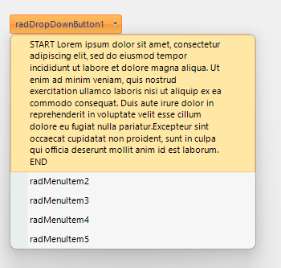

## Environment

<table>
<tbody>
<tr>
<td>Product</td>
<td>Progress® Telerik® UI for WinForms</td>
</tr>
<tr>
<td>Version</td>
<td>2024.3.924</td>
</tr>
</table>

## Description

When using a [RadMenu](https://docs.telerik.com/devtools/winforms/controls/menus/menu/overview) or a [RadDropDownButton](https://docs.telerik.com/devtools/winforms/controls/buttons/dropdownbutton/dropdownbutton) in Telerik UI for WinForms, you might have items with long text that doesn't fit comfortably within the viewable area. This article demonstrates how to wrap such text to ensure it's completely visible.

This KB article also answers the following questions:
- How to use text wrapping for menu items in WinForms applications?
- How to ensure long text is visible in RadMenu items?

## Solution

To wrap the text of a `RadMenuItem`, access the `TextPrimitive` object responsible for painting the text. Then set its `MaxSize` and `TextWrap` properties to enable text wrapping. 

```csharp
// Create or access the RadMenuItem
RadMenuItem menuItem = (RadMenuItem)this.radDropDownButton1.Items[0];

// Set the maximum size for the text area and enable text wrapping
menuItem.Layout.Text.MaxSize = new Size(240, 0);
menuItem.Layout.Text.TextWrap = true;

// Set the long text to be wrapped
menuItem.Text = "START Lorem ipsum dolor sit amet, consectetur adipiscing elit, sed do eiusmod tempor incididunt ut labore et dolore magna aliqua." +
    " Ut enim ad minim veniam, quis nostrud exercitation ullamco laboris nisi ut aliquip ex ea commodo consequat." +
    " Duis aute irure dolor in reprehenderit in voluptate velit esse cillum dolore eu fugiat nulla pariatur.Excepteur sint occaecat cupidatat non proident,";
```

 

Adjust the `MaxSize` property according to your requirements to ensure the text fits well within the available space.

## See Also

- [RadMenu Documentation](https://docs.telerik.com/devtools/winforms/controls/menus/menu/overview)
- [RadDropDownButton Documentation](https://docs.telerik.com/devtools/winforms/controls/buttons/dropdownbutton/dropdownbutton)
- [TextPrimitive API Reference](https://docs.telerik.com/devtools/winforms/api/telerik.wincontrols.primitives.textprimitive)
