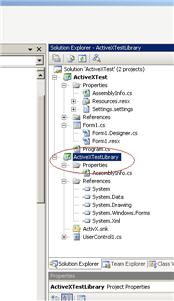
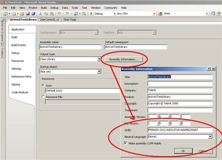
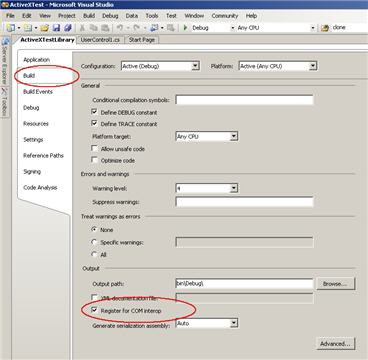
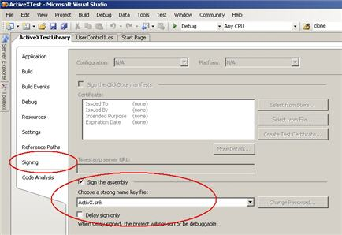

|Product Version|Product|Author|Last modified|
|----|----|----|----|
|Q2 2008|RadControls for WinForms|Dimitar Kapitanov|Sep 15, 2008| 

   
**HOW-TO**

Wrap a .NET user control in an ActiveX class  
   
**SOLUTION**

Let's create a very simple example that includes a label and a button inside of a user control. When the button is clicked, the code in the Click event handler changes the text of the label.   
   
Create a new solution that includes a Windows Forms application (to test the functionality provided by the user control). Then add a library project that will wrap our user control.  
   
 

   
 
**Setting up the library project**
Open the library's **Property Settings** window and select the **Application **tab. You should see an *“Assembly Information…”* button - click on it and it will open a dialog form with various assembly settings.
 
You will see a checkbox named *“Make assembly COM-visible”*. The checkbox must be checked. Also you will see a GUID field. It is used to set the ID of the typelib if this project is exposed to COM.
 

 

**Setting up the build**  
If you want automatic registration of the freshly created ActiveX wrapper you should check the *“Register for COM interop”* checkbox in the **Build **tab of the settings form. It runs Regasm.exe after every build to register the types with COM (which you probably shouldn't do until you're stable because your COM GUIDs will change whenever you change the methods unless you specify GUIDs explicitly, so your registry could end up with a lot of registration junk for versions that will never be used): 


 
 
**Signing the project**  
 If you're using VB.NET, you also need a strong named assembly. This is considered a good practice and it is good to do it for the C# project as well:
 

 
This is all you have to do in the project settings, but we have unfinished business with the code base.What we have below is the *ProgId* attribute which provides a unique name for the created ActiveX interface:
 
````C#
[ProgId("ActiveXTestLibrary.UserControl")]      
[ClassInterface(ClassInterfaceType.AutoDispatch)]      
public partial class UserControl1 : UserControl      
{}    

````


 
It is uniquely identified by the assembly GUID, yet the GUIDs are not human-readable, and a second level of abstraction (easy referral) is provided by the (**Prog**rammatic **ID**entifier) or the *ProgId* attribute. For example, the **ProgID** for the **Word** automation object is ***Word.Basic***.
 
The second *ClassInterface* attribute states whether and how a COM interface will be generated for the managed assembly. The behavior is controlled through an enum named *ClassInterfaceType*. You can find more on the topic here: [ClassInterfaceType Enumeration](http://msdn.microsoft.com/en-us/library/system.runtime.interopservices.classinterfacetype.aspx).<!---->
 
 
Last but not least you can provide static methods that are invoked when the ActiveX is registered or unregistered through the Regasm.exe:  
   
 
````C# 
[ComRegisterFunction()]  
public static void RegisterClass(string key)  
{  
    StringBuilder sb = new StringBuilder(key);  
    sb.Replace(@"HKEY_CLASSES_ROOT\", "");  
 
    // Open the CLSID\{guid} key for write access  
 
    RegistryKey k = Registry.ClassesRoot.OpenSubKey(sb.ToString(), true);  
 
    RegistryKey ctrl = k.CreateSubKey("Control");  
    ctrl.Close();  
 
    // Next create the CodeBase entry - needed if not string named and GACced.  
 
    RegistryKey inprocServer32 = k.OpenSubKey("InprocServer32", true);  
    inprocServer32.SetValue("CodeBase", Assembly.GetExecutingAssembly().CodeBase);  
    inprocServer32.Close();  
 
    k.Close();  
}  
 
[ComUnregisterFunction()]  
public static void UnregisterClass(string key)  
{  
    StringBuilder sb = new StringBuilder(key);  
    sb.Replace(@"HKEY_CLASSES_ROOT\", "");  
 
    // Open HKCR\CLSID\{guid} for write access  
 
    RegistryKey k = Registry.ClassesRoot.OpenSubKey(sb.ToString(), true);  
 
    // Delete the 'Control' key, but don't throw an exception if it does not exist  
    if (k == null)  
    {  
        return;  
    }  
    k.DeleteSubKey("Control", false);  
 
    // Next open up InprocServer32  
 
    RegistryKey inprocServer32 = k.OpenSubKey("InprocServer32", true);  
 
    // And delete the CodeBase key, again not throwing if missing   
 
    inprocServer32.DeleteSubKey("CodeBase", false);  
 
    // Finally close the main key   
 
    inprocServer32.Close();    k.Close();   
} 

````

 
The methods have predefined names (RegisterClass and UnregisterClass) and should be marked respectively with the ComRegisterFunction/ComUnregisterFunction attributes. Here we register the category of the ActiveX as a UI control.
 
 
**Testing the ActiveX control**
 
You can do so by using the tstcon32.exe tool (ActiveXControlTestContainer) that is provided with your Visual Studio installation. You can invoke it easily through the Visual Studio Command Prompt which has all variables and paths preset correctly.

 
**Unlocking locked assemblies**
 
You can end up with locked assemblies due to the tstcon32 test. What you can do is use a file unlock utility to kill the locking process. Then you could unregister the COM interface using the Regasm.exe /unregister option and then delete the file.
 
 
**The sample project**  
   
 You can find [here](https://github.com/telerik/winforms-sdk/tree/master/ActiveXTest) a sample project which follows the above approach. The UserControl has RadPanelBar, RadLabel and RadButton on it.


