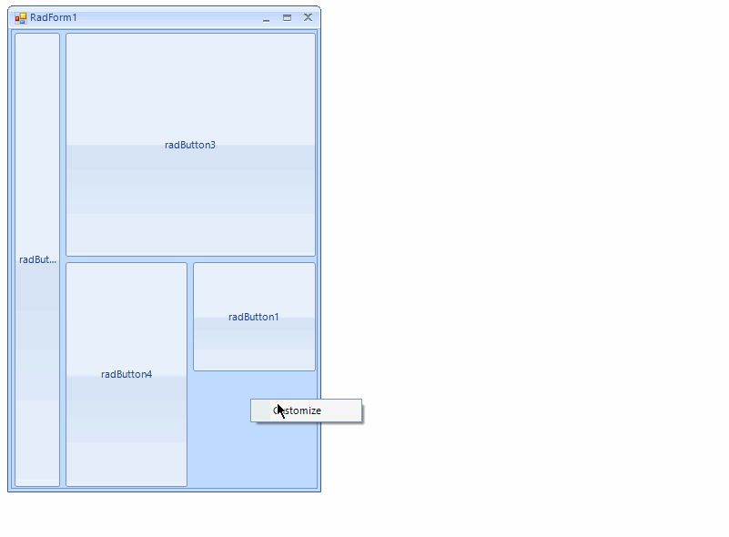
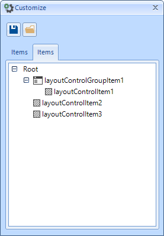

# Customize Layout Mode

This article describes how the layout can be changed at runtime.
      

## Customize Dialog

With __RadLayoutControl__ the predefined form layout can be edited at runtime.
          This can be achieved by opening the __Customize__ dialog. It can be opened from the default context menu.
        
>caption Figure 1: Customize dialog.

Once the dialog is opened you will be able to rearrange the controls with drag and drop operations. 
          Additional items can be added from the __Items__ tab as well.
        
>caption Figure 2: Arranging the layout at runtime.

The current layout structure is shown in the
          __Structure__ tab. It allows you to easily select and even rearrange the controls by dragging from this tab to the form.
        
>caption Figure 3: Structure tab.

The customize dialog allows you to save/load the layout. This can be achieved by using the corresponding buttons.
        

## The DragOverlay

The __DragOverlay__ is a separate control which is shown when the customize dialog is opened. 
          It contains snapshot of the form’s layout and is used for items arranging. 
          There is a __DragOvelay__ property which is allowing you to access this control.
          It allows you to access the drag and drop service as well.
        
