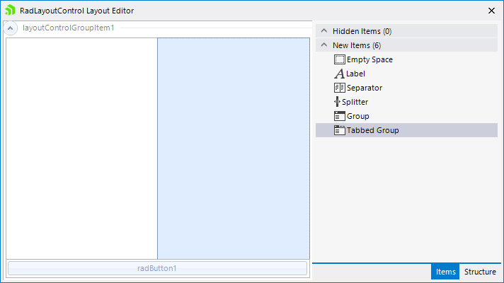
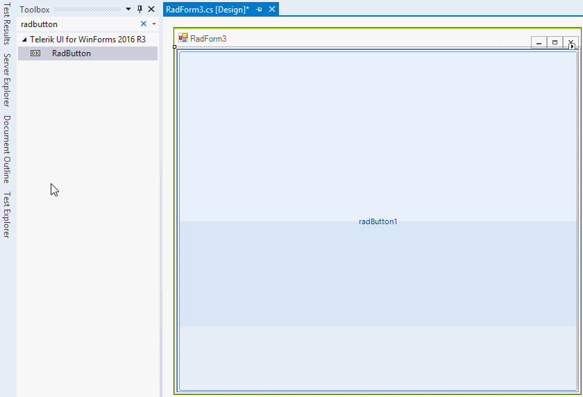
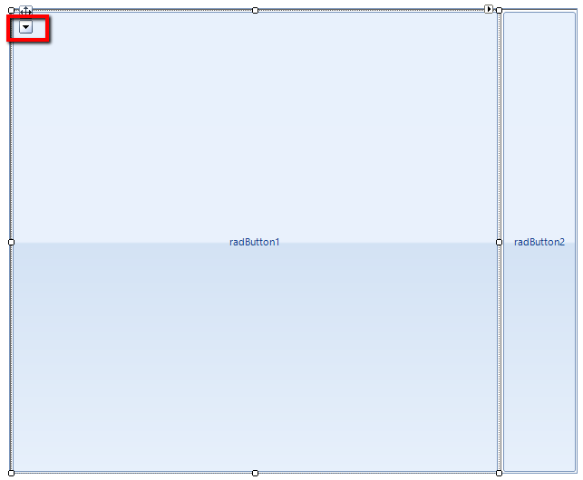
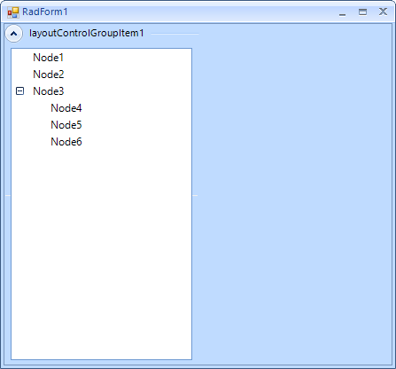
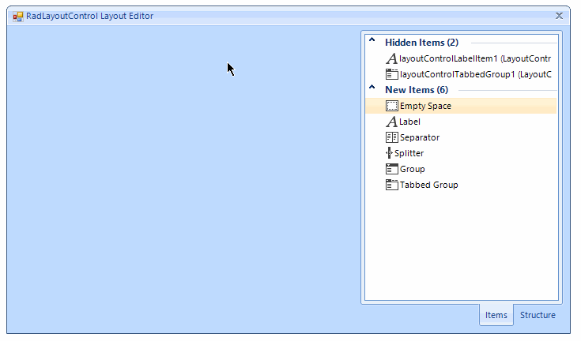

# Design Time

This article describes what the user can do with __RadLayoutControl__ at design time.

## Smart Tag

The smart tag allows you to open the layout editor, change the theme and open the on-line resources. You can dock the control in its parent container as well. The following section describes the layout editor.
        
>caption Figure 1: Smart Tag. 

## Layout Editor
      

The layout editor allows you to add and arrange [items]() at design time. It can be opened from the smart tag.
      
>caption Figure 2: The design time Layout Editor. 

This editor allows you to add items to the layout. To do this just drag and drop an item from the __Items__ tab in the layout panel. You can hide existing items with the default context menu as well. The __Structure__ tab shows the current layout structure and allows easier item selection. You can start drag and drop operation from this tab to the layout panel.

## Arrange Controls 

At design time you will be able to add and arrange any underlying controls you want. To achieve that just drag a control on the layout panel. The drag hint will show you where the control will be positioned. Once you are ready you should just drop the control in the desired position.

>note To position the controls in different location at least one item should be added to the layout panel. It could be an empty space item.
>

>caption Figure 3: Adding control at design time. 

## Selection Glyph

The selection glyph is an arrow that is shown when a control in the layout panel is selected. It allows you to select the underlying host [item]() and change its properties at design time.
        
>caption Figure 4: Selection Glyph. 

## Adding Groups

The groups can be expanded or collapsed. The group contains separate layout panel which allows you to add and arrange the controls in it just like in the layout control. To add a group you should first open the Layout Editor. First you can just add a free space item. This way the group would not occupy the entire space. Now you can add a group, once the group is added you can close the Layout Editor and add controls to the group. Figure 3 shows a sample layout with a group. 
        
>caption Figure 5: Adding Group. 

## Adding Tabbed Groups

The tabbed group allows you to display the underlying controls with tabbed layout. To add a tabbed group first open the Layout Editor and add a free space item to the layout panel. Now add a tabbed group to the panel. Once the group is added you can add tabs by adding regular group items to the tabbed group. The first one should occupy the entire space of the tabbed group. The second should be added to the top of the tabbed group. After the tabs are added you can add controls like you do in the regular layout panel.
        
>caption Figure 6: Adding tabbed groups. 

# See Also

 * [Items]()

 * [Getting Started]()

 * [Properties, Events and Methods]()
