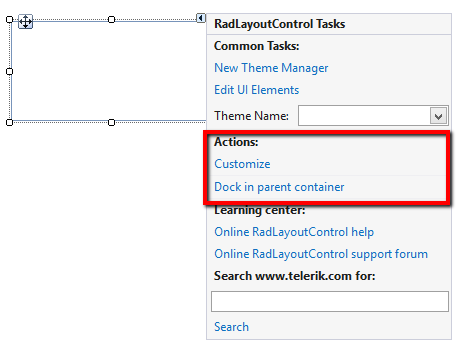
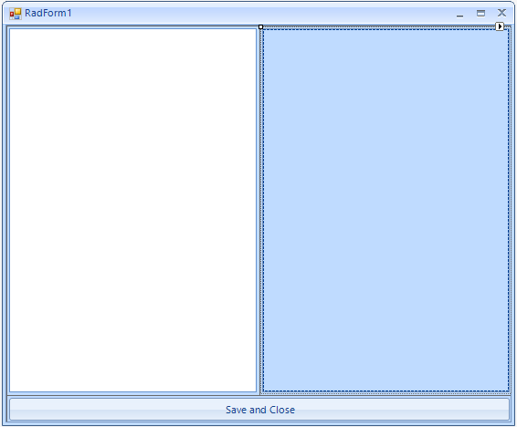
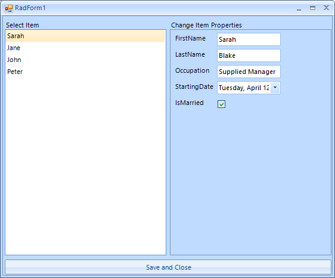

# Getting Started


In this article, you will learn how to use __RadLayoutControl__. The example below shows how you can create a layout that will fill the entire form and will be resized along with it.

## 

1\. First drag and drop the control on the form. Set its __Dock__ property to *Fill* (figure 1 shows how you can do that from the smart tag). The control will be responsible for the entire form layout and the other controls will be placed inside it.
            
>caption Figure 1: Dock in parent container.<br>

2\. Add __RadListView__ to the layout control it will take the entire space because it is the only control in the layout panel, then add __RadDataEntry__ to the right part of the panel. The final step of the layout creation is to add a close button to the bottom of the form. Figure 3 shows the desired layout at this step.
            
>caption Figure 2: Sample layout.<br>

3\. Let’s add some functionality to our new form. The following snippet shows how you can bind the two controls and close the form when the button is clicked. Additionally you can show text above the __RadDataEntry__ and __RadListView__. For this purpose you can just use the items text. Detailed information about the used properties is available in the [Items]() article. Figure 3 shows the final layout. If you now try to resize the form, you will see that the controls in __RadLayoutControl__ grow and shrink proportionally.

{{source=..\SamplesCS\LayoutControl\GettingStartedForm.cs region=FormCode}} 
{{source=..\SamplesVB\LayoutControl\GettingStartedForm.vb region=FormCode}} 

````C#
    
public partial class GettingStartedForm : Telerik.WinControls.UI.RadForm
{
    public GettingStartedForm()
    {
        InitializeComponent();
        
        List<Employee> employees = new List<Employee>();
        employees.Add(new Employee()
        {
            FirstName = "Sarah",
            LastName = "Blake",
            Occupation = "Supplied Manager",
            StartingDate = new DateTime(2005, 04, 12),
            IsMarried = true
        });
        employees.Add(new Employee()
        {
            FirstName = "Jane",
            LastName = "Simpson",
            Occupation = "Security",
            StartingDate = new DateTime(2008, 12, 03),
            IsMarried = true
        });
        employees.Add(new Employee()
        {
            FirstName = "John",
            LastName = "Peterson",
            Occupation = "Consultant",
            StartingDate = new DateTime(2005, 04, 12),
            IsMarried = false
        });
        employees.Add(new Employee()
        {
            FirstName = "Peter",
            LastName = "Bush",
            Occupation = "Cashier",
            StartingDate = new DateTime(2005, 04, 12),
            IsMarried = true
        });
        
        BindingSource bindingSource1 = new BindingSource();
        bindingSource1.DataSource = employees;
        
        radDataEntry1.DataSource = bindingSource1;
        radListView1.DataSource = bindingSource1;
        radListView1.DisplayMember = "FirstName";
        radListView1.AllowEdit = false;
        
        this.radButton1.Click += radButton1_Click;
        layoutControlItem1.DrawText = true;
        layoutControlItem2.DrawText = true;
        layoutControlItem1.TextProportionalSize = 0.05f;
        layoutControlItem2.TextProportionalSize = 0.05f;
        layoutControlItem1.TextPosition = LayoutItemTextPosition.Top;
        layoutControlItem2.TextPosition = LayoutItemTextPosition.Top;
        layoutControlItem1.TextAlignment = ContentAlignment.BottomLeft;
        layoutControlItem2.TextAlignment = ContentAlignment.BottomLeft;
        layoutControlItem1.Text = "Select Item";
        layoutControlItem2.Text = "Change Item Properties";
    }
    
    void radButton1_Click(object sender, EventArgs e)
    {
        this.Close();
    }
}
    
public class Employee
{
    public string FirstName { get; set; }
    
    public string LastName { get; set; }
    
    public string Occupation { get; set; }
    
    public DateTime StartingDate { get; set; }
    
    public bool IsMarried { get; set; }
}

````
````VB.NET
Partial Public Class GettingStartedForm1
    Inherits Telerik.WinControls.UI.RadForm
    Public Sub New()
        InitializeComponent()
        Dim employees As New List(Of EmployeeData)()
        employees.Add(New EmployeeData() With {.FirstName = "Sarah", .LastName = "Blake", .Occupation = "Supplied Manager", .StartingDate = New Date(2005, 4, 12), .IsMarried = True})
        employees.Add(New EmployeeData() With {.FirstName = "Jane", .LastName = "Simpson", .Occupation = "Security", .StartingDate = New Date(2008, 12, 3), .IsMarried = True})
        employees.Add(New EmployeeData() With {.FirstName = "John", .LastName = "Peterson", .Occupation = "Consultant", .StartingDate = New Date(2005, 4, 12), .IsMarried = False})
        employees.Add(New EmployeeData() With {.FirstName = "Peter", .LastName = "Bush", .Occupation = "Cashier", .StartingDate = New Date(2005, 4, 12), .IsMarried = True})
        Dim bindingSource1 As New BindingSource()
        bindingSource1.DataSource = employees
        radDataEntry1.DataSource = bindingSource1
        radListView1.DataSource = bindingSource1
        radListView1.DisplayMember = "FirstName"
        radListView1.AllowEdit = False
        AddHandler Me.radButton1.Click, AddressOf radButton1_Click
        layoutControlItem1.DrawText = True
        layoutControlItem2.DrawText = True
        layoutControlItem1.TextProportionalSize = 0.05F
        layoutControlItem2.TextProportionalSize = 0.05F
        layoutControlItem1.TextPosition = LayoutItemTextPosition.Top
        layoutControlItem2.TextPosition = LayoutItemTextPosition.Top
        layoutControlItem1.TextAlignment = ContentAlignment.BottomLeft
        layoutControlItem2.TextAlignment = ContentAlignment.BottomLeft
        layoutControlItem1.Text = "Select Item"
        layoutControlItem2.Text = "Change Item Properties"
    End Sub
    Private Sub radButton1_Click(ByVal sender As Object, ByVal e As EventArgs)
        Me.Close()
    End Sub
End Class
Public Class EmployeeData
    Public Property FirstName() As String
    Public Property LastName() As String
    Public Property Occupation() As String
    Public Property StartingDate() As Date
    Public Property IsMarried() As Boolean
End Class

````

{{endregion}} 

>caption Figure 3: The application final layout.<br>
