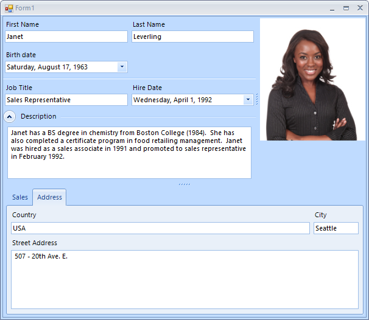

# LayoutControl

## 

__RadLayoutControl__ allows you to add and arrange other controls in complex layouts.

>caption Figure 1: RadLayoutControl. 

The below list shows the main features of the control.

* Create complex layouts where the controls are automatically resized according to the current available size.

* Arrange the controls in the form at runtime - your users will be able to rearrange the controls according to their needs.

* Save and load the layout.

* Group the underlying controls in tabs.

* Expand/Collapse groups.
            
