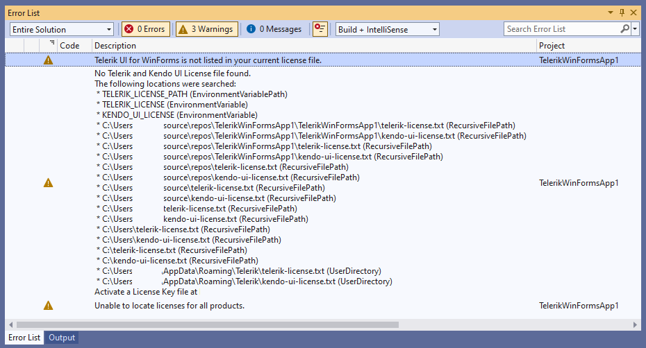
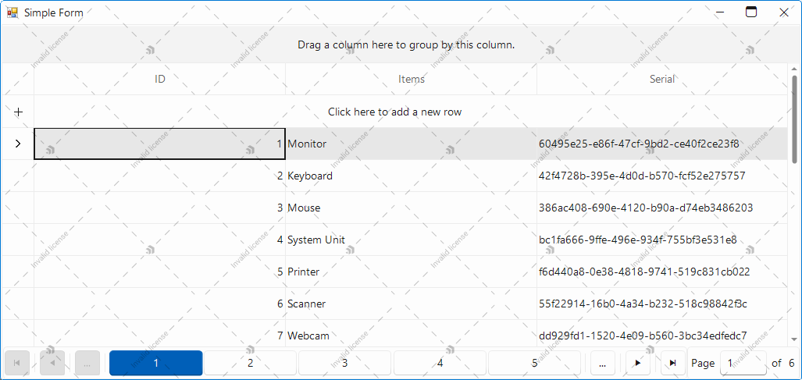
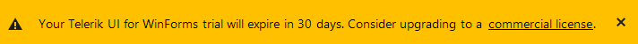
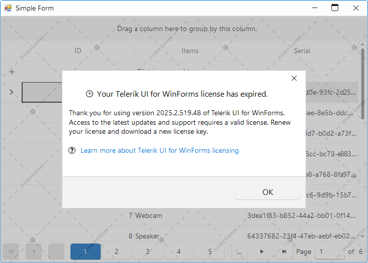

# License Activation Errors and Warnings

Starting with the __2025 Q1 release__, using Telerik UI for .NET WinForms without a license or with an invalid license causes specific license warnings and errors. This article defines what an invalid license is, explains what is causing it, and describes the related license warnings and errors.

A missing, expired, or invalid license will result in:
  - A watermark appearing on application startup.
  - A modal dialog appearing on application startup. Clicking the **OK** button of the dialog closes the dialog and removes the banner until the next application startup.
  - A warning messages similar to the following may appear in the build log:

 

## Invalid License

An invalid license can be caused by any of the following:

- Using an expired subscription license—subscription licenses expire at the end of the subscription term.
- Using a perpetual license for product versions released outside the validity period of your license.
- Using an expired trial license.
- A missing license for Telerik UI for .NET WinForms.
- Not installing a license key in your application.
- Not updating the license key after renewing your Telerik UI for .NET WinForms license.

## License Warnings

If you use Telerik UI for WinForms in a project with an invalid license, the UI components exhibit the following invalid license attributes:

* A watermark appears over a number of selected components.
* A banner is rendered on pages that use the Telerik UI for WinForms components.
* A modal dialog appears on pages when your Telerik UI for WinForms license has expired.

### Watermark

A watermark appears on the form using Telerik UI for WinForms controls:

### Banner

A banner appears on pages that use unlicensed Telerik UI for WinForms components:

* Clicking the ? button on the banner takes you to the Telerik licensing price page.
* Clicking the X button of the banner closes it until the page is reloaded or a license is activated.

### Modal Dialog

A modal dialog appears on pages when your Telerik UI for WinForms license has expired:

## License Warnings and Errors

When using Telerik UI for .NET WinForms in a project with an expired or missing license, the `Telerik.Licensing` build task will indicate the following errors or conditions:

| Error or Condition           |Message Code   |Solution           |
|:-----------------------------|:-----------:|:--------------------|
| `No Telerik and Kendo UI License file found`           |TKL002   | [Install up a license key]() to activate the UI components and remove the error message. | 
| `Corrupted Telerik and Kendo UI License Key content` in *file path or environment variable name* |TKL003      |- If you use a telerik-license.txt file to activate the components, [Download a new license key](#downloading-the-license-key) and place it in your home directory. Make sure to use a license key and not a script key.   - If you use the TELERIK_LICENSE environment variable to store your license key, [Download a new license key](#downloading-the-license-key), update the content of the environment variable, and make sure it contains the entire key.|
|`Unable to locate licenses for all products`|TKL004|Your license is not valid for all Telerik and Kendo products added to your project. If you have already purchased the required license, then [update your license key](#updating-your-license-key).|
| `Telerik UI for .NET WinForms is not listed in your current license file.` |TKL101| Review the purchase options for the listed products. Alternatively, remove the references to the listed packages from `package.json`. |
| `Your current license has expired.` |TKL102| You are using a product version released outside the validity period of your perpetual license. To remove the error message, do either of the following:   - Renew your subscription and [download a new license key](#downloading-the-license-key) and use it to activate the controls.   - Downgrade to a product version included in your perpetual license as indicated in the message. |
| `Your subscription has expired.`|TKL103; TKL104  | Renew your subscription and [download a new license key](#downloading-the-license-key).|
| `Your trial has expired.`    |TKL105   | Purchase a commercial license to continue using the product. |
|`No Telerik or Kendo UI product references detected in project`|TKL001|   - If you use Telerik products and see this message, update the Telerik.Licensing package to version 1.4.9 or later.   - If you do not use Telerik products, remove the `Telerik.Licensing` NuGet reference from your project.|

## See Also

* [Setting Up Your License Key]()
* [Adding the License Key to CI Services]()
* [Frequently Asked Questions about Your Telerik UI for .NET WinForms License Key]()
