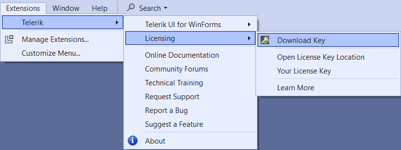
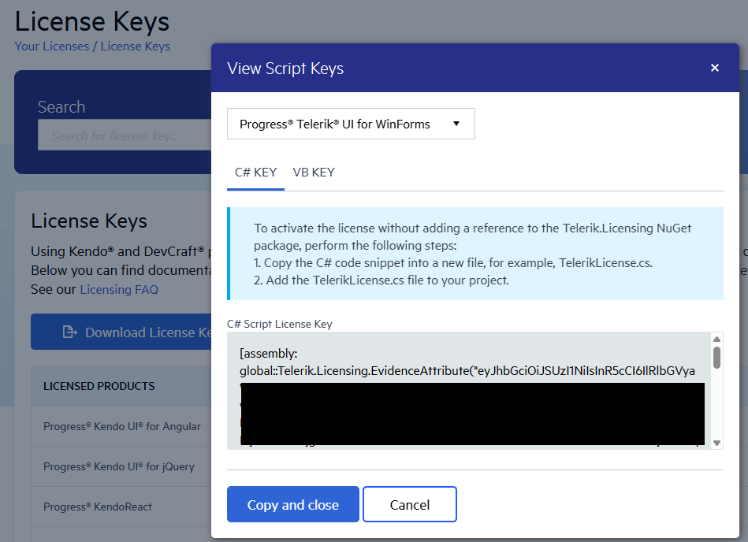

# Setting Up Your Telerik UI for WinForms License Key

Starting with the __Q1 2025 release__, the UI components from the Telerik UI for WinForms library require activation through a license key (trial or commercial). This article describes how to download your personal license key and use it to activate the Telerik UI for WinForms components. An invalid license results in [errors and warnings]() during build and run-time indicators such as watermarks and banners.

## Downloading the License Key

To download a license key for Telerik UI for WinForms, you must have either a developer license or a trial license. If you are new to Telerik UI for WinForms, sign up for a [free trial](https://www.telerik.com/try/ui-for-WinForms) first, and then follow the steps below.

Depending on your development environment and preferences, you can install your license key in either of the following ways: 

* [Automatic installation](#automatic-license-key-installation) - suitable for developers using Telerik productivity tools like the Telerik extensions for Visual Studio and the Progress Control Panel.
* [Manual installation](#manual-license-key-installation) - suitable for trial users and developers who prefer to manage their projects and Telerik product versions manually.

>note Update your license key whenever you [renew or purchase a new Telerik license](#updating-your-license-key).

## Automatic License Key Installation

To download and install your Telerik license key automatically, you can use either of the following Telerik productivity tools. They can automatically download and store the license key in your home directory (`%appdata%\Telerik`) and make it available for all projects that you develop on your local machine. 
These tools include [Telerik UI for WinForms Visual Studio extensions](#installing-a-license-key-with-the-vs-extensions) and [Telerik Control Panel](#installing-a-license-key-with-the-progress-control-panel)

### Installing a License Key with the VS Extensions

To install your license key by using the [Telerik UI for WinForms Visual Studio extensions]():

1. Open Visual Studio.
1. Go to **Extensions > Telerik > Licensing > Download Key**.

    
1. You might be asked to enter your Telerik credentials to log into your [Telerik account](https://www.telerik.com/account/).

The Visual Studio extension automatically downloads the license key file to your home directory (`%appdata%\Telerik`), which activates the Telerik WinForms components.

### Installing a License Key with the Progress Control Panel

To install your Telerik License Key by using the [Progress Control Panel](https://docs.telerik.com/controlpanel/introduction), start the application. It automatically downloads the license key file to your home directory (`%appdata%\Telerik`), which activates the Telerik WinForms components.

## Manual License Key Installation

1. Go to the [License Keys](https://www.telerik.com/account/your-licenses/license-keys) page in your Telerik account.

1. Click the **Download License Key** button.

    

## Activating the Telerik UI for WinForms Components

To activate the Telerik UI for WinForms controls:

1. Copy the [downloaded](#downloading-the-license-key) `telerik-license.txt` license key file to your home directory. This makes the license key available to all projects that you develop on your computer:

    * For Windows: `%AppData%\Telerik\telerik-license.txt`
    * For Mac/Linux: `~/.telerik/telerik-license.txt`
    * Alternatively, copy the `telerik-license.txt` license key file to the root folder of your project. This makes the license key available only to this project. Do not commit the file to source control, as this is your personal license key.

1. Download the `Telerik.Licensing` NuGet package from [NuGet.org](https://www.nuget.org/). It will add the **Telerik.Licensing.Runtime** assembly in your project, which is required to activate the WinForms controls.

When you build the project, the `Telerik.Licensing` NuGet package automatically locates the license file and uses it to activate the WinForms controls.

> If your project doesn’t use NuGet packages, see the [next document section](#installing-a-license-key-in-projects-without-nuget-references).

## Installing a License Key in Projects without NuGet References

Telerik strongly recommends the use of NuGet packages whenever possible. Only include the license key as a code snippet when NuGet packages are not an option.

If you cannot use NuGet packages in your project, add the license as a code snippet:

1. Go to the [License Keys page](https://www.telerik.com/account/your-licenses/license-keys) in your Telerik account.

1. On the Telerik UI for WinForms row, click the **View key** link in the **SCRIPT KEY** column.

    

1. Copy the C# code snippet into a new file, for example, `TelerikLicense.cs`.

1. Add the `TelerikLicense.cs` file to your project.

>important Do not publish the license key code snippet in publicly accessible repositories. This is your personal license key.

## Updating Your License Key

Whenever you purchase a new Telerik UI for WinForms license or renew an existing one, always [download a new license key](#downloading-the-license-key). The new license key includes information about all previous license purchases. This process is referred to as a license key update. Once you have the new license key, use it to [activate the components](#activating-the-telerik-ui-for-net-winforms-components).

## See Also

* [License Activation Errors and Warnings]()
* [Adding the License Key to CI Services]()
* [Frequently Asked Questions about Your Telerik UI for WinForms License Key]()
