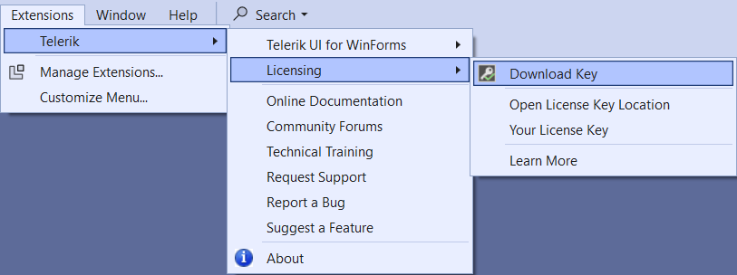
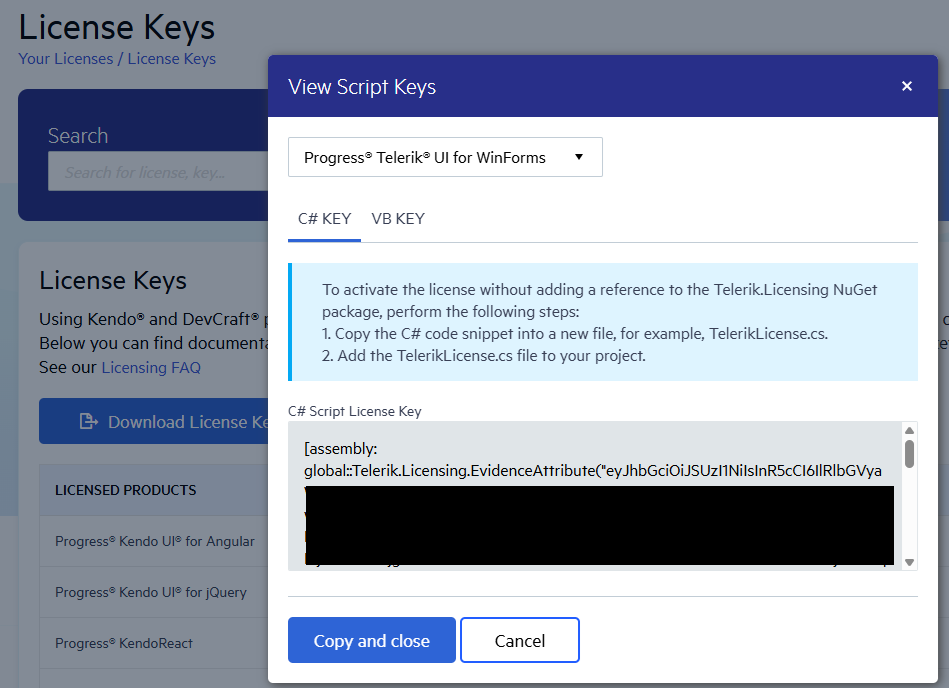

# Setting Up Your Telerik UI for WinForms License Key

Starting with Q1 2025, Telerik UI for WinForms requires activation through a trial or commercial license key. The recommended activation path is to use the `Telerik.Licensing` NuGet package together with a `telerik-license.txt` license key file. Use the script-key approach only when package-based activation is not possible or when you work in exceptional scenarios that rely on direct assembly references, such as some plug-ins, add-ins, isolated class libraries, or similar host-constrained solutions. If the license is missing or invalid, builds show [license activation errors and warnings](), and running applications may display watermarks or banners.

## Choose the Right Activation Method

Before you copy the license key or update your build pipeline, identify how your project consumes Telerik UI for WinForms:

* Recommended: Use a `telerik-license.txt` file together with the `Telerik.Licensing` NuGet package. This is the preferred activation path for regular WinForms projects, local development, and CI builds.
* Alternative: Use a script key source file only when the project references Telerik assemblies directly and cannot use the `Telerik.Licensing` package. In that scenario, the home-directory license file is not enough by itself.

Choose the script approach only if package-based activation is not available in your solution architecture or if you are dealing with a special host scenario that requires direct assembly references.

>note Update your license key whenever you [renew or purchase a new Telerik license](#updating-your-license-key).

## Downloading the License Key

To download a license key for Telerik UI for WinForms, you must have either a developer license or a trial license. If you are new to Telerik UI for WinForms, sign up for a [free trial](https://www.telerik.com/try/ui-for-WinForms) first, and then follow the steps below.

Depending on your development environment and preferences, you can install your license key in either of the following ways:

* [Automatic installation](#automatic-license-key-installation): Suitable for local Windows development with Telerik productivity tools such as the Visual Studio extensions and the Progress Control Panel.
* [Manual installation](#manual-license-key-installation): Suitable for build servers, locked-down environments, trial users, and teams that prefer to manage files directly.

After you download the license key, prefer the [NuGet-based activation path](#activate-nuget-based-telerik-ui-for-winforms-projects) unless your project explicitly cannot use it.

## Automatic License Key Installation

To download and install your Telerik license key automatically, use one of the following Telerik tools or workflows. They store the license key in `%AppData%\Telerik` for the current Windows user account and make it available to NuGet-based Telerik UI for WinForms projects that build under that account.

These options include [Telerik UI for WinForms Visual Studio extensions](#installing-a-license-key-with-the-vs-extensions), [Progress Control Panel](#installing-a-license-key-with-the-progress-control-panel), and [Telerik CLI](#installing-a-license-key-with-telerik-cli).

### Installing a License Key with the VS Extensions

To install your license key by using the [Telerik UI for WinForms Visual Studio extensions]():

1. Open Visual Studio.
1. Go to **Extensions > Telerik > Licensing > Download Key**.

    
1. You might be asked to enter your Telerik credentials to log into your [Telerik account](https://www.telerik.com/account/).

The Visual Studio extension automatically downloads the license key file to your home directory (`%AppData%\Telerik`), which activates NuGet-based Telerik WinForms projects for the current Windows user account.


### Installing a License Key with the Progress Control Panel

To install your Telerik license key by using the [Progress Control Panel](https://docs.telerik.com/controlpanel/introduction), start the application. It automatically downloads the license key file to your home directory (`%AppData%\Telerik`), which activates NuGet-based Telerik WinForms projects for the current Windows user account.

### Installing a License Key with Telerik CLI

Use [Telerik CLI](#get-license-key) when you prefer a command-line workflow or want to download the license key without opening Visual Studio. The `telerik license get-key` command downloads the latest `telerik-license.txt` file to `%AppData%\Telerik` for the current user account.

## Manual License Key Installation

Use manual installation when you need to control where the license file is stored, prepare a build agent, or work outside the Telerik productivity tools:

1. Go to the [License Keys](https://www.telerik.com/account/your-licenses/license-keys) page in your Telerik account.
1. Click the **Download License Key** button.

    

After you download `telerik-license.txt`, continue with the activation path that matches your project type.

In most cases, that means continuing with the [NuGet-based activation path](#activate-nuget-based-telerik-ui-for-winforms-projects). Use the script-key path only when your project cannot use `Telerik.Licensing`.

## Activate NuGet-Based Telerik UI for WinForms Projects

This is the recommended activation path for Telerik UI for WinForms projects. Use it whenever the project can install the `Telerik.Licensing` NuGet package:

1. Install or restore the `Telerik.Licensing` NuGet package from [NuGet.org](https://www.nuget.org/) in each Telerik UI for WinForms project that you build. It will add the **Telerik.Licensing.Runtime** assembly in your project, which is required to activate the WinForms controls.
1. Copy the [downloaded](#downloading-the-license-key) `telerik-license.txt` file to one of the following locations:

    * For Windows: `%AppData%\Telerik\telerik-license.txt`
    * For Mac/Linux: `~/.telerik/telerik-license.txt`
    * Alternatively, copy the `telerik-license.txt` license key file to the root folder of your project. This makes the license key available only to this project. Do not commit the file to source control, as this is your personal license key.

1. Build the project.

When you build the project, the `Telerik.Licensing` NuGet package automatically locates the license file and uses it to activate the WinForms controls.

>important Prefer this package-based activation model for new and existing projects whenever possible. Use the script-key approach only when the project cannot use `Telerik.Licensing` or must stay on a direct-assembly model for a special integration scenario.

>note If your project does not use NuGet packages, use the script-key approach described in [Installing a License Key in Projects by Using Telerik Assembly References (without NuGet packages)](#installing-a-license-key-in-projects-by-using-telerik-assembly-references-without-nuget-packages).

## Use a License Key on a Windows Build Server or CI Agent

For Windows continuous integration (CI), continue to use the package-based activation path. The critical detail is the Windows account that runs the build. The license file must exist for that account before restore and build start:

1. Store the contents of `telerik-license.txt` as a secure file or pipeline secret.
1. Before the build, create `%AppData%\Telerik` for the build account and write `telerik-license.txt` to that folder. If you want per-project activation instead, copy the file next to the `.csproj` file.
1. Restore NuGet packages and build the project or solution.

The following article explains in detail how to set up the license key for use in CI/CD environments:  [Adding Your License Key to CI/CD Services]().

>important On self-hosted agents and Windows services, copy `telerik-license.txt` to the `%AppData%` profile of the account that actually runs the build. A license file in the profile of the user who configured the machine does not activate builds that run under a different account.

## Installing a License Key in Projects by Using Telerik Assembly References (without NuGet packages)

Use this approach only as an alternative when the project references Telerik assemblies directly and does not use NuGet packages, or when package-based activation is not feasible because of a special hosting or integration constraint. In this model, a shared `telerik-license.txt` file in `%AppData%\Telerik` does not activate the project. Each project must compile a script key into the assembly.

Typical reasons to use this approach include solutions that must stay on assembly references, certain plug-ins or add-ins, and similar cases where the standard `Telerik.Licensing` package flow cannot be applied.

If you add the Telerik components to your project by referencing Telerik assemblies directly, add the license as a code snippet:

1. Go to the [License Keys page](https://www.telerik.com/account/your-licenses/license-keys) in your Telerik account.
1. Click the __View Script Keys__ button.
1. In the dropdown menu, select __Progress® Telerik® UI for WinForms__.

    

1. In the Script Key window, copy the C# or VB script license key. The code snippet contains the `EvidenceAttribute` assembly attribute that holds your license information.

    * For C#: Copy the C# code snippet into a new file, for example, `TelerikLicense.cs`.
    * For VB: Copy the VB code snippet into a new file, for example, `TelerikLicense.vb`.

1. Add the `TelerikLicense.cs` or `TelerikLicense.vb` file to each project that must compile the license.

>note If you build several internal projects without NuGet packages, you can keep one `TelerikLicense.cs` or `TelerikLicense.vb` file in a secure internal location and include it in each project as a linked file or as part of your build process. Do not publish that file in a public repository.

The following example shows a `TelerikLicense.cs` file that contains one script key:

```csharp
[assembly: global::Telerik.Licensing.EvidenceAttribute("your-WINFORMS-script-key-here")] 
```

If you use multiple Telerik products in the same application, such as WPF, Telerik Document Processing, or Telerik Reporting, add script keys for all products that you use.

The following example shows multiple script keys in the same file:

```csharp
[assembly: global::Telerik.Licensing.EvidenceAttribute("your-WPF-script-key-here")] 
[assembly: global::Telerik.Licensing.EvidenceAttribute("your-Document-Processing-script-key-here")] 
[assembly: global::Telerik.Licensing.EvidenceAttribute("your-REPORTING-script-key-here")]     
```

>warning Do not publish the license key code snippet in publicly accessible repositories. This is your personal license key.

## Troubleshoot Common License Key Problems

Use the following checks when a project still reports that no license key was found.

### Why does a file in the application directory not work?

For NuGet-based activation, Telerik UI for WinForms looks for `telerik-license.txt` in `%AppData%\Telerik` or in the project root next to the `.csproj` file. The output folder, installed application folder, and current working directory are different locations and are not used for build-time activation.

### Why does the build work locally but fail on the build server?

In most cases, the build server runs under a different Windows account. Copy the license file to `%AppData%\Telerik` for that account or place it next to the `.csproj` file in the build workspace, then make sure the build restores the `Telerik.Licensing` package before compiling.

### Why does a shared user-profile license file not work for non-NuGet projects?

Projects that reference Telerik assemblies directly do not use file-based activation. They require a script key compiled into each project, so the shared `%AppData%\Telerik\telerik-license.txt` location does not replace the `TelerikLicense.cs` or `TelerikLicense.vb` file.

When possible, move those projects to the `Telerik.Licensing` package model instead of maintaining the script-key flow.

### What should you verify first?

Verify the following items before you continue troubleshooting:

* The file name is exactly `telerik-license.txt`.
* The project restores or installs the `Telerik.Licensing` NuGet package when you use file-based activation.
* The file is in `%AppData%\Telerik` for the build account or next to the `.csproj` file.
* The build server uses the same Windows account and profile path where you copied the file.
* You downloaded a new license key after a license renewal or a new purchase.


## Updating Your License Key

Whenever you purchase a new Telerik UI for WinForms license or renew an existing one, always [download a new license key](#downloading-the-license-key), either automatically or manually. The new license key includes information about all previous license purchases. Once you have the new license key, use it to [activate NuGet-based Telerik UI for WinForms projects](#activate-nuget-based-telerik-ui-for-winforms-projects) or to update the script key that your non-NuGet projects compile.

## See Also

* [License Activation Errors and Warnings]()
* [Adding the License Key to CI Services]()
* [Frequently Asked Questions about Your Telerik UI for WinForms License Key]()
