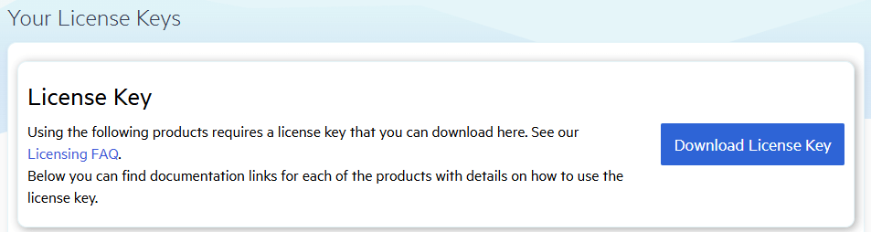

# Setting Up Your Telerik UI for .NET WinForms License Key

Starting with the Q1 2025 release, the UI components from the Telerik UI for .NET WinForms library require activation through a license key (trial or commercial). This article describes how to download your personal license key and use it to activate the Telerik UI for .NET WinForms components.

An invalid license results in [errors and warnings]() during build and run-time indicators such as watermarks and banners.

## Downloading the License Key

To download a license key for Telerik UI for .NET WinForms, you must have either a developer license or a trial license. If you are new to Telerik UI for .NET WinForms, sign up for a [free trial](https://www.telerik.com/try/ui-for-WinForms) first, and then follow the steps below.

1. Go to the [License Keys](https://www.telerik.com/account/your-licenses/license-keys/new) page in your Telerik account.

1. Click the **Download License Key** button.

    

The [Progress Control Panel](), [automated installers](), and the [Visual Studio Extensions]() will automatically download and store your license key in your home directory. This makes it available for all projects that you develop on your local machine.

## Activating the Telerik UI for .NET WinForms Components

To activate the Telerik UI for .NET WinForms controls:

* Copy the [downloaded](#downloading-the-license-key) `telerik-license.txt` license key file to your home directory. This makes the license key available to all projects that you develop on your computer:

    * For Windows: `%AppData%\Telerik\telerik-icense.txt`
    * For Mac/Linux: `~/.telerik/telerik-license.txt`

* Alternatively, copy the `telerik-license.txt` license key file to the root folder of your project. This makes the license key available only to this project. Do not commit the file to source control as this is your personal license key.

When you build the project, the `Telerik.Licensing` NuGet package automatically locates the license file and uses it to activate the WinForms controls.

> If your project doesn’t use NuGet packages, see the [next document section](#installing-a-license-key-in-projects-without-nuget-references).
## Installing a License Key in Projects without NuGet References

Telerik strongly recommends the use of NuGet packages whenever possible. Only include the license key as a code snippet when NuGet packages are not an option.

If you cannot use NuGet packages in your project, add the license as a code snippet:

1. Go to the [License Keys page](https://www.telerik.com/account/your-licenses/license-keys/new) in your Telerik account.

1. On the Telerik UI for .NET WinForms row, click the **View key** link in the **SCRIPT KEY** column.

    

1. Copy the C# code snippet into a new file, for example, `TelerikLicense.cs`.

1. Add the `TelerikLicense.cs` file to your project.

>Do not publish the license key code snippet in publicly accessible repositories. This is your personal license key.

## See Also

* [License Activation Errors and Warnings]()
* [Adding the License Key to CI Services]()
* [Frequently Asked Questions about Your Telerik UI for .NET WinForms License Key]()