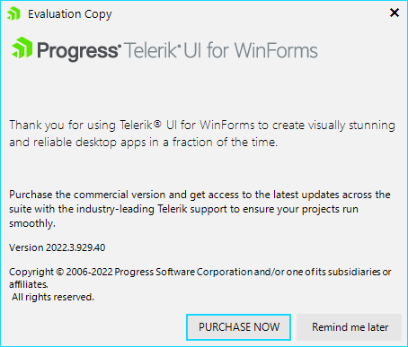

# Trial Vs Licensed version

You can easily download and install the trial version from our site. The trial version is fully functional and the only difference is that you will get the following message after the trial period is expired (when starting an application that references trial assemblies). 

>caption Figure 1: The trial message. 

# Upgrading to licensed version

There are 2 versions of the assemblies (trial and licensed). This is why to upgrade you need to un-install the trial version and then download and install the licensed one. 

* The following article show where you can find the licensed version: [Download Product Files]()

* To check if your current version is trial you can examine the assemblies properties.

 

>note A step by step tutorial is available here:  [How to Upgrade Trial to Licensed Version]().

# See Also

* [How to Upgrade Trial to Licensed Version]()
