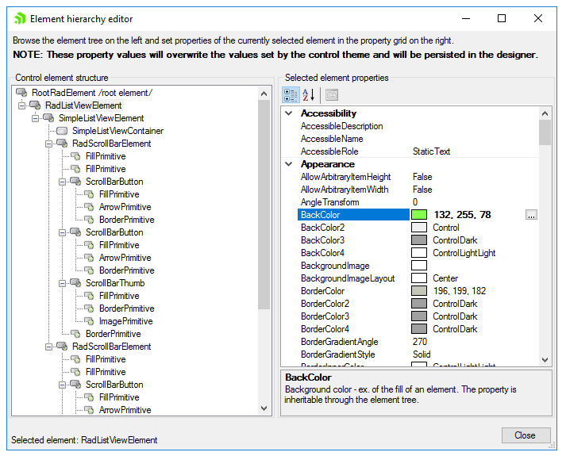

# Accessing and Customizing Elements
 
Accessing and customizing elements can be performed either at design time, or at run time. Before proceeding with this topic, it is recommended to get familiar with the [visual structure]() of the __RadListView__.      

## Design time

You can access and modify the style for different elements in __RadListView__ by using the *Element hierarchy editor*, which can accessed by clicking Edit UI Elements link.
>caption Fig.1 Element hierarchy editor




## Programmatically

You can customize the nested elements at run time as well:
>caption Fig.2 Customize elements


#### Customize elements 

{{source=..\SamplesCS\ListView\ListViewFormattingItems.cs region=CustomizeElements}} 
{{source=..\SamplesVB\ListView\ListViewFormattingItems.vb region=CustomizeElements}} 

````C#
this.radListView1.ListViewElement.BackColor = Color.Yellow;
this.radListView1.ListViewElement.ViewElement.HScrollBar.ThumbElement.ThumbFill.BackColor = Color.Red;

````
````VB.NET
Me.RadListView1.ListViewElement.BackColor = Color.Yellow
Me.RadListView1.ListViewElement.ViewElement.HScrollBar.ThumbElement.ThumbFill.BackColor = Color.Red

````

{{endregion}} 
 
# See Also

* [Formatting Items]()		
