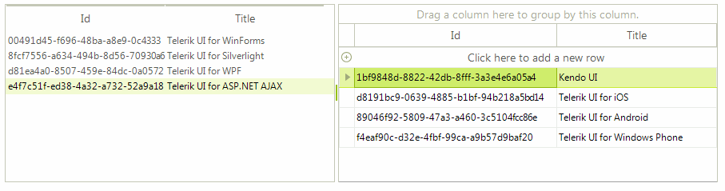

# Drag and Drop using RadDragDropService

This article will guide you through the process of achieving drag and drop functionality from __RadListView__ to __RadGridView__ and vice versa. For this purpose, we will use the __RadDragDropService__, supported by both of the controls. Let’s assume that the __RadListView__  is in unbound mode and the __ViewType__ property is set to *DetailsView*. The __RadGridView__ is bound to a DataTable with identical columns as the manually added ones to the __RadListView__.

#### Populating with data

{{source=..\SamplesCS\ListView\DragDrop\DragDropRadDragDropService.cs region=PopulateWithData}} 
{{source=..\SamplesVB\ListView\DragDrop\DragDropRadDragDropService.vb region=PopulateWithData}} 

````C#
        
DataTable gridViewDataTable = new DataTable();
        
public DragDropRadDragDropService()
{
    InitializeComponent();
    
    this.radListView1.Columns.Add("Id");
    this.radListView1.Columns.Add("Title");
    this.radListView1.ViewType = Telerik.WinControls.UI.ListViewType.DetailsView;
    
    List<string> products = new List<string>()
    {
        "Telerik UI for WinForms",
        "Telerik UI for Silverlight",
        "Telerik UI for WPF",
        "Telerik UI for ASP.NET AJAX"
    };
    for (int i = 0; i < products.Count; i++)
    {
        ListViewDataItem item = new ListViewDataItem();
        this.radListView1.Items.Add(item);
        item["Id"] = Guid.NewGuid().ToString();
        item["Title"] = products[i];
    }
    
    gridViewDataTable.Columns.Add("Id", typeof(string));
    gridViewDataTable.Columns.Add("Title", typeof(string));
    gridViewDataTable.Rows.Add(Guid.NewGuid().ToString(), "Kendo UI");
    gridViewDataTable.Rows.Add(Guid.NewGuid().ToString(), "Telerik UI for iOS");
    gridViewDataTable.Rows.Add(Guid.NewGuid().ToString(), "Telerik UI for Android");
    gridViewDataTable.Rows.Add(Guid.NewGuid().ToString(), "Telerik UI for Windows Phone");
    this.radGridView1.DataSource = gridViewDataTable;
}

````
````VB.NET
Private gridViewDataTable As New DataTable()
Sub New()
    InitializeComponent()
    Me.RadListView1.Columns.Add("Id")
    Me.RadListView1.Columns.Add("Title")
    Me.RadListView1.ViewType = Telerik.WinControls.UI.ListViewType.DetailsView
    Dim products As New List(Of String)() From { _
        "Telerik UI for WinForms", _
        "Telerik UI for Silverlight", _
        "Telerik UI for WPF", _
        "Telerik UI for ASP.NET AJAX" _
    }
    For i As Integer = 0 To products.Count - 1
        Dim item As New ListViewDataItem()
        Me.RadListView1.Items.Add(item)
        item("Id") = Guid.NewGuid().ToString()
        item("Title") = products(i)
    Next
    gridViewDataTable.Columns.Add("Id", GetType(String))
    gridViewDataTable.Columns.Add("Title", GetType(String))
    gridViewDataTable.Rows.Add(Guid.NewGuid().ToString(), "Kendo UI")
    gridViewDataTable.Rows.Add(Guid.NewGuid().ToString(), "Telerik UI for iOS")
    gridViewDataTable.Rows.Add(Guid.NewGuid().ToString(), "Telerik UI for Android")
    gridViewDataTable.Rows.Add(Guid.NewGuid().ToString(), "Telerik UI for Windows Phone")
    Me.RadGridView1.DataSource = gridViewDataTable
End Sub

````

{{endregion}} 
 
## Drag and Drop from RadGridView to RadListView

>caption Figure 1: Drag and Drop from RadGridView to RadListView


1\. The first thing we need to do is to start the __RadGridView__’s drag and drop service when a user clicks on a row with the left mouse down. For this purpose, we should create a custom [grid behavior]():

#### Starting a drag and drop operation

{{source=..\SamplesCS\ListView\DragDrop\DragDropRadDragDropService.cs region=RowBehavior}} 
{{source=..\SamplesVB\ListView\DragDrop\DragDropRadDragDropService.vb region=RowBehavior}} 

````C#
        
//initiates drag and drop service for clicked rows
public class CustomRowGridBehavior : GridDataRowBehavior
{
    protected override bool OnMouseDownLeft(MouseEventArgs e)
    {
        GridDataRowElement row = this.GetRowAtPoint(e.Location) as GridDataRowElement;
        if (row != null)
        {
            RadGridViewDragDropService svc = this.GridViewElement.GetService<RadGridViewDragDropService>();
            svc.Start(row);
        }
        return base.OnMouseDownLeft(e);
    }
}

````
````VB.NET
'initiates drag and drop service for clicked rows
Public Class CustomRowGridBehavior
    Inherits GridDataRowBehavior
    Protected Overrides Function OnMouseDownLeft(e As MouseEventArgs) As Boolean
        Dim row As GridDataRowElement = TryCast(Me.GetRowAtPoint(e.Location), GridDataRowElement)
        If row IsNot Nothing Then
            Dim svc As RadGridViewDragDropService = Me.GridViewElement.GetService(Of RadGridViewDragDropService)()
            svc.Start(row)
        End If
        Return MyBase.OnMouseDownLeft(e)
    End Function
End Class

````

{{endregion}} 

2\. Next, we should register this behavior in our grid:

#### Register the custom row behavior

{{source=..\SamplesCS\ListView\DragDrop\DragDropRadDragDropService.cs region=RegisterRowBehavior}} 
{{source=..\SamplesVB\ListView\DragDrop\DragDropRadDragDropService.vb region=RegisterRowBehavior}} 

````C#
           
//register the custom row behavior
BaseGridBehavior gridBehavior = this.radGridView1.GridBehavior as BaseGridBehavior;
gridBehavior.UnregisterBehavior(typeof(GridViewDataRowInfo));
gridBehavior.RegisterBehavior(typeof(GridViewDataRowInfo), new CustomRowGridBehavior());

````
````VB.NET
'register the custom row behavior
Dim gridBehavior As BaseGridBehavior = TryCast(Me.RadGridView1.GridBehavior, BaseGridBehavior)
gridBehavior.UnregisterBehavior(GetType(GridViewDataRowInfo))
gridBehavior.RegisterBehavior(GetType(GridViewDataRowInfo), New CustomRowGridBehavior())

````

{{endregion}} 

3\. It is necessary to subscribe to the __PreviewDragStart__, __PreviewDragOver__ and __PreviewDragDrop__ events of the grid’s __RadDragDropService__. The __PreviewDragStart__ event is fired once the drag and drop service on the grid is started. We should notify the service that the drag and drop operation can move forward. In the __PreviewDragOver__  event you can control on what targets to allow dropping the dragged row. The __PreviewDragDrop__ event performs the actual move of the row from the __RadGridView__ to the __RadListView__.

#### Handling the RadDragDropService's events

{{source=..\SamplesCS\ListView\DragDrop\DragDropRadDragDropService.cs region=GridViewToListView}} 
{{source=..\SamplesVB\ListView\DragDrop\DragDropRadDragDropService.vb region=GridViewToListView}} 

````C#
        
private void svc_PreviewDragStart(object sender, PreviewDragStartEventArgs e)
{
    e.CanStart = true;
}
        
private void svc_PreviewDragOver(object sender, RadDragOverEventArgs e)
{
    if (e.DragInstance is GridDataRowElement)
    {
        e.CanDrop = e.HitTarget is DetailListViewDataCellElement ||
                    e.HitTarget is DetailListViewElement;
    }
}
        
private void svc_PreviewDragDrop(object sender, RadDropEventArgs e)
{
    DetailListViewDataCellElement targetCell = e.HitTarget as DetailListViewDataCellElement;
    DetailListViewElement targetElement = e.HitTarget as DetailListViewElement;
    GridDataRowElement draggedRow = e.DragInstance as GridDataRowElement;
    
    if (draggedRow == null)
    {
        return;
    }
    ListViewDataItem item = new ListViewDataItem();            
    DataRow draggedDataBoundItem = ((DataRowView)draggedRow.RowInfo.DataBoundItem).Row;
    if (targetElement != null)
    {
        ((RadListViewElement)targetElement.Parent).Items.Add(item) ;
    }
    if (targetCell != null)
    {
        BaseListViewVisualItem targetVisualItem = targetCell.RowElement;
        
        int insertIndex = targetCell.Row.ListView.Items.IndexOf(targetVisualItem.Data);
        if (insertIndex > -1)
        {
            targetCell.Row.ListView.Items.Insert(insertIndex, item);
        }
    }
    item["Id"] = draggedDataBoundItem["Id"];
    item["Title"] = draggedDataBoundItem["Title"];
    
    gridViewDataTable.Rows.Remove(draggedDataBoundItem);
}

````
````VB.NET
Private Sub svc_PreviewDragStart(sender As Object, e As PreviewDragStartEventArgs)
    e.CanStart = True
End Sub
Private Sub svc_PreviewDragOver(sender As Object, e As RadDragOverEventArgs)
    If TypeOf e.DragInstance Is GridDataRowElement Then
        e.CanDrop = TypeOf e.HitTarget Is DetailListViewDataCellElement OrElse TypeOf e.HitTarget Is DetailListViewElement
    End If
End Sub
Private Sub svc_PreviewDragDrop(sender As Object, e As RadDropEventArgs)
    Dim targetCell As DetailListViewDataCellElement = TryCast(e.HitTarget, DetailListViewDataCellElement)
    Dim targetElement As DetailListViewElement = TryCast(e.HitTarget, DetailListViewElement)
    Dim draggedRow As GridDataRowElement = TryCast(e.DragInstance, GridDataRowElement)
    If draggedRow Is Nothing Then
        Return
    End If
    Dim item As New ListViewDataItem()
    Dim draggedDataBoundItem As DataRow = DirectCast(draggedRow.RowInfo.DataBoundItem, DataRowView).Row
    If targetElement IsNot Nothing Then
        DirectCast(targetElement.Parent, RadListViewElement).Items.Add(item)
    End If
    If targetCell IsNot Nothing Then
        Dim targetVisualItem As BaseListViewVisualItem = targetCell.RowElement
        Dim insertIndex As Integer = targetCell.Row.ListView.Items.IndexOf(targetVisualItem.Data)
        If insertIndex > -1 Then
            targetCell.Row.ListView.Items.Insert(insertIndex, item)
        End If
    End If
    item("Id") = draggedDataBoundItem("Id")
    item("Title") = draggedDataBoundItem("Title")
    gridViewDataTable.Rows.Remove(draggedDataBoundItem)
End Sub

````

{{endregion}} 

## Drag and Drop from RadListView to RadGridView

>caption Figure 2: Drag and Drop from RadListView to RadGridView



1\. In order to enable dragging an item from the __RadListView__ and dropping it onto the __RadGridView__, it is necessary to set the RadListView.__AllowDragDrop__ property to *true*.

2\. To implement drag and drop functionality for this scenario, we will use the ListViewElement.__DragDropService__, which is a derivative of the __RadDragDropService__ . Subscribe to its __PreviewDragOver__  and __PreviewDragDrop__ events. In the __PreviewDragOver__ event allow dropping over a row element or over the table element. The __PreviewDragDrop__ event performs the actual inserting of the dragged item into the __RadGridView__’s data source:

#### Handling the RadDragDropService's events

{{source=..\SamplesCS\ListView\DragDrop\DragDropRadDragDropService.cs region=ListViewToGridView}} 
{{source=..\SamplesVB\ListView\DragDrop\DragDropRadDragDropService.vb region=ListViewToGridView}} 

````C#
        
private void DragDropService_PreviewDragOver(object sender, RadDragOverEventArgs e)
{
    e.CanDrop = e.HitTarget is GridTableElement ||
                e.HitTarget is GridDataRowElement;
}
        
private void DragDropService_PreviewDragDrop(object sender, RadDropEventArgs e)
{
    BaseListViewVisualItem draggedItem = e.DragInstance as BaseListViewVisualItem;
    GridDataRowElement rowElement = e.HitTarget as GridDataRowElement;
    GridTableElement tableElement = e.HitTarget as GridTableElement;
    
    if (rowElement == null && tableElement == null)
    {
        return;
    }
    e.Handled = true;           
    DataRow newRow = gridViewDataTable.NewRow();
    if (tableElement != null)
    {
        gridViewDataTable.Rows.Add(newRow);
    }
    if (rowElement != null)
    {
        GridViewRowInfo targetRow = rowElement.RowInfo;
        
        int insertIndex = this.radGridView1.Rows.IndexOf(targetRow);
        if (insertIndex > -1)
        {
            gridViewDataTable.Rows.InsertAt(newRow, insertIndex);
        }
    }
    newRow["Id"] = draggedItem.Data["Id"];
    newRow["Title"] = draggedItem.Data["Title"];
    
    this.radListView1.Items.Remove(draggedItem.Data);
}

````
````VB.NET
Private Sub DragDropService_PreviewDragOver(sender As Object, e As RadDragOverEventArgs)
    e.CanDrop = TypeOf e.HitTarget Is GridTableElement OrElse TypeOf e.HitTarget Is GridDataRowElement
End Sub
Private Sub DragDropService_PreviewDragDrop(sender As Object, e As RadDropEventArgs)
    Dim draggedItem As BaseListViewVisualItem = TryCast(e.DragInstance, BaseListViewVisualItem)
    Dim rowElement As GridDataRowElement = TryCast(e.HitTarget, GridDataRowElement)
    Dim tableElement As GridTableElement = TryCast(e.HitTarget, GridTableElement)
    If rowElement Is Nothing AndAlso tableElement Is Nothing Then
        Return
    End If
    e.Handled = True
    Dim newRow As DataRow = gridViewDataTable.NewRow()
    If tableElement IsNot Nothing Then
        gridViewDataTable.Rows.Add(newRow)
    End If
    If rowElement IsNot Nothing Then
        Dim targetRow As GridViewRowInfo = rowElement.RowInfo
        Dim insertIndex As Integer = Me.RadGridView1.Rows.IndexOf(targetRow)
        If insertIndex > -1 Then
            gridViewDataTable.Rows.InsertAt(newRow, insertIndex)
        End If
    End If
    newRow("Id") = draggedItem.Data("Id")
    newRow("Title") = draggedItem.Data("Title")
    Me.RadListView1.Items.Remove(draggedItem.Data)
End Sub

````

{{endregion}} 


# See Also

* [Drag and Drop in bound mode]()
* [Drag and Drop from another control]()
* [Combining RadDragDropService and OLE drag-and-drop]()	


