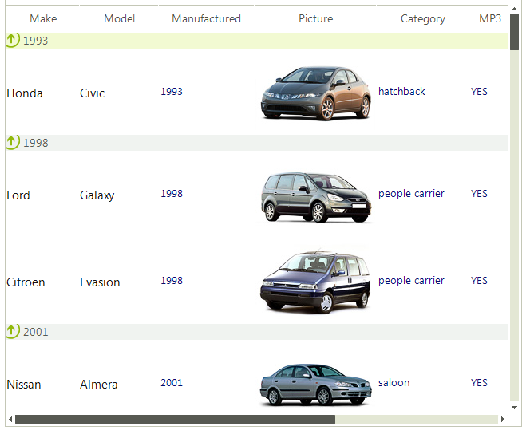

# Features

## 

Since RadListView uses the powerful data layer used also by [RadGridView]() and [RadListControl]() it supports out of the box sorting, filtering and grouping operations. Every operation is achieved by adding the appropriate Descriptor (__FilterDescriptor__, __SortDescriptor__ or __GroupDescriptor__) to the respective Descriptors collection of RadListView (__FilterDescriptors__ and __GroupDescriptors__).

>note When a Descriptor is created, the first argument requires a __PropertyName__ . This property name is used to find a column in the __Columns__ collection of RadListView and execute the desired operation over this column. If such does not exists,the operation is executed for the __Value__ property of the items.
>

Another interesting feature of RadListView is the support of a kinetic scrolling, which makes itvery convenient control for usage of applications deployed on Kiosks. Enabling this feature is as simple as setting the __EnableKineticScrolling__ property to *true*.
        
