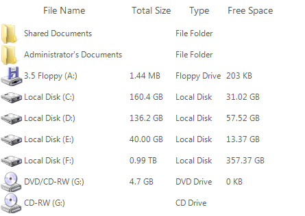

# Sorting

## 

Sorting is possible in two ways either programmatically by adding the appropriate 
        	__SortDescriptor__ to the __SortDescriptors__ collection 
        	of RadListView, or by enabling the user to sort by clicking a column header in __DetailsView__.
        

Enabling sorting on header click is done by setting both __EnableSorting__ and
            __EnableColumnSort__ property to *true*.
        

#### __[C#] Enable column sorting__

{{source=..\SamplesCS\ListView\Features\ListViewSorting.cs region=EnableColumnSort}}
	            radListView1.EnableSorting = true;
	            radListView1.EnableColumnSort = true;
	{{endregion}}

#### __[VB.NET] Enable column sorting__

{{source=..\SamplesVB\ListView\Features\ListViewSorting.vb region=EnableColumnSort}}
	        RadListView1.EnableColumnSort = True
	        RadListView1.EnableSorting = True
	{{endregion}}

The following code demonstrates how to add __SortDescriptor__ to RadListView:

#### __[C#] Adding SortDescriptors__

{{source=..\SamplesCS\ListView\Features\ListViewSorting.cs region=SortDescriptor}}
	            radListView1.EnableSorting = true;
	            SortDescriptor sort = new SortDescriptor("Free Space", ListSortDirection.Ascending);
	            radListView1.SortDescriptors.Add(sort);
	{{endregion}}

#### __[VB.NET] Adding SortDescriptors__

{{source=..\SamplesVB\ListView\Features\ListViewSorting.vb region=SortDescriptor}}
	        RadListView1.EnableSorting = True
	        Dim sort = New SortDescriptor("Free Space", ListSortDirection.Ascending)
	        RadListView1.SortDescriptors.Add(sort)
	{{endregion}}

Here is the sorted data:

