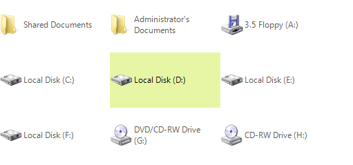
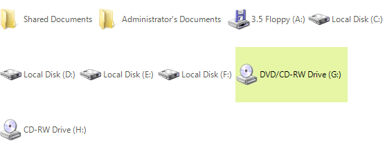
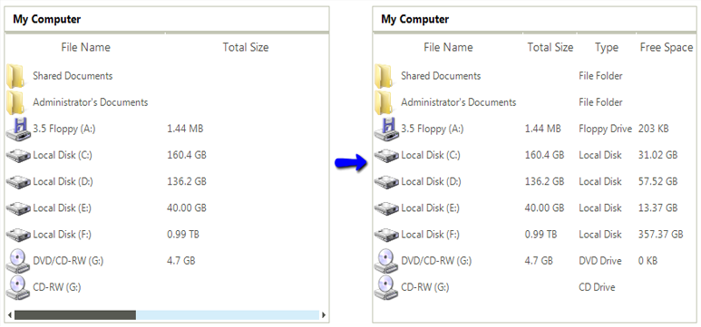

# Working with items


## Selection

RadListView supports both single and multi selection. The selection mode is determined by the
        	__MiltiSelect__ property of the control. The selected item in single selection
        	mode can be accessed from the __SelectedItem__ property and in multi select mode
        	from the __SelectedItems__ collection of RadListView.
        

Multiple items can be selected in code as well. This can be achieved by using the __Select__ method.
          This method takes and array of ListViewDataItem as parameter.#_[C#] Programmatically select items_

	


{{source=..\SamplesCS\ListView\Features\ListViewWorkingWithItems.cs region=itemSelect}} 
{{source=..\SamplesVB\ListView\Features\ListViewWorkingWithItems.vb region=itemSelect}} 

````C#
            ListViewDataItem[] itemsToSlelct = new ListViewDataItem[3];

            itemsToSlelct[0] = radListView1.Items[1];
            itemsToSlelct[1] = radListView1.Items[3];
            itemsToSlelct[2] = radListView1.Items[4];

            radListView1.Select(itemsToSlelct);
````
````VB.NET
        Dim itemsToSlelct(2) As ListViewDataItem

        itemsToSlelct(0) = RadListView1.Items(1)
        itemsToSlelct(1) = RadListView1.Items(3)
        itemsToSlelct(2) = RadListView1.Items(4)

        RadListView1.Select(itemsToSlelct)
        '
````

{{endregion}} 


## Item sizing

In __DetailsView__ this property sets only the __Height__ of the
        	__Item__, since the __Width__ is determined by the 
        	__Width__ of the columns. Here is a sample setting of 50 pixels height of
        	the items and different widths for the columns:
        #_[C#] Item sizing_

	


{{source=..\SamplesCS\ListView\Features\ListViewWorkingWithItems.cs region=itemSizing}} 
{{source=..\SamplesVB\ListView\Features\ListViewWorkingWithItems.vb region=itemSizing}} 

````C#
            radListView1.ItemSize = new Size(0, 50);
            radListView1.Columns[0].Width = 50;
            radListView1.Columns[1].Width = 75;
            radListView1.Columns[2].Width = 100;
````
````VB.NET
        RadListView1.ItemSize = New Drawing.Size(0, 50)
        RadListView1.Columns(0).Width = 50
        RadListView1.Columns(1).Width = 75
        RadListView1.Columns(2).Width = 100
        '
````

{{endregion}} 


In __ViewType.ListView__, when __FullRowSelect__ is set to 
        	*false*, the __ItemSize__ sets the __Item__ size accordingly:
        #_[C#] Item sizing_

	


{{source=..\SamplesCS\ListView\Features\ListViewWorkingWithItems.cs region=fullRowSelect}} 
{{source=..\SamplesVB\ListView\Features\ListViewWorkingWithItems.vb region=fullRowSelect}} 

````C#
            radListView1.FullRowSelect = false;
            radListView1.ItemSize = new Size(180, 35);
````
````VB.NET
        RadListView1.FullRowSelect = False
        RadListView1.ItemSize = New Drawing.Size(180, 35)
        '
````

{{endregion}} 


There are	two more properties that provide additional customization options for all views – 
        	__AllowArbitraryItemWidth__ and __AllowArbitraryItemHeight__.
        	When both of these are set to *false*, the __ItemSize__ is
        	the one that determines the size of the items:
        #_[C#] Item sizing_

	


{{source=..\SamplesCS\ListView\Features\ListViewWorkingWithItems.cs region=arbitrarySizes}} 
{{source=..\SamplesVB\ListView\Features\ListViewWorkingWithItems.vb region=arbitrarySizes}} 

````C#
            radListView1.ItemSize = new Size(160, 80);
            radListView1.AllowArbitraryItemHeight = false;
            radListView1.AllowArbitraryItemWidth = false;
````
````VB.NET
        RadListView1.ItemSize = New Drawing.Size(160, 80)
        RadListView1.AllowArbitraryItemHeight = False
        RadListView1.AllowArbitraryItemWidth = False
        '
````

{{endregion}} 




If __AllowArbitraryItemWidth__ is set to *true*, 
        	the item will size horizontally as much as it needs to fit its content:
        

Respectively, __AllowArbitraryItemHeight__ sizes the item in height in 
        	order to fit its content.
        

## Best fit columns

RadListView has a built-in mechanism to increase or decrease the width of one or all columns in a way that makes all the text inside that column cells visible.
          You can trigger this mechanism by using DetailListViewElement.BestFitColumns or ListViewDetailColumn.BestFitColumn methods. 
          The end-user can perform the best fit by double clicking on the right edge of a header cell.
        

You can customize the execution of the algorithm of a concrete column by setting its AutoSizeMode property if the desired column. There are the following options:
        

* __BestFitColumnMode.None__ - The column width does not automatically adjust.

* __BestFitColumnMode.AllCells__ - The column width adjusts to fit the contents all cells in the column.

* __BestFitColumnMode.DataCells__ - The column width adjusts to fit the contents of the data cells.

* __BestFitColumnMode.HeaderCells__ - The column width adjusts to fit the contents of the header cell.
