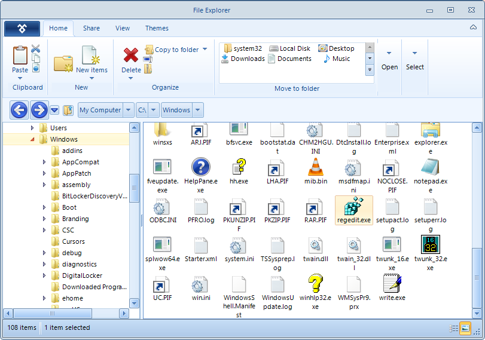

# ListView

**RadListView** is created as a result of the concord of the powerful data layer used by [RadGridView]() and [RadListControl](), together with the outstanding [Telerik Presentation Framework](). The data layer provides very high performance when working with data and also different types of binding options. Additionally, it provides features like grouping, sorting and filtering. Thanks to the [Telerik Presentation Framework](), the control customization is very flexible and intuitive.
        
**RadListView** is a bindable control for representing and editing list data with lots of customization abilities. First of all, **RadListView** will offer three different types of views, which will let you visualize your data the way that you want. You may choose between *SimpleListView*, *IconView* or *DetailView*.      

**RadListView** will also provide a rich and flexible API, which will let the developers easily customize the layout or the behavior of the control. Furthermore, the API will be similar to the API of our existing controls, so it will be easier for those who have already used our products to use the new component. The known family of items’ creating/formatting events will let you replace or style the items according to your preferences. Check boxes, re-sizing and reordering of columns, hot tracking, multiple selection and different sizing modes are another small part of the possibilities provided by the API.

At design time, you will be able to easily choose a data source or populate it with unbound items, groups and columns.

Last, but not least, **RadListView** will support kinetic scrolling mechanism which is a great advantage when used for applications deployed on Kiosks.

# Key Features

You can find listed below the key features that **RadListView** supports:

* DataBinding

* ViewTypes – ListView, DetailsView and IconsView

* Columns

* Sorting

* Grouping

* Filtering

* Kinetic scrolling

* CheckBoxes

* Multi selection

* Hot tracking

# See Also

* [Getting Started]()
* [Structure]()
* [Desing Time]()
