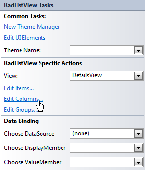
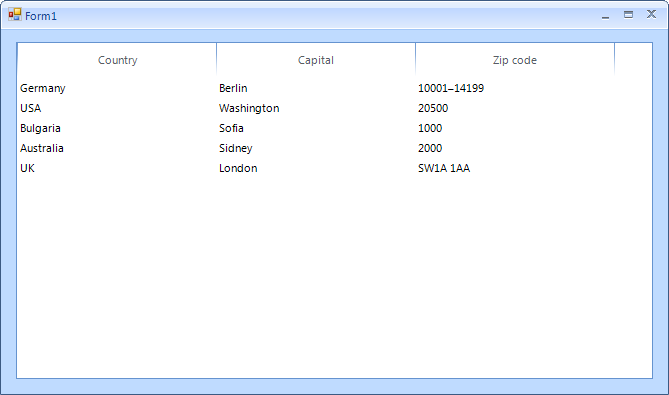

# Adding columns

## 

When RadListView __ViewType__ is set to __DetailsView__, the data can be displayed in columns view. Adding columns to the control at design time, is done by populating the __Columns__ collection of RadListView. This collection can be accessed either through the __Columns__ property in the property grid of the control or through the __Smart Tag__ of RadListView.
        

Once __ListViewDetailColumn__ collection editor is open, you can add as many columns as you need, and also, you can modify their properties in the property grid.

Once the __Columns__ collection is populated, you can assign values for each column of each ListViewDataItem, by making use of the __SubItems__ property (this property is available in design-time only):

Here is the result of the explained operations:

