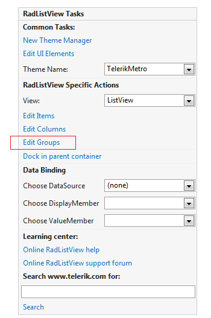
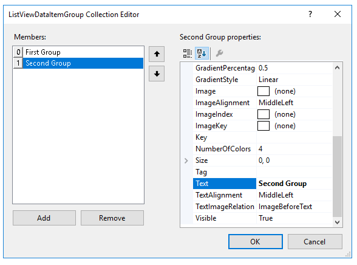
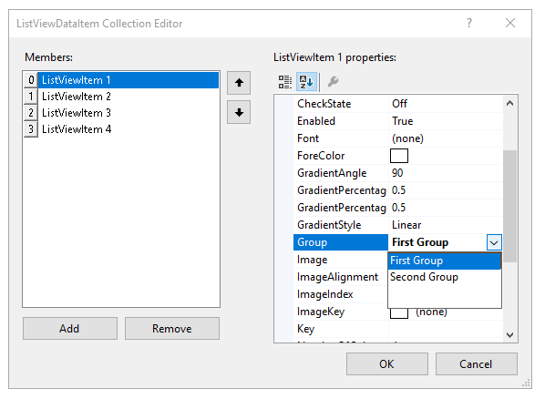
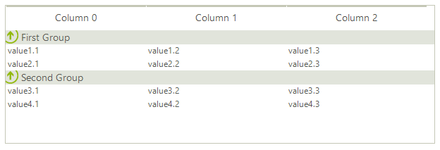

# Adding groups
 
Items in **RadListView** can be grouped conveniently into different groups, which will enhance your end-user experience when working with **RadListView**. Grouping the items at design time can be achieved by setting the __EnableCustomGroups__ and __ShowGroups__ properties of the control to true and, adding the desired groups into the __Groups__ collection of **RadListView**. This collection is accessible either through the __Smart Tag__ of the control or through the __Groups__ collection property located in the property grid.

>caption Figure 1: Groups option in Smart tag

>caption Figure 2: Groups option in Properties section

Once the __ListViewDataItemGroup Collection Editor__ is opened, you can add the desired groups by using the __Add__ button on the bottom, and also, you can modify the group settings in the property grid.

>caption Figure 3: ListViewDataItemGroup Collection Editor

After the desired groups are added, you can easily assign each __ListViewDataItem__ to the group of your choice by setting the ListViewDataItem.__Group__ property:

>caption Figure 4: Specifying item's group

Here is how the grouped items will look like:

# See Also

* [Design Time Basics]()	 
* [Adding items]()	
* [Adding columns]()	
