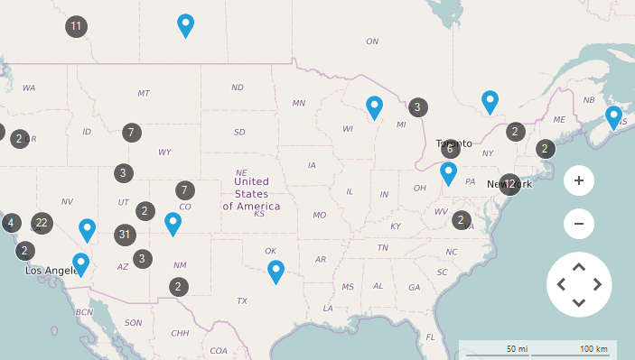
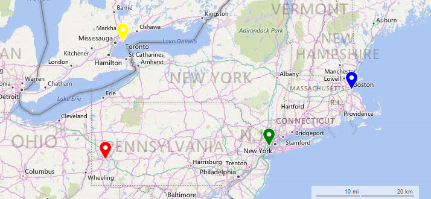

# Clusterization

__RadMap__ supports clusterization of its layers allowing grouping of their items. This feature is extremely useful when dealing with large collections having items located close to each other.

>caption Figure 1: Clustering



# Clusterization Modes

The __ClusterdDistance__ property of a certain layer is responsible for setting a distance according to which each of the layer items will be evaluated to form a group. There are two types of clusters which can be assigned to the __ClusterStrategy__ property of the layer:

* __ElementClusterStrategy__: All of the layer items are evaluated and a cluster is being created on the exact coordinates an item within the cluster.

* __DistanceClusterStrategy__: All of the layer items are evaluated and a cluster is being created on the geographic center of the items part of the cluster.

The example below creates a layer having with four __MapPin__ elements and defines clusters using __ElementClusterStrategy__ and __DistanceClusterStrategy__ having the same __ClusterDistance__. 

#### Add Layer and Data

{{source=..\SamplesCS\Map\ClusterizationForm.cs region=SetupLayersAndData}} 
{{source=..\SamplesVB\Map\ClusterizationForm.vb region=SetupLayersAndData}}
````C#
private void SetupLayers()
{
    MapLayer easternLayer = new MapLayer("CitiesLayer");
    this.radMap1.Layers.Add(easternLayer);
}
    
private void SetupData()
{
    MapPin element = new MapPin(new PointG(40.4467648, -80.01576030));
    element.Text = "Pittsburgh";
    element.BackColor = Color.Red;
    this.radMap1.Layers["CitiesLayer"].Add(element);
    element = new MapPin(new PointG(40.8130697, -74.07439790));
    element.Text = "New York";
    element.BackColor = Color.Green;
    this.radMap1.Layers["CitiesLayer"].Add(element);
    element = new MapPin(new PointG(42.3665137, -71.06160420));
    element.Text = "Boston";
    element.BackColor = Color.Blue;
    this.radMap1.Layers["CitiesLayer"].Add(element);
    element = new MapPin(new PointG(43.6434661, -79.37909890));
    element.Text = "Toronto";
    element.BackColor = Color.Yellow;
    this.radMap1.Layers["CitiesLayer"].Add(element);
}

````
````VB.NET
Private Sub SetupLayers()
    Dim easternLayer As New MapLayer("CitiesLayer")
    Me.RadMap1.Layers.Add(easternLayer)
End Sub
Private Sub SetupData()
    Dim element As New MapPin(New PointG(40.4467648, -80.0157603))
    element.Text = "Pittsburgh"
    element.BackColor = Color.Red
    Me.RadMap1.Layers("CitiesLayer").Add(element)
    element = New MapPin(New PointG(40.8130697, -74.0743979))
    element.Text = "New York"
    element.BackColor = Color.Green
    Me.RadMap1.Layers("CitiesLayer").Add(element)
    element = New MapPin(New PointG(42.3665137, -71.0616042))
    element.Text = "Boston"
    element.BackColor = Color.Blue
    Me.RadMap1.Layers("CitiesLayer").Add(element)
    element = New MapPin(New PointG(43.6434661, -79.3790989))
    element.Text = "Toronto"
    element.BackColor = Color.Yellow
    Me.RadMap1.Layers("CitiesLayer").Add(element)
End Sub

````


{{endregion}}

>caption Figure 2: Initial Result



#### ElementClusterStrategy

{{source=..\SamplesCS\Map\ClusterizationForm.cs region=ElementClusterStrategy}} 
{{source=..\SamplesVB\Map\ClusterizationForm.vb region=ElementClusterStrategy}}
````C#
private void SetElementCluster()
{
    this.radMap1.Layers[0].ClusterStrategy = new ElementClusterStrategy();
    this.radMap1.Layers["CitiesLayer"].ClusterDistance = 200;
}

````
````VB.NET
Private Sub SetElementCluster()
    Me.RadMap1.Layers(0).ClusterStrategy = New ElementClusterStrategy()
    Me.RadMap1.Layers("CitiesLayer").ClusterDistance = 200
End Sub

````


{{endregion}}

>caption Figure 3: ElementClusterStrategy


#### DistanceClusterStrategy

{{source=..\SamplesCS\Map\ClusterizationForm.cs region=DistanceClusterStrategy}} 
{{source=..\SamplesVB\Map\ClusterizationForm.vb region=DistanceClusterStrategy}}
````C#
private void DistanceElementCluster()
{
    this.radMap1.Layers[0].ClusterStrategy = new DistanceClusterStrategy();
    this.radMap1.Layers["CitiesLayer"].ClusterDistance = 200;
}

````
````VB.NET
Private Sub SetDistanceCluster()
    Me.RadMap1.Layers(0).ClusterStrategy = New DistanceClusterStrategy()
    Me.RadMap1.Layers("CitiesLayer").ClusterDistance = 200
End Sub

````


{{endregion}}

>caption Figure 4: DistanceClusterStrategy

