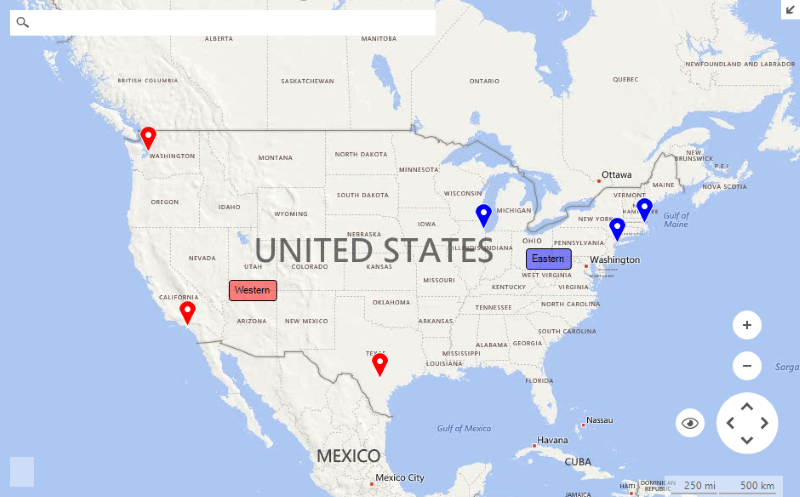

# Layers Overview

Layers provide an easy way to present meaningful information to the end user. A __RadMap__ control may have many layers each responsible for a different part of the presentation logic. The layer object represents a collection holding __MapVisualElements__. The __RadMap.Layers__ property is responsible for exposing the layers allowing easy access and manipulation.


>caption Figure 1: Map Layers 



The example below  uses the [BingRestMapProvider]() and adds pin and label elements to a couple of layers defined within the __RadMap__ control.

#### Setup Layers

{{source=..\SamplesCS\Map\MapLayers.cs region=SetupLayers}} 
{{source=..\SamplesVB\Map\MapLayers.vb region=SetupLayers}}
````C#
private void SetupLayers()
{
    MapLayer easternLayer = new MapLayer("Eastern");
    this.radMap1.Layers.Add(easternLayer);
    MapLayer westernLayer = new MapLayer("Western");
    this.radMap1.Layers.Add(westernLayer);
}

````
````VB.NET
Private Sub SetupLayers()
    Dim easternLayer As New MapLayer("Eastern")
    Me.RadMap1.Layers.Add(easternLayer)
    Dim westernLayer As New MapLayer("Western")
    Me.RadMap1.Layers.Add(westernLayer)
End Sub

````


{{endregion}}

#### Setup Data

{{source=..\SamplesCS\Map\MapLayers.cs region=SetupData}} 
{{source=..\SamplesVB\Map\MapLayers.vb region=SetupData}}
````C#
private void SetupData()
{
    MapPin element = new MapPin(new PointG(34.0140562, -118.2880489));
    element.Text = "Los Angeles";
    element.BackColor = Color.Red;
    this.radMap1.Layers["Western"].Add(element);
    element = new MapPin(new PointG(47.5951518, -122.3316280));
    element.Text = "Seattle";
    element.BackColor = Color.Red;
    this.radMap1.Layers["Western"].Add(element);
    element = new MapPin(new PointG(29.4270198, -98.43744520));
    element.Text = "San Antonio";
    element.BackColor = Color.Red;
    this.radMap1.Layers["Western"].Add(element);
    element = new MapPin(new PointG(41.8806908, -87.67416460));
    element.Text = "Chicago";
    element.BackColor = Color.Blue;
    this.radMap1.Layers["Eastern"].Add(element);
    element = new MapPin(new PointG(40.8296426, -73.92636320));
    element.Text = "New York";
    element.BackColor = Color.Blue;
    this.radMap1.Layers["Eastern"].Add(element);
    element = new MapPin(new PointG(42.3665137, -71.06160420));
    element.Text = "Boston";
    element.BackColor = Color.Blue;
    this.radMap1.Layers["Eastern"].Add(element);
    MapLabel westernLabel = new MapLabel(new PointG(36.251282d, -111.593335d), "Western") 
    {
        BackColor = Color.FromArgb(122, 255, 0, 0) 
    };
    MapLabel easternLabel = new MapLabel(new PointG(38.790412d, -81.000594d), "Eastern")
    {
        BackColor = Color.FromArgb(122, 0, 0, 255)
    };
    this.radMap1.Layers["Western"].Add(westernLabel);
    this.radMap1.Layers["Eastern"].Add(easternLabel);
}

````
````VB.NET
Private Sub SetupData()
    Dim element As New MapPin(New PointG(34.0140562, -118.2880489))
    element.Text = "Los Angeles"
    element.BackColor = Color.Red
    Me.RadMap1.Layers("Western").Add(element)
    element = New MapPin(New PointG(47.5951518, -122.331628))
    element.Text = "Seattle"
    element.BackColor = Color.Red
    Me.RadMap1.Layers("Western").Add(element)
    element = New MapPin(New PointG(29.4270198, -98.4374452))
    element.Text = "San Antonio"
    element.BackColor = Color.Red
    Me.RadMap1.Layers("Western").Add(element)
    element = New MapPin(New PointG(41.8806908, -87.6741646))
    element.Text = "Chicago"
    element.BackColor = Color.Blue
    Me.RadMap1.Layers("Eastern").Add(element)
    element = New MapPin(New PointG(40.8296426, -73.9263632))
    element.Text = "New York"
    element.BackColor = Color.Blue
    Me.RadMap1.Layers("Eastern").Add(element)
    element = New MapPin(New PointG(42.3665137, -71.0616042))
    element.Text = "Boston"
    element.BackColor = Color.Blue
    Me.RadMap1.Layers("Eastern").Add(element)
    Dim westernLabel As New MapLabel(New PointG(36.251282, -111.593335), "Western") With {
         .BackColor = Color.FromArgb(122, 255, 0, 0)
    }
    Dim easternLabel As New MapLabel(New PointG(38.790412, -81.000594), "Eastern") With {
         .BackColor = Color.FromArgb(122, 0, 0, 255)
    }
    Me.RadMap1.Layers("Western").Add(westernLabel)
    Me.RadMap1.Layers("Eastern").Add(easternLabel)
End Sub

````


{{endregion}}

# See Also

* [Colorization]()
* [Clusterization]()
