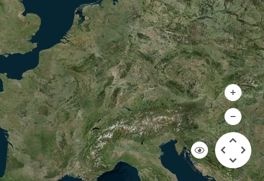
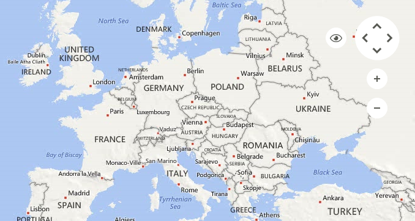
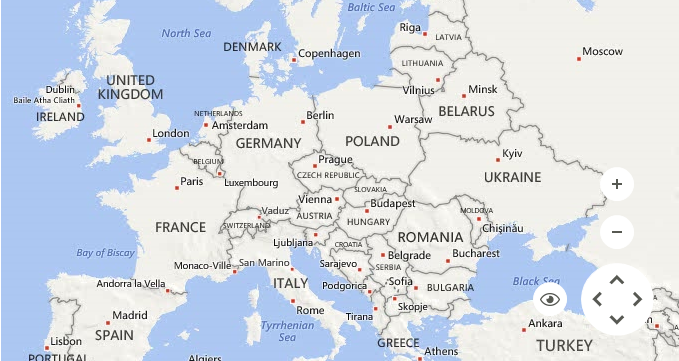
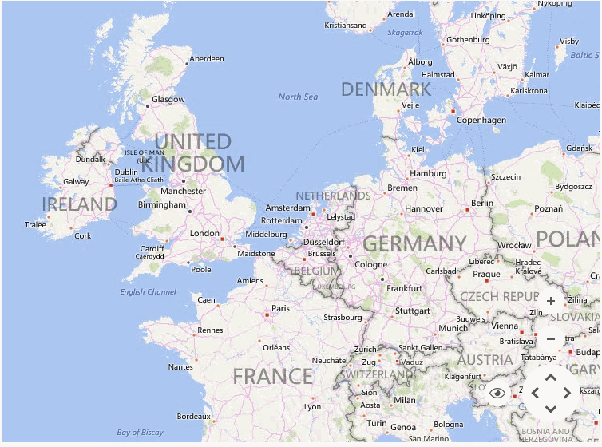

# Navigation Controls

__RadMap__ incorporates a navigation tool allowing the end to user to easily zoom, pan and change the current view. 

>caption Figure 1: Navigation Bar



The __RadMap.ShowNavigationBar__ property is responsible for showing or hiding the navigation bar. By default this property is set to *true* and the location of the navigation bar is set to *BottomRight*.

#### Hide Navigation Bar

{{source=..\SamplesCS\Map\MapLayers.cs region=HideNavigationBar}} 
{{source=..\SamplesVB\Map\MapLayers.vb region=HideNavigationBar}}
````C#
this.radMap1.ShowNavigationBar = false;

````
````VB.NET
Me.RadMap1.ShowNavigationBar = False

````
 

{{endregion}}

# Navigation Bar Location

The location of the __MapNavigationBarElement__ is controlled by the RadMap.MapElement.__NavigationBarLocation__ property.

* __MapNavigationBarLocation__.*TopRight*: The location is set to the top right part of the view port.

>caption Figure 2: TopRight



* __MapNavigationBarLocation__.*TopLeft*: The location is set to the top left part of the view port.

>caption Figure 3: TopLeft


* __MapNavigationBarLocation__.*BottomLeft*: The location is set to the bottom left part of the view port.

>caption Figure 4: BottomLeft


* __MapNavigationBarLocation__.*BottomCenter*: The location is set to the bottom center part of the view port.

>caption Figure 5: BottomCenter


* __MapNavigationBarLocation__.*BottomRight*: The location is set to the bottom right part of the view port.

>caption Figure 6: BottomRight



# View Modes

The navigation control allows an easy selection of the currently displayed view.

>note The views which will be displayed in the drop-down will vary depending on the chosen map provider: [Providers Overview]().

>caption Figure 7: BingRestMapProvider Views


# Zoom and Pan

The navigation control allows the end user to easily zoom and pan to a particular location on the map.

>caption Figure 8: Zoom and Pan



The __MapNavigationBarElement__ can be accessed through the __RadMap.MapElement.NavigationBarElement__. The table below lists the exposed properties.

# Properties

|Property|Description|
|------|------|
|__MapElement__|Gets the map element.|
|__ZoomInButton__|Gets the zoom in button.|
|__ZoomOutButton__|Gets the zoom out button.|
|__ViewButton__|Gets the view button.|
|__MapNavigationElement__|Gets the map navigation element.|

# See Also

* [Layers Overview]()
* [Mini Map]()
* [Scale Indicators]()
* [Legend]()
* [Pan and Zoom]()
