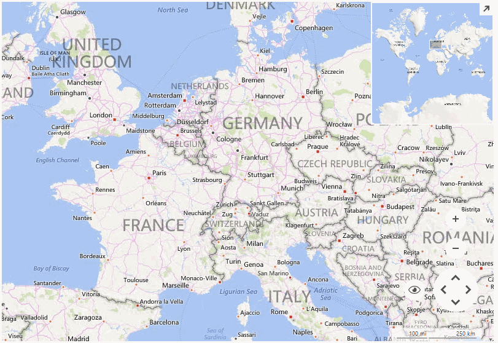

# Pan and Zoom

__RadMap__ can be panned and zoomed both from the UI as well as programmatically.

# UI Pan and Zoom

The end user can pan the control by simply holding the left mouse button and dragging the map to a desired location. The zoom operation can be performed with a double click on the map or by using the mouse scroll wheel. The same behavior can also be achieved with the [navigation controls]().

# Programmatic Pan and Zoom

The control exposes an API for panning and zooming programmatically. The responsible __Pan__ and __Zoom__ methods have several overloads handling different scenarios.

>caption Figure 1: Programmatic Pan and Zoom



#### Customizing Appearance

{{source=..\SamplesCS\Map\MapLayers.cs region=ZoomAndPan}} 
{{source=..\SamplesVB\Map\MapLayers.vb region=ZoomAndPan}}
````C#
this.radMap1.Zoom(8, true);
this.radMap1.Pan(new SizeL(200, 200));

````
````VB.NET
Me.RadMap1.Zoom(8, True)
Me.RadMap1.Pan(New SizeL(200, 200))

````


{{endregion}}