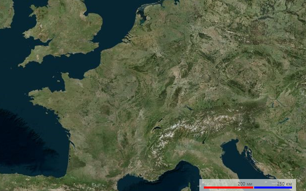

# Scale Indicators

The scale indicators use two measures - imperial and metric. Depending on the scale of the view port the indicators have two modes showing miles and kilometers or feet and meters.

>caption Figure 1: Large Scale


>caption Figure 2: Small Scale


# Customizing Appearance

The scaling indicators expose several properties allowing modification of the way the element is painted.

>caption Figure 2: Custom Text, Color and Bar Height 



#### Customizing Appearance

{{source=..\SamplesCS\Map\MapLayers.cs region=CustomizeScalingIndicators}} 
{{source=..\SamplesVB\Map\MapLayers.vb region=CustomizeScalingIndicators}}
````C#
this.radMap1.MapElement.ScaleIndicatorElement.ImperialBarColor = Color.Red;
this.radMap1.MapElement.ScaleIndicatorElement.MetricBarColor = Color.Blue;
this.radMap1.MapElement.ScaleIndicatorElement.BarHeight = 4;
this.radMap1.MapElement.ScaleIndicatorElement.KilometersText = " км";
this.radMap1.MapElement.ScaleIndicatorElement.MetersText = " м";
this.radMap1.MapElement.ScaleIndicatorElement.MilesText = " ми";
this.radMap1.MapElement.ScaleIndicatorElement.FeetText = " фт";

````
````VB.NET
Me.RadMap1.MapElement.ScaleIndicatorElement.ImperialBarColor = Color.Red
Me.RadMap1.MapElement.ScaleIndicatorElement.MetricBarColor = Color.Blue
Me.RadMap1.MapElement.ScaleIndicatorElement.BarHeight = 4
Me.RadMap1.MapElement.ScaleIndicatorElement.KilometersText = " км"
Me.RadMap1.MapElement.ScaleIndicatorElement.MetersText = " м"
Me.RadMap1.MapElement.ScaleIndicatorElement.MilesText = " ми"
Me.RadMap1.MapElement.ScaleIndicatorElement.FeetText = " фт"

````


{{endregion}}