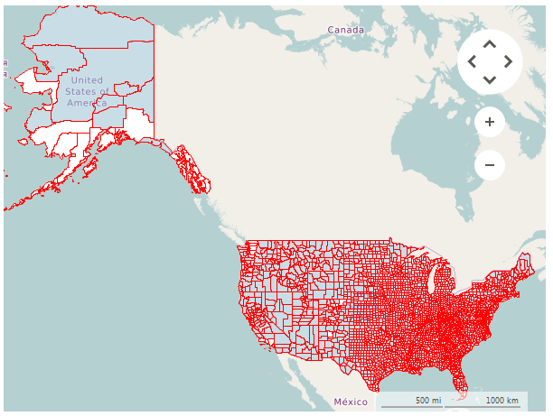

# KML Reader

__RadMap__ provides support for stunning map overlays through its KML-import feature. Once you have the desired set of features (place marks, images, polygons, textual descriptions, etc.) encoded in KML, you can easily import the data and visualize it through the __RadMap__ control. In this way you can easily visualize complex shapes like country's borders on the map and fill the separate shapes with different colors in order to achieve a sort of grouping.

>caption Figure 1: KML Reader



To read your data you have to use a __KmlReader__.

>note The KML reader is available only when using .NET Framework 4.0 or higher versions.

#### Using KmlReader

{{source=..\SamplesCS\Map\MapFileReaders.cs region=SetupKMLReader}} 
{{source=..\SamplesVB\Map\MapFileReaders.vb region=SetupKMLReader}}

````C#
        
OpenStreetMapProvider osmProvider = new OpenStreetMapProvider();
this.radMap1.MapElement.Providers.Add(osmProvider);
this.radMap1.Layers.Clear();
this.radMap1.Layers.Add(new MapLayer("Capitals"));
using (FileStream seatsStream = new FileStream(@"..\..\Resources\cb_2015_us_county_5m.kml", FileMode.Open, FileAccess.Read))
{
List<MapVisualElement> elements = KmlReader.Read(seatsStream);
foreach (MapVisualElement item in elements)
{
item.BorderWidth = 1;
item.BorderColor = Color.Red;
}
        this.radMap1.Layers["Capitals"].AddRange(elements);
}

````
````VB.NET
Dim osmProvider As New OpenStreetMapProvider()
Me.radMap1.MapElement.Providers.Add(osmProvider)
Me.radMap1.Layers.Clear()
Me.radMap1.Layers.Add(New MapLayer("Capitals"))
Using seatsStream As New FileStream("..\..\Resources\cb_2015_us_county_5m.kml", FileMode.Open, FileAccess.Read)
    Dim elements As List(Of MapVisualElement) = KmlReader.Read(seatsStream)
    For Each item As MapVisualElement In elements
        item.BorderWidth = 1
        item.BorderColor = Color.Red
    Next
    Me.radMap1.Layers("Capitals").AddRange(elements)
End Using

````

{{endregion}} 


# Using local images

The __KmlReader__ supports loading images from a local folder. The KmlReader class has two static properties that controls this functionality:

* __UseLocalImages:__ A boolean property which enables the local image loading.
* __LocalImagesFolder:__ The folder that contains all images. 


# See Also
* [KML](https://developers.google.com/kml/documentation/?csw=1)

 

 
