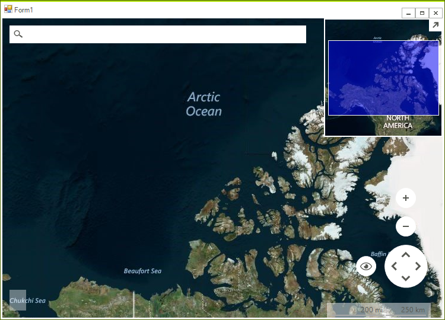

# Getting Started

This tutorial will help you to quickly get started using the control.

>note In order to use __RadMap__ in your project you have to add references to the following assemblies:
* Telerik.WinControls
* Telerik.WinControls.RadMap
* Telerik.WinControls.UI

Follow the steps:

1\. Create a new __Windows Application__ project.
2\. Drop a __RadMap__ control on the form and set its __Dock__ property to *Fill*.
3\. The __RadMap__ control doesn't display any imagery data initially, it needs an __IMapProvider__ instance from which to consume this data. This example will use [Bing Maps](https://www.bingmapsportal.com/) for its imagery source. To achieve that you have to add a new __BingRestMapProvider__ to the RadMap.__Providers__ property.

>note You must provide a Bing Maps Key to the provider for it to work. To get your free Bing Maps Key, please refer to the following link: [Getting a Bing Maps Key](https://msdn.microsoft.com/en-us/library/ff428642.aspx).

>note If you use __RadMap__ with .Net Framework 2.0 and you don't have an installation of the Progress&reg; Telerik&reg; UI for WinForms suite on the current machine, it is necessary to add a reference to the Newtonsoft.Json assembly which can be found in the \Bin folder of the *Telerik_UI_For_WinForms_[version]_Dev_dlls.zip*. If you are using .Net Framework 4.0 this is not requried.

If you want to use data caching, you should set an __IMapCacheProvider__ instance to the BingRestMapProvider.__CacheProvider__ property. In this example a __LocalFileCacheProvider__ will be used:

#### Using BingRestMapProvider

{{source=..\SamplesCS\Map\MapGettingStarted.cs region=GettingStarted}} 
{{source=..\SamplesVB\Map\MapGettingStarted.vb region=GettingStarted}}

````C#
string cacheFolder = @"..\..\cache";
BingRestMapProvider bingProvider = new Telerik.WinControls.UI.BingRestMapProvider();
bingProvider.UseSession = true;
bingProvider.BingKey = bingKey;
LocalFileCacheProvider cache = new LocalFileCacheProvider(cacheFolder);
bingProvider.CacheProvider = cache;
this.radMap1.Providers.Add(bingProvider);

````
````VB.NET
Dim cacheFolder As String = "..\..\cache"
Dim bingProvider As BingRestMapProvider = New Telerik.WinControls.UI.BingRestMapProvider()
bingProvider.UseSession = True
bingProvider.BingKey = bingKey
Dim cache As New LocalFileCacheProvider(cacheFolder)
bingProvider.CacheProvider = cache
Me.radMap1.Providers.Add(bingProvider)

````

{{endregion}} 

>caption Figure 1: RadMap 



# See Also
* [Providers]()
* [File Readers]()
* [Features]()

