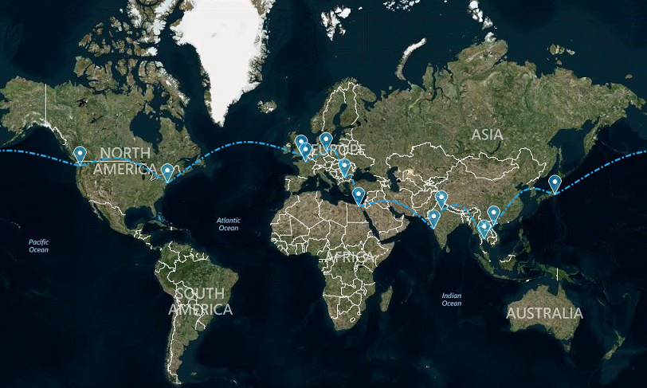

# Map

__RadMap__ can visualize tile data from the [Bing Maps](https://www.bingmapsportal.com/) and the [OpenStreetMaps](http://wiki.openstreetmap.org/wiki/API) REST services as well as from the local file system. 

# Key Features

* Pan and Zoom
* Bing Maps Search
* Route and Elevation services
* Visualizes data from ESRI shape files, KML files and SQL Geo-spatial data files
* Clusterization
* Colorization
* Layers
* Navigation bar
* Search bar
* Scale indicator
* Mini map
* Legend
* Custom shapes (pins, callouts)

