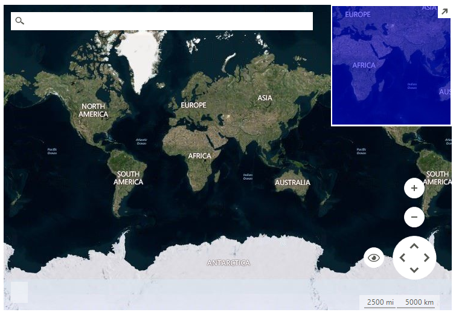

# BingRestMapProvider

__RadMap__ can visualize tile data from the [Bing Maps](https://www.bingmapsportal.com/) REST service. You can enable tile caching to a local folder by setting a new __LocalFileCacheProvider__ to the BingRestMapProvider.__CacheProvider__ property.

>caption Figure 1: BingRestMapProvider 



>note You must provide a Bing Maps Key to the provider for it to work. To get your free Bing Maps Key, please refer to the following link: [Getting a Bing Maps Key](https://msdn.microsoft.com/en-us/library/ff428642.aspx).

>note If you use __RadMap__ with .Net Framework 2.0 and you don't have an installation of the Telerik UI for WinForms suite on the current machine, it is necessary to add a reference to the Newtonsoft.Json assembly which can be found in the \Bin folder of the *Telerik_UI_For_WinForms_[version]_Dev_dlls.zip*. If you are using .Net Framework 4.0 this is not requried.

#### Using BingRestMapProvider

{{source=..\SamplesCS\Map\MapGettingStarted.cs region=GettingStarted}} 
{{source=..\SamplesVB\Map\MapGettingStarted.vb region=GettingStarted}}

````C#
string cacheFolder = @"..\..\cache";

BingRestMapProvider bingProvider = new Telerik.WinControls.UI.BingRestMapProvider();
bingProvider.Culture = System.Threading.Thread.CurrentThread.CurrentCulture;
bingProvider.UseSession = true;
bingProvider.BingKey = bingKey;

LocalFileCacheProvider cache = new LocalFileCacheProvider(cacheFolder);
bingProvider.CacheProvider = cache;

this.radMap1.Providers.Add(bingProvider);

````
````VB.NET
Dim cacheFolder As String = "..\..\cache"

Dim bingProvider As BingRestMapProvider = New Telerik.WinControls.UI.BingRestMapProvider()
bingProvider.Culture = System.Threading.Thread.CurrentThread.CurrentCulture
bingProvider.UseSession = True
bingProvider.BingKey = bingKey

Dim cache As New LocalFileCacheProvider(cacheFolder)
bingProvider.CacheProvider = cache

Me.radMap1.Providers.Add(bingProvider)

````

{{endregion}} 
