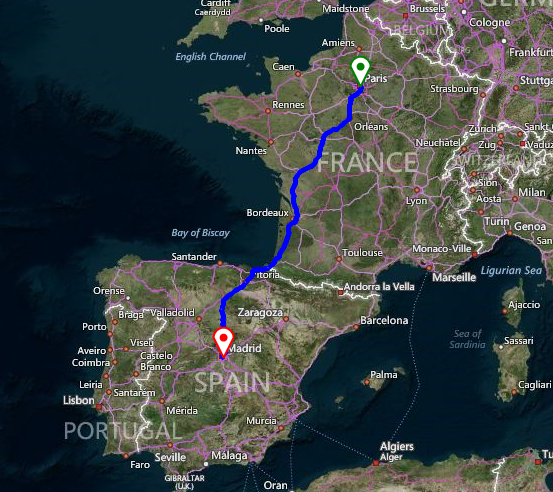

# Route

__RadMap__ provides a unified route search architecture which uses functionality of the different routing services. This allows you to calculate a route between different locations on the map. The routing is achieved by an __IMapRouteProvider__. The __BingRestMapProvider__ implements the __IMapRouteProvider__ interface.

>caption Figure 1: Bing routing



The whole information that is necessary for calculating the route, like start/end points, the distance unit, mode, optimization etc., is stored in a __RouteRequest__. Subscribe to the IMapRouteProvider.__CalculateRouteCompleted__ event where you can add __MapPins__ and __MapRoute__ to the __MapLayer__ for the route results.

#### Bing routing

{{source=..\SamplesCS\Map\BingProvider.cs region=BingRouteRequest}} 
{{source=..\SamplesVB\Map\BingProvider.vb region=BingRouteRequest}}

````C#
public void RunRouteRequest()
{
    //add a layer to display the route
    this.radMap1.MapElement.Layers.Add(new MapLayer());
    RouteRequest request = new RouteRequest();
    request.DistanceUnit = DistanceUnit.Kilometer;
    request.Options.Mode = TravelMode.Driving;
    request.Options.Optimization = RouteOptimization.Time;
    request.Options.RouteAttributes = RouteAttributes.RoutePath;
    request.Options.RouteAvoidance = RouteAvoidance.None;
    request.RoutePoints.Add(new Waypoint("Paris, France"));
    request.RoutePoints.Add(new Waypoint("Madrid, Spain"));
    BingRestMapProvider bingProvider = this.radMap1.Providers[0] as BingRestMapProvider;
    bingProvider.CalculateRouteCompleted += BingProvider_RoutingCompleted;
    bingProvider.CalculateRouteAsync(request);
}
private void BingProvider_RoutingCompleted(object sender, RoutingCompletedEventArgs e)
{
    List<Telerik.WinControls.UI.Map.PointG> points = new List<Telerik.WinControls.UI.Map.PointG>();
    foreach (double[] coordinatePair in e.Route.RoutePath.Line.Coordinates)
    {
        Telerik.WinControls.UI.Map.PointG point = new Telerik.WinControls.UI.Map.PointG(coordinatePair[0], coordinatePair[1]);
        points.Add(point);
    }
    Telerik.WinControls.UI.Map.RectangleG boundingRectangle = new Telerik.WinControls.UI.Map.RectangleG(e.Route.BBox[2],
        e.Route.BBox[1], e.Route.BBox[0], e.Route.BBox[3]);
    MapRoute routeElement = new MapRoute(points, boundingRectangle);
    routeElement.BorderColor = Color.Blue;
    routeElement.BorderWidth = 5;
    MapPin start = new MapPin(new Telerik.WinControls.UI.Map.PointG(e.Route.RouteLegs[0].ActualStart.Coordinates[0],
        e.Route.RouteLegs[0].ActualStart.Coordinates[1]));
    start.BackColor = Color.White;
    start.BorderColor = Color.Green;
    start.BorderWidth = 2f;
    MapPin end = new MapPin(new Telerik.WinControls.UI.Map.PointG(e.Route.RouteLegs[e.Route.RouteLegs.Length - 1].ActualEnd.Coordinates[0],
        e.Route.RouteLegs[e.Route.RouteLegs.Length - 1].ActualEnd.Coordinates[1]));
    end.BackColor = Color.White;
    end.BorderColor = Color.Red;
    end.BorderWidth = 2f;
    this.radMap1.MapElement.Layers[0].Add(routeElement);
    this.radMap1.MapElement.Layers[0].Add(start);
    this.radMap1.MapElement.Layers[0].Add(end);
}

````
````VB.NET
Public Sub RunRouteRequest()
    'add a layer to display the route
    Me.radMap1.MapElement.Layers.Add(New MapLayer())
    Dim request As New RouteRequest()
    request.DistanceUnit = DistanceUnit.Kilometer
    request.Options.Mode = TravelMode.Driving
    request.Options.Optimization = RouteOptimization.Time
    request.Options.RouteAttributes = RouteAttributes.RoutePath
    request.Options.RouteAvoidance = RouteAvoidance.None
    request.RoutePoints.Add(New Waypoint("Paris, France"))
    request.RoutePoints.Add(New Waypoint("Madrid, Spain"))
    Dim bingProvider As BingRestMapProvider = TryCast(Me.radMap1.Providers(0), BingRestMapProvider)
    AddHandler bingProvider.CalculateRouteCompleted, AddressOf BingProvider_RoutingCompleted
    bingProvider.CalculateRouteAsync(request)
End Sub
Private Sub BingProvider_RoutingCompleted(sender As Object, e As RoutingCompletedEventArgs)
    Dim points As New List(Of Telerik.WinControls.UI.Map.PointG)()
    For Each coordinatePair As Double() In e.Route.RoutePath.Line.Coordinates
        Dim point As New Telerik.WinControls.UI.Map.PointG(coordinatePair(0), coordinatePair(1))
        points.Add(point)
    Next
    Dim boundingRectangle As New Telerik.WinControls.UI.Map.RectangleG(e.Route.BBox(2), e.Route.BBox(1), e.Route.BBox(0), e.Route.BBox(3))
    Dim routeElement As New MapRoute(points, boundingRectangle)
    routeElement.BorderColor = Color.Blue
    routeElement.BorderWidth = 5
    Dim start As New MapPin(New Telerik.WinControls.UI.Map.PointG(e.Route.RouteLegs(0).ActualStart.Coordinates(0), e.Route.RouteLegs(0).ActualStart.Coordinates(1)))
    start.BackColor = Color.White
    start.BorderColor = Color.Green
    start.BorderWidth = 2.0F
    Dim [end] As New MapPin(New Telerik.WinControls.UI.Map.PointG(e.Route.RouteLegs(e.Route.RouteLegs.Length - 1).ActualEnd.Coordinates(0), _
                                                                  e.Route.RouteLegs(e.Route.RouteLegs.Length - 1).ActualEnd.Coordinates(1)))
    [end].BackColor = Color.White
    [end].BorderColor = Color.Red
    [end].BorderWidth = 2.0F
    Me.radMap1.MapElement.Layers(0).Add(routeElement)
    Me.radMap1.MapElement.Layers(0).Add(start)
    Me.radMap1.MapElement.Layers(0).Add([end])
End Sub

````

{{endregion}} 

The **RouteRequest** class also supports *ViaWayPoints* objects. These route points allow a particular leg to be divided into separate sub legs. The [Bing REST Serivices documentation](https://msdn.microsoft.com/en-us/library/ff701717.aspx) provides additional information what a *waypoint* and a *viaWayPoint* represents.

#### Creating a Route with ViaWayPoints

{{source=..\SamplesCS\Map\BingProvider.cs region=ViaWayPointsExample}} 
{{source=..\SamplesVB\Map\BingProvider.vb region=ViaWayPointsExample}}
````C#
RouteRequest viaWayPointsRequest = new RouteRequest();
viaWayPointsRequest.DistanceUnit = DistanceUnit.Kilometer;
viaWayPointsRequest.Options.Mode = TravelMode.Driving;
viaWayPointsRequest.Options.Optimization = RouteOptimization.Time;
viaWayPointsRequest.Options.RouteAttributes = RouteAttributes.RoutePath;
viaWayPointsRequest.Options.RouteAvoidance = RouteAvoidance.None;
viaWayPointsRequest.RoutePoints.Add(new Waypoint("47.6062, -122.3321")); //Seattle
viaWayPointsRequest.RoutePoints.Add(new ViaWaypoint("40.7306, -73.9352")); //New York
viaWayPointsRequest.RoutePoints.Add(new Waypoint("25.789, -80.2264")); //Miami
BingRestMapProvider bingProvider = this.radMap1.Providers[0] as BingRestMapProvider;
bingProvider.CalculateRouteAsync(viaWayPointsRequest);

````
````VB.NET
Dim viaWayPointsRequest As RouteRequest = New RouteRequest()
viaWayPointsRequest.DistanceUnit = DistanceUnit.Kilometer
viaWayPointsRequest.Options.Mode = TravelMode.Driving
viaWayPointsRequest.Options.Optimization = RouteOptimization.Time
viaWayPointsRequest.Options.RouteAttributes = RouteAttributes.RoutePath
viaWayPointsRequest.Options.RouteAvoidance = RouteAvoidance.None
viaWayPointsRequest.RoutePoints.Add(New Waypoint("47.6062, -122.3321"))
viaWayPointsRequest.RoutePoints.Add(New ViaWaypoint("40.7306, -73.9352"))
viaWayPointsRequest.RoutePoints.Add(New Waypoint("25.789, -80.2264"))
Dim bingProvider As BingRestMapProvider = TryCast(Me.radMap1.Providers(0), BingRestMapProvider)
bingProvider.CalculateRouteAsync(viaWayPointsRequest)

````


{{endregion}}

# See Also
* [BingRestMapProvider]()