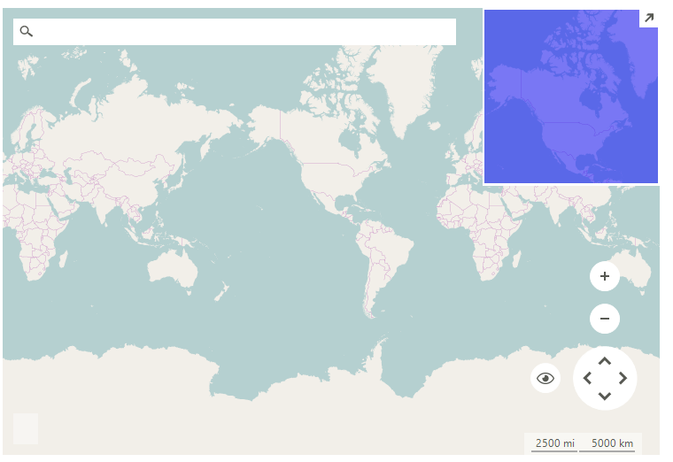

# OpenStreetMapProvider

__RadMap__ can visualize data from the [OpenStreetMaps](http://wiki.openstreetmap.org/wiki/API) REST services.  You can enable tile caching to a local folder setting a new __LocalFileCacheProvider__ to the OpenStreetMapProvider.__CacheProvider__ property.

>caption Figure 1: OpenStreetMapProvider 



#### Using OpenStreetMapProvider

{{source=..\SamplesCS\Map\OSMProvider.cs region=UseOSMProvider}} 
{{source=..\SamplesVB\Map\OSMProvider.vb region=UseOSMProvider}}

````C#
string cacheFolder = @"..\..\cache";
OpenStreetMapProvider osmProvider = new OpenStreetMapProvider();
LocalFileCacheProvider cache = new LocalFileCacheProvider(cacheFolder);
osmProvider.CacheProvider = cache;
this.radMap1.MapElement.Providers.Add(osmProvider);

````
````VB.NET
Dim cacheFolder As String = "..\..\cache"
Dim osmProvider As New OpenStreetMapProvider()
Dim cache As New LocalFileCacheProvider(cacheFolder)
osmProvider.CacheProvider = cache
Me.radMap1.MapElement.Providers.Add(osmProvider)

````

{{endregion}} 
