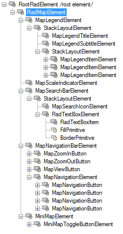

# Structure

This article describes the inner structure and organization of the elements which build the __RadMap__ control.
        
>caption Figure 1: RadMap visual structure

# See Also

* [RadControlSpy]()
            
