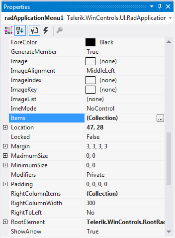

# Populating with Data

This article demonstrates how to populate **RadApplicationMenu** with data either at design time or at run time. 

## Adding Items at Design Time

You can add items at design time by using the *RadItem Collection Editor*.

>caption Figure 1: RadApplicationMenu's  RadItem Collection Editor


You can access it through the *Smart tag >> Edit Items* option:

>caption Figure 2: Smart tag options


By using the *Edit RightColumnItems* and *Edit ButtonItems* options you can add items to the menu's right column and bottom buttons container respectively.

Another possibility to open the editor is via the __Items__ collection in the *Properties* Visual Studio section:

>caption Figure 3:  Visual Studio Properties window

print


## Adding Items Programmatically

**RadApplicationMenu** supports adding items at run time, which means that you can manually populate it with items. The following example demonstrates how to add items to the left and right drop down menu's columns and to the bottom buttons container.

#### Add items programmatically 

{{source=..\SamplesCS\Menus\AppMenu\ApplicationMenu.cs region=AddItems}} 
{{source=..\SamplesVB\Menus\AppMenu\ApplicationMenu.vb region=AddItems}} 

````C#
public ApplicationMenu()
{
    InitializeComponent();

    RadMenuItem newItem = new RadMenuItem("New");
    newItem.Click += NewItem_Click;
    this.radApplicationMenu1.Items.Add(newItem);

    RadMenuItem saveItem = new RadMenuItem("Save");
    saveItem.Click += SaveItem_Click;
    this.radApplicationMenu1.Items.Add(saveItem);

    RadMenuItem printItem = new RadMenuItem("Print");
    printItem.Click += PrintItem_Click;
    this.radApplicationMenu1.RightColumnItems.Add(printItem);

    RadMenuButtonItem exitItem = new RadMenuButtonItem("Exit");
    exitItem.Click += ExitItem_Click;
    this.radApplicationMenu1.ButtonItems.Add(exitItem);
}

private void ExitItem_Click(object sender, EventArgs e)
{
    this.radApplicationMenu1.DropDownButtonElement.DropDownMenu.ClosePopup(RadPopupCloseReason.Mouse);
}

private void PrintItem_Click(object sender, EventArgs e)
{
    RadMessageBox.Show("Print item is clicked!");
}

private void SaveItem_Click(object sender, EventArgs e)
{
    RadMessageBox.Show("Save item is clicked!");
}

private void NewItem_Click(object sender, EventArgs e)
{
    RadMessageBox.Show( "New item is clicked!");
}

````
````VB.NET
Public Sub New()
    InitializeComponent()

    Dim newItem As New RadMenuItem("New")
    AddHandler newItem.Click, AddressOf NewItem_Click
    Me.RadApplicationMenu1.Items.Add(newItem)

    Dim saveItem As New RadMenuItem("Save")
    AddHandler saveItem.Click, AddressOf SaveItem_Click
    Me.RadApplicationMenu1.Items.Add(saveItem)

    Dim printItem As New RadMenuItem("Print")
    AddHandler printItem.Click, AddressOf PrintItem_Click
    Me.RadApplicationMenu1.RightColumnItems.Add(printItem)

    Dim exitItem As New RadMenuButtonItem("Exit")
    AddHandler exitItem.Click, AddressOf ExitItem_Click
    Me.RadApplicationMenu1.ButtonItems.Add(exitItem)
End Sub

Private Sub ExitItem_Click(sender As Object, e As EventArgs)
    Me.RadApplicationMenu1.DropDownButtonElement.DropDownMenu.ClosePopup(RadPopupCloseReason.Mouse)
End Sub

Private Sub PrintItem_Click(sender As Object, e As EventArgs)
    RadMessageBox.Show("Print item is clicked!")
End Sub

Private Sub SaveItem_Click(sender As Object, e As EventArgs)
    RadMessageBox.Show("Save item is clicked!")
End Sub

Private Sub NewItem_Click(sender As Object, e As EventArgs)
    RadMessageBox.Show("New item is clicked!")
End Sub


````

>caption Figure 4:  Add items programmatically 

