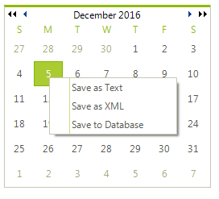

# Context Menus

## 

To implement context menus use __RadContextMenu__in your application. __RadContextMenu__is a non-visual component that sits in the component tray located below the form design surface. __RadContextMenu__, like __RadMenu__, can be themed and has an items collection that accepts __RadMenuItem__,
        __RadMenuComboBoxItem__, __RadMenuSeparatorItem__ and __RadMenuContextItem__. 

There are two ways to attach a context menu to a given control or portion of a control: 

* For those Rad Controls that have a __ContextMenu__ or 
          	__RadContextMenu__ properties you can assign the 
          	__RadContextMenu__in the designer or in code.
          

#### __[C#] Assigning a RadContextMenu__

{{source=..\SamplesCS\Menus\ContextMenu\ContextMenu1.cs region=assignToTreeView}}
	            radTreeView1.Nodes[0].ContextMenu = radContextMenu1;
	{{endregion}}

#### __[VB.NET] Assigning a RadContextMenu__

{{source=..\SamplesVB\Menus\ContextMenu\ContextMenu1.vb region=assignToTreeView}}
	        RadTreeView1.Nodes(0).ContextMenu = RadContextMenu1
	{{endregion}}

>The __ContextMenuStrip__ property refers to a Windows standard control. 
            This property drop down will not display __RadMenu__or
            __RadContextMenu__components that exist on the form.

* Handle the mouse down event for the control that requires the context menu and call
          	the __RadContextMenu.Show()__ method.
         

#### __[C#] Handling the MouseDown event__

{{source=..\SamplesCS\Menus\ContextMenu\ContextMenu1.cs region=mouseDown}}
	        void radCalendar1_MouseDown(object sender, MouseEventArgs e)
	        {
	            if (e.Button == MouseButtons.Right)
	            {
	                Point p = (sender as Control).PointToScreen(e.Location);
	                radContextMenu1.Show(p.X, p.Y);
	            }
	        }
	{{endregion}}

#### __[VB.NET] Handling the MouseDown event__

{{source=..\SamplesVB\Menus\ContextMenu\ContextMenu1.vb region=mouseDown}}
	    Private Sub radCalendar1_MouseDown(ByVal sender As Object, ByVal e As MouseEventArgs)
	        If e.Button = MouseButtons.Right Then
	            Dim p As Point = (TryCast(sender, Control)).PointToScreen(e.Location)
	            RadContextMenu1.Show(p.X, p.Y)
	        End If
	    End Sub
	{{endregion}}

