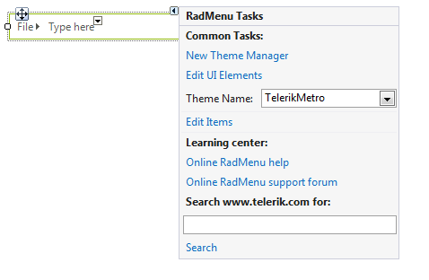
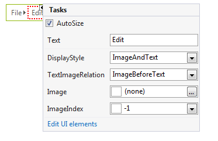

# Smart Tag

## 

The Smart Tag for RadMenu lets you quickly access common tasks involved with building menus and customizing appearance through themes.

* __New Theme Manager__: Adds a new __RadThemeManager__component to the form.

* __Edit UI elements__: Opens a dialog that displays the __Element Hierarchy Editor__. This editor lets you browse all the elements in the control, including the RadMenu itself and the UI elements that make up each menu item.

* __Theme Name__: Select a theme name from the drop down list of themes available for that control. Selecting a theme allows you to change all aspects of the controls visual style at one time.

* __Learning Center__: Navigate to the Telerik help, code library projects or support forum.

* __Search__: Search the Telerik site for a given string.

Each individual __RadMenuItem__ within the RadMenu also has a Smart Tag. Use this Smart Tag to quickly toggle the __AutoSize__ property, set the __Text__ property, set image properties and to display the __Element Hierarchy Editor__ for selected RadMenuItem.

